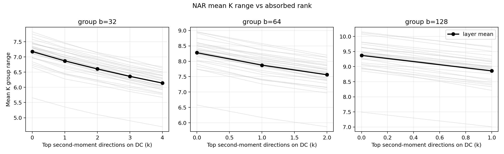
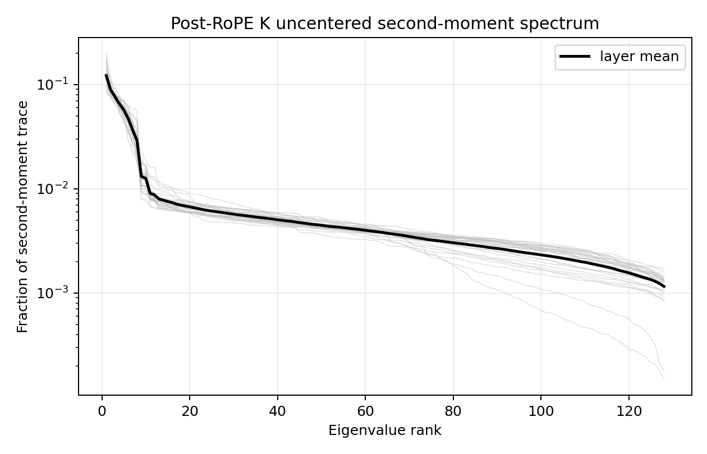

# NAR offline tensor validation

A reproducible benchmark testing whether a learned orthogonal rotation can put
dominant post-RoPE Llama K directions onto the free DC directions of dynamic
asymmetric per-token, per-group INT4 quantization.

> **Result: NO-GO under the pre-registered criteria.** NAR reduced mean K range
> by 7.770% versus full-head Hadamard at `b=128`, below the required 10%. The
> separate KV-only perplexity gate passed, but the overall criterion was
> conjunctive. This negative result is preserved without configuration search.

| Gate | Result | Main number |
|---|---:|---:|
| E0 asymmetric-quantizer sanity | PASS | Hadamard outlier range matches `2\|x\|/sqrt(b)`; NAR range 0 |
| E1 phenomenon at `b=128` | **FAIL** | 7.770% range reduction (required >=10%) |
| Low-rank attribution | PASS | 15.231% top-k projection attribution |
| Held-out stability | PASS | 100.914% of calibration-A reduction retained |
| E2 3B `b=128` PPL gate | PASS | NAR-Hadamard -0.01713, paired 90% CI [-0.02789, -0.00637] |
| Overall method-promising criterion | **FAIL** | E1 and E2 were both required |





## Scope

The repository performs forward-hook activation capture, offline tensor
analysis, and KV-only INT4 fake quantization. It does **not** run GPTQ, weight
quantization, end-to-end W4A4KV4, or configuration tuning. Models are
Llama-3.2-3B and Llama-3.2-1B; data are fixed WikiText-2 chunks.

The complete protocol, all per-layer tables, confidence intervals, negative
findings, and caveats are in [`report.md`](report.md). Exact CSV/JSON outputs
and figures are committed under [`results/`](results/). Execution transcripts
are under [`runs/`](runs/).

Large generated assets are intentionally excluded: model weights, Hugging Face
and dataset caches, virtual environments, and the 128-sequence Q/K activation
dumps. The script regenerates them locally.

## Reproduce

```bash
python -m venv .venv
source .venv/bin/activate
pip install -r requirements.txt
./run_all.sh
```

The full run requires one CUDA GPU and writes resumable stage markers. On a
Slurm cluster, adjust the GPU type in `slurm.sh` if necessary, then run:

```bash
sbatch slurm.sh
```

See [`nar/README.md`](nar/README.md) for the frozen sample selection, group
sizes, calibration splits, seeds, and individual stage commands.
