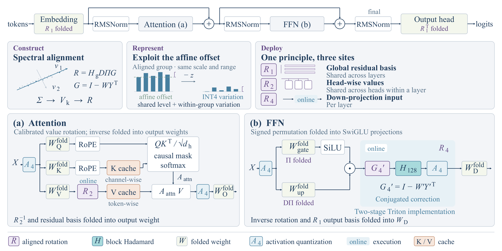
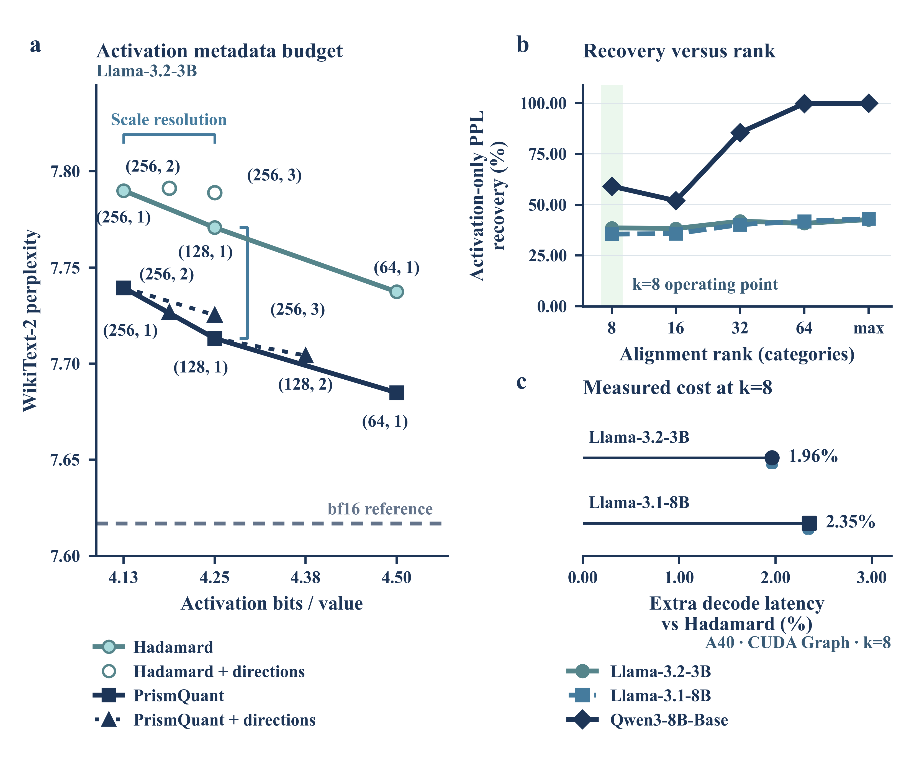

# PrismQuant manuscript figures — revision 7

Scientific plots are generated with Python/matplotlib. User-specified presentation
choices take precedence over journal-style defaults. SVG/PDF axes and text remain
editable; dense scientific marks are embedded rasters.

## PrismQuant method framework — 2026-09-10

The refined framework preserves the Transformer backbone, Construct / Represent /
Deploy cards, Attention and FFN expansions, and a compact legend on a 2:1 canvas.
It corrects residual bypasses, attention scores versus weighted values, gate-only
SiLU, signed-permutation folding, rotation sharing, and online/offline notation.
The diagram contains no performance claims or measured-data substitutes.

- [Editable PPTX](prismquant_method/PrismQuant_method_refined.pptx)
- [Vector PDF](prismquant_method/PrismQuant_method_refined.pdf)
- [600-dpi PNG](prismquant_method/PrismQuant_method_refined.png)
- [Generator and reproduction instructions](prismquant_method/)
- [Complete package, including QA](prismquant_method/PrismQuant_refined_bundle.zip)

The PPTX contains 342 native shapes and connectors in 7 module groups, with no
picture objects. Actual PPT rendering, embedded Times New Roman typography,
measured panel alignment, and glyph-outline collision checks passed. Conceptual
scatter/bar marks are explicitly identified as schematic illustrations.



## Current exports

- Figure 4: `fig4_revised.pdf/svg/png`, also available through `fig4.pdf/svg` and `fig4_preview.png`.
- Deployment: `fig_deployment_efficiency.pdf/svg/png`; full details and appendices below.

- Figure 1: fig1a through fig1g, each in SVG/PDF/transparent 300-dpi PNG.
  fig1_preview.png and fig1.pdf/svg form a compact 6.6 × 4.25-inch mechanism
  teaser with a raw-activation fork, two rotation paths, matched range outcomes,
  and a shared strip of the original three signed traces. Vector arrows and
  unscaled icons annotate the mechanism; no error/energy results are invented.
- Figure 2: fig2a/b/c and assembly; Hadamard, DuQuant, and PrismQuant in all three panels.
- Figure 3: fig3a (cloud), fig3b (energy), and fig3c (two-part range law).
  fig3c1 and fig3c2 are also exported independently in SVG/PDF/PNG.
  fig3_preview.png is the complete 2-by-2 review sheet; fig3c_preview.png is
  the side-by-side range-law comparison. No in-panel titles or footer captions.

## Figures 3 and 4 typography and print strokes (historical baseline)

The original Figures 3 and 4 use the same verified, upright **Times New Roman Bold**
as Figures 1 and 2, including all tick numbers, axes, direct labels, insets,
and legends. `FIGURE3_FONT_DIR` and `FIGURE4_FONT_DIR` support a custom
font directory; rendering fails if the actual bold font is unavailable.
Font identity and SHA-256 are recorded in each figure metadata file.
Axes are 0.9 pt and major ticks 0.8 pt. Figure 3 energy curves are
1.5–1.8 pt, with a 1.1 pt identity line and 0.95 pt pooled fit.
Figure 4 series are 1.6–2.0 pt, kernel curves 1.1 pt, and brackets 0.9 pt.
Point labels use extra clearance for the wider bold glyphs.

All plotted CSVs, palette, statistics, panel sizes, and the Figure 4
62:38 recovery/cost split are preserved. Standalone SVG/PDF/PNG panels,
appendix panel, and combined previews are refreshed. Figure 3's existing
caption text is also exported separately in Times New Roman Bold as
`fig3_caption.svg/pdf/png`; it is not added inside the bare panels.
The typography and rendered checks are recorded in
`qa/fig3.typography-review.json` and `qa/fig4.typography-review.json`.

## Figure 3 SVG import correction

The two range-law views (`fig3c1.svg` and `fig3c2.svg`) now contain native
vector marks for all 2520 activation, 280 V-cache, and 112 multi-slot
observations, including vector copies in the insets. SVG assemblies use one
viewport and translated groups with unique IDs, avoiding nested viewport
placement that lost the right half in an independent SVG renderer.
The x-axis formula now has a complete vector radical and overbar spanning
`1 − f`; the radicand remains editable Times New Roman Bold text.

Run `python figures/verify_fig3_svg.py` after rendering. It checks actual
SVG marker counts, references, formula geometry, and independently rendered
content in every half of `fig3c.svg` and `fig3.svg`, against the standalone
panels. Results are in `qa/fig3.svg-integrity.json`. PDF/PNG companions and
previews are regenerated from the same matplotlib source.

## Figure 1 mechanism redesign

Reproduce with `python figures/make_fig1.py --reuse-data`. The data builder
remains available with `--workdir` for the original frozen activation dumps.
`fig1_layout.py` defines the final layout, semantic vector icons, and native-size
PDF/SVG composition. The original NPZ and source CSVs remain unchanged.

Raw activations fork into the Hadamard and PrismQuant paths. Matched panels
c/d retain identical token/group windows, panel size, camera, 0–10 z limits,
and color normalization. The a/b magnitude scales remain 0–40 and 0–4.
The bottom strip keeps the actual raw/Hadamard/PrismQuant signed traces,
measured range brackets, common y limits, and g's fp16(min x) offset. It is
not relabelled as NMSE or captured-energy evidence. The caption distinguishes
alignment-induced range reduction from offset representation: translating
a group alone cannot change its max-minus-min range.

All scientific samples remain plotted. Dense 3D marks are rasterized at
300 dpi, while axes, text, arrows, and conceptual icons stay vector. The
canvas height drops from 7.0 to 4.25 inches at the same 6.6-inch width.
Panel a uses the burgundy/rose family (#601D49, #BD5579, #EA9D9D)
with a pale floor, and panel e uses #601D49 for its trace, bracket and title.
Panel g returns to PrismQuant deep blue (#1D3557). Hadamard retains Figure 2's light cyan
(#A8DADC); the upper PrismQuant path retains its deep blue (#1D3557).
Zero-point and affine-offset annotations use green #73CC80 throughout.
The upward branch is Hadamard light cyan. The two shared explanatory lines
below d are omitted from the graphic; the caption retains their definitions.
Panels b/c/d retain the original shared sequential palette
(#F1FAEE → #A8DADC → #457B9D → #1D3557), with unchanged normalizations.
The sparse coordinate ticks replace the previous diagnostic grid without
changing numerical limits.

## Figure 1 typography

All seven Figure 1 panels and the composed figure use **Times New Roman
Bold**, including ticks, axes, range values, zero-point labels, panel
headings, and schematic symbols. Mathematical subscripts use the same
upright font; the direction annotation is 7.5 pt so its subscripts remain
above 5 pt. The existing layout, palette, scales, samples, and statistics
are preserved. `fig1_caption.txt` remains the exact source text and is also
exported as `fig1_caption.svg/pdf/png`, with 8 pt bold text at 6.6 in width.

Run `python figures/make_fig1.py --reuse-data`. Font installation follows
the Figure 2 instructions below, using `FIGURE1_FONT_DIR` for a custom
font directory. `figure_typography.py` provides the common font lock and
caption exporter. Font provenance is in `fig1_metadata.json`, and the
rendered audit is in `qa/fig1.typography-review.json`.

## Figure 2 DuQuant addendum

Figure 2 now uses **Times New Roman Bold** throughout: tick numbers, axis
labels, annotations, panel letters, and legend. The unchanged caption text
is also typeset separately as `fig2_caption.svg/pdf/png` at 8 pt bold;
the scientific panels remain bare. Tick labels remain 6 pt, axis labels
and annotations 7 pt, and the legend 6.5 pt. PDFs embed the actual font;
SVG text stays editable and requires Times New Roman on the viewing system.

For reproduction, install Times New Roman Bold or set `FIGURE2_FONT_DIR`
to a directory containing its TTF files. The local default is
`~/.local/share/figure-fonts/times-new-roman`; Figures 1 and 2 register these
fonts. This environment uses Microsoft core fonts `times32.exe` from
<https://downloads.sourceforge.net/corefonts/times32.exe>. Font binaries
are not redistributed in the repository. The script validates the exact
family and upright 700 weight and fails if unavailable. Font version and
SHA-256 are recorded in `fig2_metadata.json`; rendered font verification
and unchanged-data checks are recorded in `qa/fig2.typography-review.json`.


All three panels and the shared legend use soft pink #F5CBCB for
DuQuant. Hadamard remains light cyan and PrismQuant remains deep blue; all
line weights, markers, measurements, and layout are unchanged. Use
`python figures/make_fig2.py --reuse-data` for presentation-only revisions
of the frozen plotted CSVs. The default path still refreshes and checks the
experimental DuQuant addendum before updating source tables. Panels b/c
include the measured DuQuant-style diagnostic.
The 3B down-input main figure retains the existing Hadamard/PrismQuant
measurements, capture values, sizes, axes, palette, and shared three-method
legend. `fig2b.csv` and `fig2c.csv` each contain 84 plotted values with exact
physical source-CSV line numbers and source method/site/layer keys.
The displayed percentage reduction still compares PrismQuant with Hadamard.

The 3B addendum applies E16's existing `e11._duquant_blocks` construction to
all 8192 original E1c evaluation rows at both sites and all 28 layers.
Block size is 128; seed is 20260902, with the original site/layer offsets.
The descending-absmax zigzag permutation uses the frozen E11 channel scores,
and the original seeded QR construction builds each block rotation.
No model is loaded or rerun. Computation ran on an allocated CPU node;
parallel exact bf16 row reads reduce network-file latency without changing
which rows are evaluated. Hadamard was replayed on every layer/site to
check agreement with its frozen range and NMSE. `experiment.quant_metrics`
computes the exact same range, global relative error, and paired deltas.

The 56 new `method=duquant` rows are appended to the original
`results/llama32_3b/e1c_per_layer.csv`. Every byte of the existing CSV prefix
is preserved. `E1C_DONE.json` records an independently timestamped
`duquant_addendum`, construction/source hashes, row count, and checks.
`e1c_duquant_sanity.csv` records every paired range comparison, sampled-row
hash, permutation hash, and measured null-space capture. The renderer refuses
to plot if the DuQuant addendum is incomplete or outside the requested
paired Hadamard/PrismQuant bracket (relative numerical tolerance 2e-5).

The requested 8B offline addendum is **not complete**: no frozen 8B
`wide_cal_a` dump, `e1c_per_layer.csv`, or `E1C_DONE.json` exists in the checked
repository or `/projects/nar/nar-validation` asset root. The existing 8B E16
aggregates and E11 factors do not contain the individual activation rows
needed to reconstruct range or NMSE. The missing-input record is in
`fig2_duquant_inputs.json`. No 8B data is fabricated and no model rerun is
substituted for the requested frozen-dump diagnostic. An existing 8B frozen
dump location is needed to complete that part.

```bash
python figures/make_fig2.py
python figures/verify_fig2_duquant.py
python figures/audit_exports.py --figure 2
```

`measure_fig2_duquant.py` performs the offline addendum. It accepts the same
asset and frozen-code roots as the Figure 4 measurement helper, supports CPU
or CUDA, and resumes complete per-layer checkpoints. Original E1c summaries
are retained; the addendum lives in the per-layer CSV and done metadata.

## Figure 4 and deployment efficiency — 2026-09-12

The revised Figure 4 preserves all accuracy observations and replaces its
main cost panel with measured k=8 overhead from matched private CUDA Graph
records. The deployment figure provides eager prefill throughput, private
Graph decode latency and allocated memory, and measured implementation
ablations. It is named `fig_deployment_efficiency` until the complete
manuscript establishes numbering.




Both main figures are drawn at **5.5 inches wide**, with real embedded Times
New Roman Bold (all text at least 7.5 pt), editable SVG text, vector PDF, and
600-dpi PNG. Figure 4 is 4.65 inches high; deployment is 5.35 inches high.
`fig4.pdf`, `fig4.svg`, and `fig4_preview.png` are compatibility copies of the
revised Figure 4, promoted only after QA. `fig4_revised_metadata.json` describes
the current layout; `fig4_metadata.json` remains the original data/panel record.

Frozen sources are commit `6747960b96b0b03e626e98eaeeccf0d1abc34e79` and
`results/e28_v2/20260912_a40_v2_full_int4`. Private Graph correctness is 6/6
PASS and matched timing 36/36 PASS; failed original-backend Graph captures
are not plotted. The figure builder verifies raw samples, collector summaries,
paired denominators, independent memory bytes, and source hashes. Raw CSVs use
full precision. `deployment_efficiency_table.md` provides readable values.

`fig4_revised_data.csv` retains the 3B/8B budget points, all 15 rank observations,
original E17 cost points/references, and new Graph overhead. The deployment CSV
contains 416 central/session rows, including all 30 kernel comparisons. Source
file, pointer or CSV row, frozen commit/run, backend/mode, workload, units,
statistic and formula are recorded. Ratio-of-pooled-medians and
median-of-session-ratios are explicitly distinguished. Memory is maximum
inference peak allocated bytes across sessions, divided by 1e9.

The paper's accuracy protocols and random-weight E28 timing protocol are not
checkpoint-level joint accuracy/speed measurements. E28 uses per-token
symmetric INT4, different from the native paper group-128 asymmetric format.
See `captions.txt` / `captions.tex` for the full protocol, Graph page layout,
statistics, backend stress limitations, and interpretation boundaries.

Appendix exports in `appendix/` preserve the original RTX PRO 6000 E17 rank
cost, 8B metadata budget, matched private eager-to-Graph comparison, and all
T=1/2048/32768 implementation ablations, including unfavorable TC-B points.
`panels/` holds bare vector/600-dpi panel exports for assembly; reuse each main
figure's corresponding legend. The complete original Figure 4 and its old
README are saved in `archive/fig4_before_e28/`; original CSVs and individual
component exports remain unchanged.

Reproduce with a CPU plotting environment containing
`requirements-deployment-figures.txt` and a locally licensed Times New Roman
installation. Use `FIGURE4_FONT_DIR` if needed; font files are never committed.

```bash
python figures/build_e28_figure_data.py
python figures/make_fig4_revised.py --reuse-data
python figures/make_deployment_efficiency.py --reuse-data
python figures/make_deployment_appendix.py --reuse-data
python figures/write_deployment_captions.py
python figures/verify_deployment_figures.py --promote-fig4
# Optional stronger check: two identical full render bundles.
python figures/check_deployment_reproducibility.py
```

`--draft` produces 150-dpi review PNGs; rerun without it for final delivery.
`--reuse-data` skips data rebuilding and never launches an experiment. None of
these commands trains, calibrates, benchmarks a GPU, or modifies a kernel.
Use `include_deployment_figures.tex` for the LaTeX integration. The QA entry
point checks every main/appendix/standalone vector and PNG, verifies actual
font embedding, renders PDF and SVG independently, and records results under
`qa/deployment/`. The source validator includes shared modules and accepts the
explicit manuscript font contract; its generic Nature TIFF/column-width
warnings are reviewed against this task's PNG/5.5-inch specification.

## Figure 1

All contiguous, stride-1, 2048-channel windows are ranked by the number of
channels whose median absolute activation over the 512 displayed tokens exceeds
1.0. The best count is 21. Of 183 tied best windows, the earliest starts at 1254;
a and b therefore both show channels 1254–3301. The metadata records the rule,
count, tie handling, and all 6145 candidate-window counts are preserved in the
source NPZ together with all 8192 channel medians. This is a density-selected
illustration, not an average-case estimate.

Panel a uses z/color limits 0–40; the selected window's maximum is 18.125.
Panel b uses its own 0–4 z/color scale. Both use elev=22, azim=-60 and identical
channel/token ticks. Panels c/d use the same 0–10 height/color scale, elev=18,
azim=-62, and 0.9-pt lines. The aspect ratio is 2.6:1.2:0.85. Sparse grid lines
and coordinate ticks replace the dense diagnostic grid. No values are clipped,
subsampled, or smoothed.

Panels a–d contain only axes, tick labels, axis labels, and data. Median, mean,
and 95th-percentile ranges are recorded in fig1_metadata.json. The 32768 range
cells and all three signed traces remain numerically identical to revision 4.
The f/g traces are exact token-416, group-0 cells of c/d; e is raw group 25.

Panels e/f/g have equal 2.04-by-1.10-inch canvases, common y limits, y ticks
−5/0/5, and x ticks 0/64/127. They share the signed-value label, and each
retains its channel-in-group label and measured range bracket. The g trace
keeps the fp16(min x) affine offset. Standalone a/b panels are 1.88 × 1.53
and 1.82 × 1.35 inches; c/d are identically 2.16 × 1.35 inches. The annotated
assembly, rather than the bare panels alone, carries the causal story.

## Figure 3

make_fig3.py was restored from the scatter implementation at commit 721f253,
then updated. Its ellipse replacement is no longer rendered.

Panel a projects 8064 non-BOS, stride-32 tokens from layer 27 onto the same
frozen uncentered second-moment v1/v2 basis used by Figure 1. Each coordinate
is centered and divided by its own sample standard deviation (ddof=0).
The 0.5–99.5 percentile frame is expanded to the full observed extrema and
padded 8%, so every point lies inside it. Metadata records both frames.

The arrows show the unit receiving-group DC direction pulled back through the
full-width Hadamard and frozen PrismQuant transforms, projected onto v1/v2.
Their lengths are 0.0150056 and 0.9999949. Arrow coordinates use unit-direction
cosines overlaid on the standardized token cloud; their lengths are not token
standard deviations. Their common plotting multiplier is 1.0. The sign of a
null direction is arbitrary and is oriented toward positive v1.

Panel b retains the existing rank-256 energy measurements for layers 1/13/27.
The x axis is logarithmic from 1 to 256. Layer 27 uses deep blue; the other two
use frosted blue with solid/dashed lines and direct endpoint labels.

Panel c is split by source population: fig3c1 contains all 2520 E1c activation
points; fig3c2 contains all 280 E7 V-cache and 112 E20 multi-slot points. Both
use identical axes, the dashed identity line, and the same thin pooled OLS fit.
Both explicitly label “Pooled R² = 0.86”: this is not a fit estimated within
either subpanel. The exact pooled fit is y = 0.0598022 + 0.8665148 x,
R² = 0.8613894973, with x = sqrt(1-f). Small upper-left insets enlarge the
0.85–1.0 corner. Every point remains in its main plot; inset filtering only
selects the zoom region. The measured range-law table is unchanged.

Standalone Figure 3 panels are 2.65 by 2.35 inches with 600-dpi PNGs.
Combined review PNGs are 300 dpi. The paired fig3c canvas is 5.3 by 2.35 inches.

## Palette and type

Height map: #F1FAEE → #A8DADC → #457B9D → #1D3557.
Text/PrismQuant: #1D3557; raw/cloud/E7: #457B9D; Hadamard/E20: #A8DADC.
Pane edges: #C9D6DF; grids: #DCE4EA. All labels use upright DejaVu Serif,
6-pt ticks, 7-pt axis labels, and 6.5-pt legends.

## Reproduce

Use the existing environment with numpy, pandas, torch, matplotlib, Pillow,
and PyMuPDF. From the committed derived arrays and tables:

```bash
python figures/make_fig1.py --reuse-data
python figures/make_fig3.py
python figures/verify_figures.py
python figures/audit_exports.py
```

To refresh from the frozen activation artifacts, first run:

```bash
python figures/make_fig1.py --workdir "$NAR_WORKDIR"
python figures/prepare_fig3.py --workdir "$NAR_WORKDIR" --geometry-only
python figures/make_fig3.py
```

The geometry-only route reuses the frozen layer-27 basis and factor. It does
not rerun a model or eigensolver. The old fig3_eigvecs_layer1.npz is retained as
historical provenance and is not used by the current renderer.

Scientific linkage, data-integrity comparisons, and rendered export audits are
in qa/. Figure 2's measurements and files are preserved.

## Dominant eigendirections micro-diagram

`fig1_principal_directions.svg/pdf/png` is a standalone, editable vector
concept glyph for Figure 1: **216 seeded anisotropic Gaussian samples**, their
empirical covariance contours at Mahalanobis radii 1 and 2, and orthogonal
v1/v2 arrows. Sage points and their outer contour, a teal inner contour and
v2, and a blue v1 follow the requested reference palette. The colors distinguish
geometric elements of one population, not different classes. Contours are
geometric levels, not confidence intervals.

The v1/v2 line widths are **1.15/0.95 pt**; labels retain Times New Roman Bold.
The canvas is **2 × 1 in (2:1)**, widened from 1.5:1 while retaining one
isotropic coordinate scale. The white-background PNG is 1200 × 600 px at
600 dpi; SVG and PDF remain fully vector with editable text. Increasing the
conceptual sample count from 72 to 216 preserves the seed and sampling law,
then refits empirical centering, covariance, and PCA to all 216 points.

Reproduce with `python figures/principal_direction_icon.py`, using the same
font installation as Figure 1. These are **simulated conceptual samples,
not measured model activations**. Every generated point is retained in
`fig1_principal_directions.csv`; seed, covariance, PCA eigenpairs, and
rendering parameters are in `fig1_principal_directions_metadata.json`.
The icon is delivered separately for placement; the Figure 1 assembly and
its measured panels are unchanged in this revision.

Rendered QA for this revision is in `qa/fig1_principal_directions.*`: no
text collisions or clipping, every PDF glyph at least 6.65 pt, all 216 vector
markers present, and orthogonal empirical eigenvectors. The source checker
flags the inherited serif font because it only recognizes sans-serif families;
the retained Times New Roman Bold font is verified embedded in the final PDF.
Other source-preflight warnings are reviewed in the QA record.
