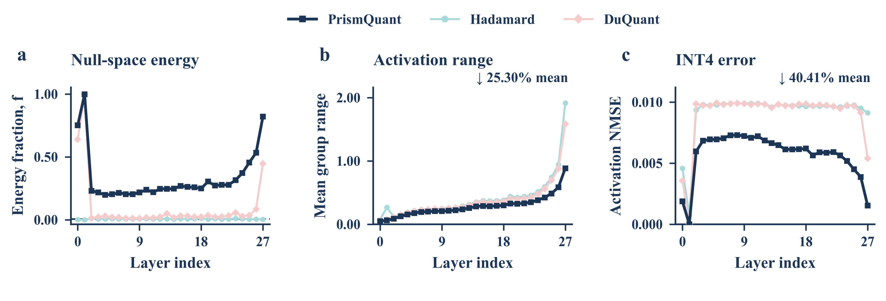
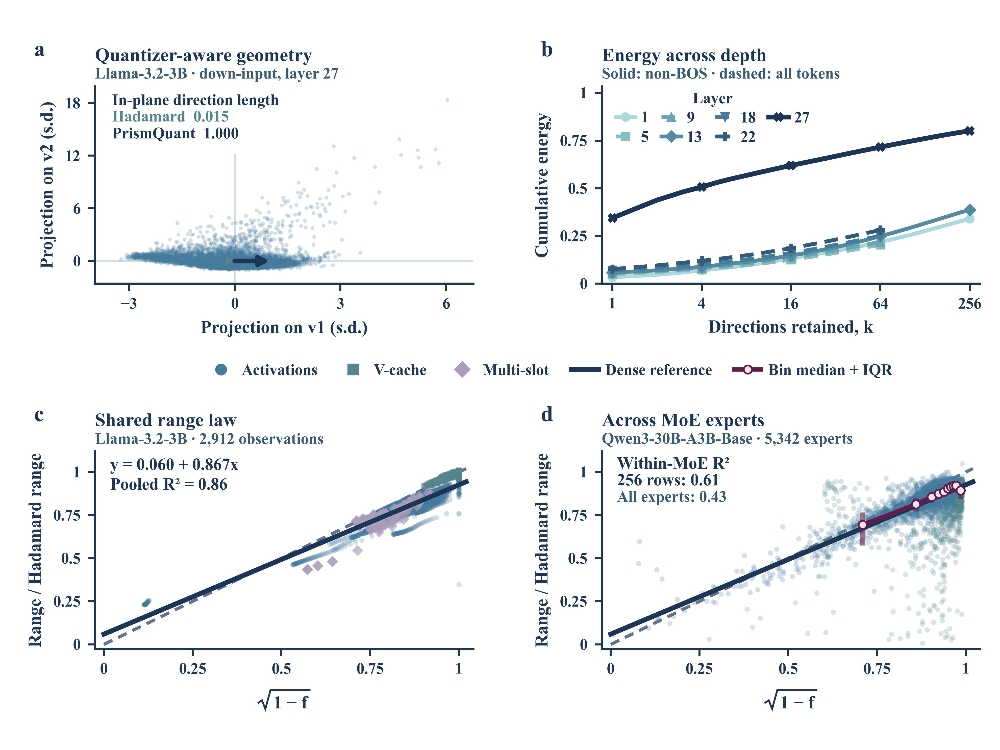
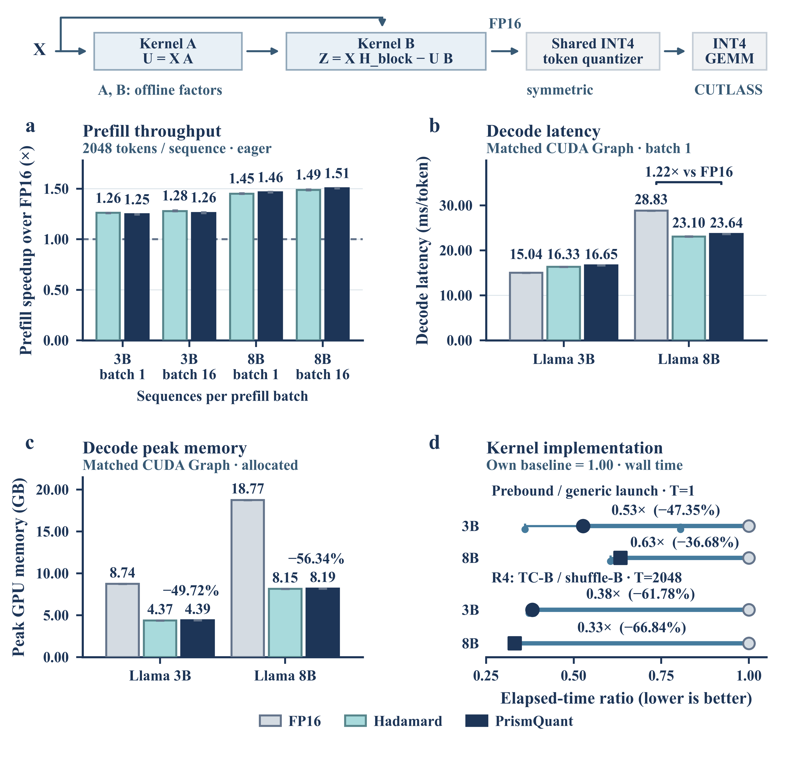

# PrismQuant manuscript figures — September 13 oral revision

Scientific plots are generated with Python/matplotlib. User-specified presentation
choices take precedence over journal-style defaults. SVG/PDF axes and text remain
editable. Figures 2, 3, 4 and deployment are entirely vector; Figure 1 retains its existing rasterized dense 3D marks.

## PrismQuant method framework — 2026-09-10

The refined framework preserves the Transformer backbone, Construct / Represent /
Deploy cards, Attention and FFN expansions, and a compact legend on a 2:1 canvas.
It corrects residual bypasses, attention scores versus weighted values, gate-only
SiLU, signed-permutation folding, rotation sharing, and online/offline notation.
The diagram contains no performance claims or measured-data substitutes.

- [Editable PPTX](prismquant_method/PrismQuant_method_refined.pptx)
- [Vector PDF](prismquant_method/PrismQuant_method_refined.pdf)
- [600-dpi PNG](prismquant_method/PrismQuant_method_refined.png)
- [Generator and reproduction instructions](prismquant_method/)
- [Complete package, including QA](prismquant_method/PrismQuant_refined_bundle.zip)

The PPTX contains 342 native shapes and connectors in 7 module groups, with no
picture objects. Actual PPT rendering, embedded Times New Roman typography,
measured panel alignment, and glyph-outline collision checks passed. Conceptual
scatter/bar marks are explicitly identified as schematic illustrations.


## Current exports

- **Figure 2:** [PDF](fig2_revised.pdf), [SVG](fig2_revised.svg), [600-dpi PNG](fig2_revised.png). Three paired layer panels, original blue/cyan/pink colors and lighter curves; every original value retained.
- **Figure 3:** [PDF](fig3_revised.pdf), [SVG](fig3_revised.svg), [600-dpi PNG](fig3_revised.png). Four panels: geometry, seven-layer energy coverage, pooled range law, and all-expert MoE evidence. Internal experiment IDs appear only in provenance.
- **Figure 4:** [PDF](fig4_revised.pdf), [SVG](fig4_revised.svg), [600-dpi PNG](fig4_revised.png). Accuracy and rank recovery, plus the restored blue/teal decoder-layer cost panel.
- **Figure 5 — deployment:** [PDF](fig5.pdf), [SVG](fig5.svg), [600-dpi PNG](fig5.png). Explicit prefill batch size and enlarged implementation comparisons.
- **Figure 5 standalone SVGs:** [Panel a](fig5_a.svg), [Panel b](fig5_b.svg), [Panel c](fig5_c.svg), [Panel d](fig5_d.svg), or [download all four (ZIP)](fig5_panels_svg.zip). These convenience copies are byte-identical to the corresponding files under `panels/`.
- Figure 1 and the method framework retain their existing exports.

`fig2.pdf/svg/png`, `fig3.pdf/svg/png`, and their preview files are verified compatibility copies. Active standalone panels are `fig2a/b/c` and `fig3a/b/c/d`, with equivalent named copies under `panels/fig2_fig3/`. The old split law panels and scripts are archived in `archive/fig2_fig3_before_oral_revision/`. All new figures use actual Times New Roman Bold at 7.5–10.5 pt. Figures 2/3 use a wider 6.6-inch canvas; Figures 4/5 retain their 5.5-inch width. Captions are kept separate from the bare figures.





The historical sections below record earlier figure choices; the active reproduction workflow is in “Figures 2/3: evidence, provenance and reproduction”.

## Figures 3 and 4 typography and print strokes (historical baseline)

The original Figures 3 and 4 use the same verified, upright **Times New Roman Bold**
as Figures 1 and 2, including all tick numbers, axes, direct labels, insets,
and legends. `FIGURE3_FONT_DIR` and `FIGURE4_FONT_DIR` support a custom
font directory; rendering fails if the actual bold font is unavailable.
Font identity and SHA-256 are recorded in each figure metadata file.
Axes are 0.9 pt and major ticks 0.8 pt. Figure 3 energy curves are
1.5–1.8 pt, with a 1.1 pt identity line and 0.95 pt pooled fit.
Figure 4 series are 1.6–2.0 pt, kernel curves 1.1 pt, and brackets 0.9 pt.
Point labels use extra clearance for the wider bold glyphs.

All plotted CSVs, palette, statistics, panel sizes, and the Figure 4
62:38 recovery/cost split are preserved. Standalone SVG/PDF/PNG panels,
appendix panel, and combined previews are refreshed. Figure 3's existing
caption text is also exported separately in Times New Roman Bold as
`fig3_caption.svg/pdf/png`; it is not added inside the bare panels.
The typography and rendered checks are recorded in
`qa/fig3.typography-review.json` and `qa/fig4.typography-review.json`.

## Figure 3 SVG import correction (historical baseline)

The two range-law views (`fig3c1.svg` and `fig3c2.svg`) now contain native
vector marks for all 2520 activation, 280 V-cache, and 112 multi-slot
observations, including vector copies in the insets. SVG assemblies use one
viewport and translated groups with unique IDs, avoiding nested viewport
placement that lost the right half in an independent SVG renderer.
The x-axis formula now has a complete vector radical and overbar spanning
`1 − f`; the radicand remains editable Times New Roman Bold text.

Run `python figures/verify_fig3_svg.py` after rendering. It checks actual
SVG marker counts, references, formula geometry, and independently rendered
content in every half of `fig3c.svg` and `fig3.svg`, against the standalone
panels. Results are in `qa/fig3.svg-integrity.json`. PDF/PNG companions and
previews are regenerated from the same matplotlib source.

## Figure 1 mechanism redesign

Reproduce with `python figures/make_fig1.py --reuse-data`. The data builder
remains available with `--workdir` for the original frozen activation dumps.
`fig1_layout.py` defines the final layout, semantic vector icons, and native-size
PDF/SVG composition. The original NPZ and source CSVs remain unchanged.

Raw activations fork into the Hadamard and PrismQuant paths. Matched panels
c/d retain identical token/group windows, panel size, camera, 0–10 z limits,
and color normalization. The a/b magnitude scales remain 0–40 and 0–4.
The bottom strip keeps the actual raw/Hadamard/PrismQuant signed traces,
measured range brackets, common y limits, and g's fp16(min x) offset. It is
not relabelled as NMSE or captured-energy evidence. The caption distinguishes
alignment-induced range reduction from offset representation: translating
a group alone cannot change its max-minus-min range.

All scientific samples remain plotted. Dense 3D marks are rasterized at
300 dpi, while axes, text, arrows, and conceptual icons stay vector. The
canvas height drops from 7.0 to 4.25 inches at the same 6.6-inch width.
Panel a uses the burgundy/rose family (#601D49, #BD5579, #EA9D9D)
with a pale floor, and panel e uses #601D49 for its trace, bracket and title.
Panel g returns to PrismQuant deep blue (#1D3557). Hadamard retains Figure 2's light cyan
(#A8DADC); the upper PrismQuant path retains its deep blue (#1D3557).
Zero-point and affine-offset annotations use green #73CC80 throughout.
The upward branch is Hadamard light cyan. The two shared explanatory lines
below d are omitted from the graphic; the caption retains their definitions.
Panels b/c/d retain the original shared sequential palette
(#F1FAEE → #A8DADC → #457B9D → #1D3557), with unchanged normalizations.
The sparse coordinate ticks replace the previous diagnostic grid without
changing numerical limits.

## Figure 1 typography

All seven Figure 1 panels and the composed figure use **Times New Roman
Bold**, including ticks, axes, range values, zero-point labels, panel
headings, and schematic symbols. Mathematical subscripts use the same
upright font; the direction annotation is 7.5 pt so its subscripts remain
above 5 pt. The existing layout, palette, scales, samples, and statistics
are preserved. `fig1_caption.txt` remains the exact source text and is also
exported as `fig1_caption.svg/pdf/png`, with 8 pt bold text at 6.6 in width.

Run `python figures/make_fig1.py --reuse-data`. Font installation follows
the Figure 2 instructions below, using `FIGURE1_FONT_DIR` for a custom
font directory. `figure_typography.py` provides the common font lock and
caption exporter. Font provenance is in `fig1_metadata.json`, and the
rendered audit is in `qa/fig1.typography-review.json`.

## Figure 2 DuQuant addendum (original measurement protocol)

The original Figure 2 used **Times New Roman Bold** throughout: tick numbers, axis
labels, annotations, panel letters, and legend. The unchanged caption text
is also typeset separately as `fig2_caption.svg/pdf/png` at 8 pt bold;
the scientific panels remain bare. Tick labels remain 6 pt, axis labels
and annotations 7 pt, and the legend 6.5 pt. PDFs embed the actual font;
SVG text stays editable and requires Times New Roman on the viewing system.

For reproduction, install Times New Roman Bold or set `FIGURE2_FONT_DIR`
to a directory containing its TTF files. The local default is
`~/.local/share/figure-fonts/times-new-roman`; Figures 1 and 2 register these
fonts. This environment uses Microsoft core fonts `times32.exe` from
<https://downloads.sourceforge.net/corefonts/times32.exe>. Font binaries
are not redistributed in the repository. The script validates the exact
family and upright 700 weight and fails if unavailable. Font version and
SHA-256 are recorded in `fig2_metadata.json`; rendered font verification
and unchanged-data checks are recorded in `qa/fig2.typography-review.json`.


All three panels and the shared legend use soft pink #F5CBCB for
DuQuant. Hadamard remains light cyan and PrismQuant remains deep blue; all
line weights, markers, measurements, and layout are unchanged. Use
`python figures/make_fig2.py --reuse-data` for presentation-only revisions
of the frozen plotted CSVs. The default path still refreshes and checks the
experimental DuQuant addendum before updating source tables. Panels b/c
include the measured DuQuant-style diagnostic.
The 3B down-input main figure retains the existing Hadamard/PrismQuant
measurements, capture values, sizes, axes, palette, and shared three-method
legend. `fig2b.csv` and `fig2c.csv` each contain 84 plotted values with exact
physical source-CSV line numbers and source method/site/layer keys.
The displayed percentage reduction still compares PrismQuant with Hadamard.

The 3B addendum applies E16's existing `e11._duquant_blocks` construction to
all 8192 original E1c evaluation rows at both sites and all 28 layers.
Block size is 128; seed is 20260902, with the original site/layer offsets.
The descending-absmax zigzag permutation uses the frozen E11 channel scores,
and the original seeded QR construction builds each block rotation.
No model is loaded or rerun. Computation ran on an allocated CPU node;
parallel exact bf16 row reads reduce network-file latency without changing
which rows are evaluated. Hadamard was replayed on every layer/site to
check agreement with its frozen range and NMSE. `experiment.quant_metrics`
computes the exact same range, global relative error, and paired deltas.

The 56 new `method=duquant` rows are appended to the original
`results/llama32_3b/e1c_per_layer.csv`. Every byte of the existing CSV prefix
is preserved. `E1C_DONE.json` records an independently timestamped
`duquant_addendum`, construction/source hashes, row count, and checks.
`e1c_duquant_sanity.csv` records every paired range comparison, sampled-row
hash, permutation hash, and measured null-space capture. The renderer refuses
to plot if the DuQuant addendum is incomplete or outside the requested
paired Hadamard/PrismQuant bracket (relative numerical tolerance 2e-5).

The requested 8B offline addendum is **not complete**: no frozen 8B
`wide_cal_a` dump, `e1c_per_layer.csv`, or `E1C_DONE.json` exists in the checked
repository or `/projects/nar/nar-validation` asset root. The existing 8B E16
aggregates and E11 factors do not contain the individual activation rows
needed to reconstruct range or NMSE. The missing-input record is in
`fig2_duquant_inputs.json`. No 8B data is fabricated and no model rerun is
substituted for the requested frozen-dump diagnostic. An existing 8B frozen
dump location is needed to complete that part.

```bash
python figures/make_fig2.py
python figures/verify_fig2_duquant.py
python figures/audit_exports.py --figure 2
```

`measure_fig2_duquant.py` performs the offline addendum. It accepts the same
asset and frozen-code roots as the Figure 4 measurement helper, supports CPU
or CUDA, and resumes complete per-layer checkpoints. Original E1c summaries
are retained; the addendum lives in the per-layer CSV and done metadata.

## Figure 4 and deployment efficiency — active September 13 revision

The revised Figure 4 has a left-spanning activation metadata panel, rank recovery at upper right, and the restored original decoder-layer transform cost at lower right. All accuracy and cost points are retained. The widened k=8 category band remains. Panel c uses blue/teal model colors, four k=8/32 points and both dashed Hadamard references; its separately benchmarked transform/(layer+transform) statistic is explained in the caption. The deployment figure provides eager prefill throughput, private
Graph decode latency and allocated memory, and measured implementation
ablations. Deployment efficiency is now **Figure 5**, with canonical `fig5.pdf/svg/png`, `fig5_metadata.json`, and `fig5_caption.txt`. Frozen measurement/provenance tables retain their original descriptive filenames.




Both main figures are drawn at **5.5 inches wide**, with real embedded Times
New Roman Bold (all text at least 7.5 pt), editable SVG text, vector PDF, and
600-dpi PNG. Figure 4 is 5.55 inches high; Figure 5 is 5.35 inches high.
`fig4.pdf`, `fig4.svg`, and `fig4_preview.png` are compatibility copies of the
revised Figure 4, promoted only after QA. `fig4_revised_metadata.json` describes
the current layout; `fig4_metadata.json` remains the original data/panel record.

Frozen sources are commit `6747960b96b0b03e626e98eaeeccf0d1abc34e79` and
`results/e28_v2/20260912_a40_v2_full_int4`. Private Graph correctness is 6/6
PASS and matched timing 36/36 PASS; failed original-backend Graph captures
are not plotted. The figure builder verifies raw samples, collector summaries,
paired denominators, independent memory bytes, and source hashes. Raw CSVs use
full precision. `deployment_efficiency_table.md` provides readable values.

`fig4_revised_data.csv` retains the 3B/8B budget points, all 15 rank observations,
original E17 cost points/references, and new Graph overhead. The deployment CSV
contains 416 central/session rows, including all 30 kernel comparisons. Source
file, pointer or CSV row, frozen commit/run, backend/mode, workload, units,
statistic and formula are recorded. Ratio-of-pooled-medians and
median-of-session-ratios are explicitly distinguished. Memory is maximum
inference peak allocated bytes across sessions, divided by 1e9.

The paper's accuracy protocols and random-weight E28 timing protocol are not
checkpoint-level joint accuracy/speed measurements. E28 uses per-token
symmetric INT4, different from the native paper group-128 asymmetric format.
See `captions.txt` / `captions.tex` for the full protocol, Graph page layout,
statistics, backend stress limitations, and interpretation boundaries.

Appendix exports in `appendix/` preserve the original RTX PRO 6000 E17 rank
cost, 8B metadata budget, matched private eager-to-Graph comparison, and all
T=1/2048/32768 implementation ablations, including unfavorable TC-B points.
`panels/` holds 15 bare vector/600-dpi panel/strip exports for assembly; reuse each main
figure's corresponding legend. The complete original Figure 4 and its old
README are saved in `archive/fig4_before_e28/`; original CSVs and individual
component exports remain unchanged. The preceding three-panel revision is
preserved in `archive/fig4_before_two_panel_refinement/`.

The prefill labels explicitly say `batch 1` / `batch 16`: these are sequences
processed together, each containing 2048 input tokens. The deployment d panel
uses a labeled linear 0.25–1.05 axis, complete session ranges, larger markers,
thicker comparison segments, and ratios with derived time-reduction labels.
The reference 1.00 remains visible; neither measurements nor statistics change.

Reproduce with a CPU plotting environment containing
`requirements-deployment-figures.txt` and a locally licensed Times New Roman
installation. Use `FIGURE4_FONT_DIR` if needed; font files are never committed.

```bash
python figures/build_e28_figure_data.py
python figures/make_fig4_revised.py --reuse-data
python figures/make_fig5.py --reuse-data
python figures/make_deployment_appendix.py --reuse-data
python figures/write_deployment_captions.py
python figures/verify_deployment_figures.py --promote-fig4
# Optional stronger check: two identical full render bundles.
python figures/check_deployment_reproducibility.py
```

`--draft` produces 150-dpi review PNGs; rerun without it for final delivery.
`--reuse-data` skips data rebuilding and never launches an experiment. None of
these commands trains, calibrates, benchmarks a GPU, or modifies a kernel.
Use `include_deployment_figures.tex` for the LaTeX integration. The QA entry
point checks every main/appendix/standalone vector and PNG, verifies actual
font embedding, renders PDF and SVG independently, and records results under
`qa/deployment/`. The source validator includes shared modules and accepts the
explicit manuscript font contract; its generic Nature TIFF/column-width
warnings are reviewed against this task's PNG/5.5-inch specification.

## Figure 1

All contiguous, stride-1, 2048-channel windows are ranked by the number of
channels whose median absolute activation over the 512 displayed tokens exceeds
1.0. The best count is 21. Of 183 tied best windows, the earliest starts at 1254;
a and b therefore both show channels 1254–3301. The metadata records the rule,
count, tie handling, and all 6145 candidate-window counts are preserved in the
source NPZ together with all 8192 channel medians. This is a density-selected
illustration, not an average-case estimate.

Panel a uses z/color limits 0–40; the selected window's maximum is 18.125.
Panel b uses its own 0–4 z/color scale. Both use elev=22, azim=-60 and identical
channel/token ticks. Panels c/d use the same 0–10 height/color scale, elev=18,
azim=-62, and 0.9-pt lines. The aspect ratio is 2.6:1.2:0.85. Sparse grid lines
and coordinate ticks replace the dense diagnostic grid. No values are clipped,
subsampled, or smoothed.

Panels a–d contain only axes, tick labels, axis labels, and data. Median, mean,
and 95th-percentile ranges are recorded in fig1_metadata.json. The 32768 range
cells and all three signed traces remain numerically identical to revision 4.
The f/g traces are exact token-416, group-0 cells of c/d; e is raw group 25.

Panels e/f/g have equal 2.04-by-1.10-inch canvases, common y limits, y ticks
−5/0/5, and x ticks 0/64/127. They share the signed-value label, and each
retains its channel-in-group label and measured range bracket. The g trace
keeps the fp16(min x) affine offset. Standalone a/b panels are 1.88 × 1.53
and 1.82 × 1.35 inches; c/d are identically 2.16 × 1.35 inches. The annotated
assembly, rather than the bare panels alone, carries the causal story.

## Figures 2/3: evidence, provenance and reproduction

Figure 2 retains 252 values (28 layers × 3 methods × 3 metrics), the 1/128 reference, and the unchanged 25.30% range / 40.41% NMSE mean reductions. Main curves are 1.5 pt; comparators are 1.05 pt and the dashed reference is 0.85 pt. The original palette is restored: PrismQuant deep blue #1D3557, Hadamard pale cyan #A8DADC and DuQuant pale pink #F5CBCB. Markers and axes are lighter while the final-size font and layout are retained. The original diagnostic scope and source-row linkage remain explicit.

Figure 2 is 6.6 × 2.25 inches and Figure 3 is 6.6 × 4.95 inches, increasing their horizontal-to-vertical ratios. Figure 3 has four equal plot areas and one shared law/family legend between its upper and lower rows, with no bottom legend. Panel a preserves all 8,064 standardized non-BOS token projections and both original unit-direction vectors. Panel b preserves all 768 original BOS-excluded rank-256 energy points at layers 1/13/27 and adds all 256 existing rank-64 points at layers 5/9/18/22. These additional spectra include BOS: dashed/solid styles, a visible note and the caption distinguish the protocols; no curve is extrapolated or spliced. A common all-token seven-layer view is in `appendix/fig3_energy_all_token_context.pdf/svg/png`, including the BOS-dominated layer-1 trace.

Panel c combines all 2,912 existing activation/V-cache/multi-slot observations. Circle/square/diamond markers distinguish the families, without internal experiment IDs. The original reference coefficients and R² are unchanged. Panel d retains all 5,342 available experts and displays ten equal-count f-bin medians with empirical Q1–Q3 intervals in Figure 1 burgundy (#601D49). No MoE fitted line is displayed. The predefined full-row subset (4,955 experts reaching the original 256-row cap) has within-subset OLS R²=0.61; the all-expert value 0.43 remains visible. Metadata separately records transferred-reference predictive R² and every eligibility, binning and calibration rule.

Source inspection confirms 263 experts have f>0.5; excluding them reduces x variance by 71.38% and within-subset R² to 0.19. Cold (<2048 routed tokens) reference residuals have 3.82× the hot-expert standard deviation. These are descriptive checks, not causal evidence. MoE experts are excluded from the dense reference fit; their retained evaluation rows are part of expert calibration capture and are not described as an independent calibration/test split.

`fig2_revised_data.csv` and `fig3_revised_data.csv` record each plotted point's source commit, file, physical CSV line, fields, formula and units. `fig3_moe_binned_summary.csv` includes exact expert membership for every bin. `fig2_fig3_source_metadata.json` stores source hashes, unrounded statistics, fit definitions and protocol limitations. The original measurement tables are unchanged.

```bash
python figures/build_fig3_moe_summary.py
python figures/make_fig2_revised.py --reuse-data
python figures/make_fig3_revised.py --reuse-data
python figures/write_fig2_fig3_captions.py
python figures/verify_fig2_fig3_revised.py --promote
python figures/check_fig2_fig3_reproducibility.py
```

The wider figures use the existing font sizes at native 6.6-inch width; LaTeX inclusion notes state the scale explicitly. Standalone panels c/d reuse the central shared legend from the full Figure 3.

Use the existing `requirements-deployment-figures.txt` CPU environment and a licensed Times New Roman installation. The shared style honors `FIGURE4_FONT_DIR`; no font binaries are redistributed. The legacy `make_fig2.py` / `make_fig3.py` entry points dispatch to the active renderers. The data builder performs only file reads and NumPy/pandas summaries; it never launches calibration, eigensolvers, model inference or GPU work. Do not run historical preparation scripts to reproduce these exports.

`captions_fig2_fig3.txt/.tex` contain scientific captions; `include_fig2_fig3.tex` supplies manuscript inclusion. `fig2_caption` and `fig3_caption` are separately typeset. The QA bundle is `qa/fig2_fig3/`: source preflight, actual 7.5-pt minimum embedded-font checks, 1.5-pt plot alignment, zero collisions, native SVG marker counts, independent PDF/SVG and grayscale renders, and two byte-identical full renders. The new bundle contains 12 figures/panels/captions, 36 export artifacts. Legacy assets and QA assumptions remain archived rather than masquerading as current checks.

## Dominant eigendirections micro-diagram

`fig1_principal_directions.svg/pdf/png` is a standalone, editable vector
concept glyph for Figure 1: **216 seeded anisotropic Gaussian samples**, their
empirical covariance contours at Mahalanobis radii 1 and 2, and orthogonal
v1/v2 arrows. Sage points and their outer contour, a teal inner contour and
v2, and a blue v1 follow the requested reference palette. The colors distinguish
geometric elements of one population, not different classes. Contours are
geometric levels, not confidence intervals.

The v1/v2 line widths are **1.15/0.95 pt**; labels retain Times New Roman Bold.
The canvas is **2 × 1 in (2:1)**, widened from 1.5:1 while retaining one
isotropic coordinate scale. The white-background PNG is 1200 × 600 px at
600 dpi; SVG and PDF remain fully vector with editable text. Increasing the
conceptual sample count from 72 to 216 preserves the seed and sampling law,
then refits empirical centering, covariance, and PCA to all 216 points.

Reproduce with `python figures/principal_direction_icon.py`, using the same
font installation as Figure 1. These are **simulated conceptual samples,
not measured model activations**. Every generated point is retained in
`fig1_principal_directions.csv`; seed, covariance, PCA eigenpairs, and
rendering parameters are in `fig1_principal_directions_metadata.json`.
The icon is delivered separately for placement; the Figure 1 assembly and
its measured panels are unchanged in this revision.

Rendered QA for this revision is in `qa/fig1_principal_directions.*`: no
text collisions or clipping, every PDF glyph at least 6.65 pt, all 216 vector
markers present, and orthogonal empirical eigenvectors. The source checker
flags the inherited serif font because it only recognizes sans-serif families;
the retained Times New Roman Bold font is verified embedded in the final PDF.
Other source-preflight warnings are reviewed in the QA record.
