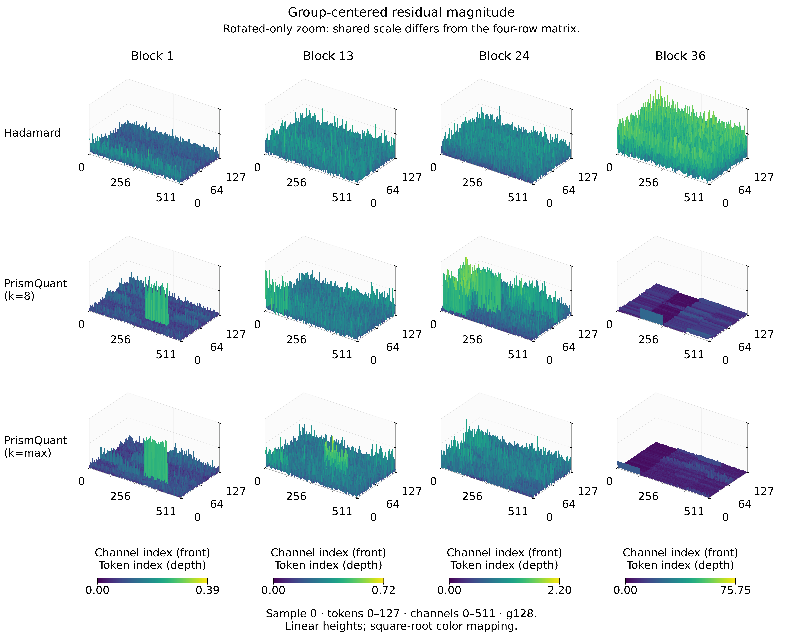

# Qwen3-8B activation diagnostics

Real Qwen/Qwen3-8B-Base activations, fixed sample 0 from eight WikiText-2 test windows. The current detail revision changes only presentation. Experimental metrics, frozen factors, quantizers and numerical limitations are unchanged.

[Revision report](figure_revision_report.md) · [Rendering contract](full_resolution_contract.md) · [Render settings](detail_render_config.json) · [Measured findings](measured_summary.md) · [Publication inventory](publication_manifest.json)

## Local surfaces



| Forward | Site | Raw detail | Residual detail | Full-domain context |
|---|---|---|---|---|
| paired_local | q_proj | [PDF](figures/paired_local/q_proj/raw/detail/matrix.pdf) | [PDF](figures/paired_local/q_proj/residual/detail/matrix.pdf) | [Raw overview](figures/paired_local/q_proj/raw/overview/matrix.pdf) · [Residual overview](figures/paired_local/q_proj/residual/overview/matrix.pdf) |
| paired_local | down_proj | [PDF](figures/paired_local/down_proj/raw/detail/matrix.pdf) | [PDF](figures/paired_local/down_proj/residual/detail/matrix.pdf) | [Raw overview](figures/paired_local/down_proj/raw/overview/matrix.pdf) · [Residual overview](figures/paired_local/down_proj/residual/overview/matrix.pdf) |
| end_to_end | q_proj | [PDF](figures/end_to_end/q_proj/raw/detail/matrix.pdf) | [PDF](figures/end_to_end/q_proj/residual/detail/matrix.pdf) | [Raw overview](figures/end_to_end/q_proj/raw/overview/matrix.pdf) · [Residual overview](figures/end_to_end/q_proj/residual/overview/matrix.pdf) |
| end_to_end | down_proj | [PDF](figures/end_to_end/down_proj/raw/detail/matrix.pdf) | [PDF](figures/end_to_end/down_proj/residual/detail/matrix.pdf) | [Raw overview](figures/end_to_end/down_proj/raw/overview/matrix.pdf) · [Residual overview](figures/end_to_end/down_proj/residual/overview/matrix.pdf) |

Every detail directory contains `matrix`, `matrix_linear`, `rotated_only_zoom`, method rows and individual panels in PDF, PNG and SVG. Each column has its own measured-unit colorbar. Raw magnitudes may remain similar between methods; no visual separation is imposed.

Detail uses exactly tokens [0,128), channels [0,512), sample 0 and four g128 groups. Raw heights are abs(Y). Residual heights are abs(Y − mean_group(Y)), with the signed mean computed on full Y before slicing. Heights are linear; only color uses fixed square-root mapping. All methods use the same window and camera. The separate rotated-only view has a different, explicitly shared scale.

The unrotated row is an unquantized norm-fused FP32 reference. In end-to-end matrices it comes from the matching paired_local/unrotated cache. Its input IDs, sample, layer, site and norm-fusion metadata are checked; the three quantized forwards include upstream QDQ and are not claimed to share identical intermediate inputs.

Full-domain overviews remain available, unchanged from the preceding publication. Their historical solid geometry is documented in the archived full-resolution contract; it is not used for current local detail. Overview and detail are independent assets. Metrics and exact ECDF values/counts retain all eight full samples. The local window is not an exhaustive model-outlier survey.

Four-column matrices use 11.75 pt text at 12.05-inch export width, retaining 7.02 pt text when inserted at 7.2 inches (183 mm). Individual panels use 8.5 pt native text and remain readable at 3.5-inch insertion width. Channel ticks 0, 256 and 511 and token ticks 0, 64 and 127 avoid crowding. All vertices are still drawn. Floor guides and short front-edge ticks mark the three g128 boundaries; per-column colorbars give the shared height/color limits. PDF/SVG axes and text are vector; only surface marks are rasterized.

## Numerical results and limitations

[Per-sample metrics](metrics_per_sample.csv) · [Full-data summary](metrics_summary.csv) · [Original measured interpretation](measured_summary.md) · [Validation](validation_report.json)

Required-check status: True. Overall all-checks status: False. The 3 supplementary failures below are retained at their original thresholds:

- rotation_inverse_relative, nar_k8, Block 36: 1.015363977785455e-05; threshold 1e-05.
- narrow_eight_output_compensated_linear_relative, nar_k8, Block 36: 5.357405825634487e-05; threshold 2e-05.
- narrow_eight_output_compensated_linear_relative, nar_kmax, Block 36: 5.118826811667532e-05; threshold 2e-05.

Group means are not actual quantizer offsets. Local raw peaks, group-centered residuals, signed group ranges and QDQ errors answer different questions. These figures do not create a new downstream-accuracy conclusion.

## Reproduction

The raw signed FP32 shards remain at `raw_activation_root` in [run_manifest.json](run_manifest.json). [activation_inventory.json](activation_inventory.json) records all 448 shard hashes. No model rerun is needed.

```bash
python -m nar.activation_viz.full_batch "$RAW_RUN" "$RUN" --workers 4
python -m nar.activation_viz.detail_checks "$RAW_RUN" "$RUN"
python -m nar.activation_viz.report "$RUN"
python -m nar.activation_viz.render_batch "$RUN" --audit-only
python -m nar.activation_viz.publish "$RUN" "$PUBLICATION_DIR"
```

This is a user-requested visualization revision. Earlier predeclared experiment rules and superseded display records are retained; the new window and color mapping are not presented as the original preregistration.
