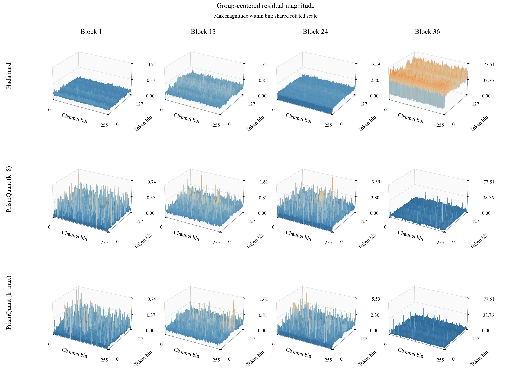

# Qwen3-8B activation diagnostics

Real Qwen/Qwen3-8B-Base forwards; 8 fixed WikiText-2 test windows of 2048 tokens. Rotation seed 0; sample selection seed 42. Main surfaces show sample 0; statistics use all samples at full resolution.

[Measured findings](measured_summary.md) · [Figure audit](qa/delivery_review.json) · [Publication inventory](publication_manifest.json)

## Figures



Main mechanism figures use paired local inputs. End-to-end figures separately show the three existing E22 W4A4KV4 evaluation rows; no unquantized reference is mislabelled as an end-to-end quantized row.

| Site | Raw magnitude | Group-centered residual | Range distribution |
|---|---|---|---|
| down_proj | [Overview](figures/paired_local/down_proj/raw/overview/matrix.png) · [Detail](figures/paired_local/down_proj/raw/detail/matrix.png) | [Overview](figures/paired_local/down_proj/residual/overview/matrix.png) · [Detail](figures/paired_local/down_proj/residual/detail/matrix.png) | [ECDF](figures/paired_local/down_proj/group_range_ecdf.pdf) |
| q_proj | [Overview](figures/paired_local/q_proj/raw/overview/matrix.png) · [Detail](figures/paired_local/q_proj/raw/detail/matrix.png) | [Overview](figures/paired_local/q_proj/residual/overview/matrix.png) · [Detail](figures/paired_local/q_proj/residual/detail/matrix.png) | [ECDF](figures/paired_local/q_proj/group_range_ecdf.pdf) |

PDF and SVG siblings accompany every PNG; individual panels and method rows are in the same directories. Overview colors encode max magnitude within each bin. Zero-based bin IDs map to exact token/channel edges in display_cache.npz. Different block columns may use different z limits; comparisons across methods within a column share z and color limits.

## Full-resolution paired results

NMSE is pooled error energy divided by pooled activation energy. rho is pooled signed group-mean energy divided by activation energy. Range means include all non-padding token/group observations. Sample variability is in metrics_summary.csv; these eight windows are descriptive replicates, not independently trained models.

| Site | Block | Method | NMSE | rho | Mean group range | Token 0 energy fraction |
|---|---:|---|---:|---:|---:|---:|
| q_proj | 1 | Unrotated | 0.02 | 7.70e-03 | 6.40 | 4.88e-04 |
| q_proj | 1 | Hadamard | 9.77e-03 | 0.01 | 5.14 | 4.88e-04 |
| q_proj | 1 | PrismQuant (k=8) | 9.09e-03 | 0.02 | 4.89 | 4.88e-04 |
| q_proj | 1 | PrismQuant (k=max) | 9.04e-03 | 0.04 | 4.87 | 4.88e-04 |
| down_proj | 1 | Unrotated | 0.05 | 7.87e-03 | 0.20 | 5.49e-03 |
| down_proj | 1 | Hadamard | 7.94e-03 | 8.09e-03 | 0.13 | 5.49e-03 |
| down_proj | 1 | PrismQuant (k=8) | 4.49e-03 | 0.07 | 0.08 | 5.49e-03 |
| down_proj | 1 | PrismQuant (k=max) | 4.19e-03 | 0.20 | 0.08 | 5.49e-03 |
| q_proj | 13 | Unrotated | 0.04 | 7.43e-03 | 8.22 | 4.88e-04 |
| q_proj | 13 | Hadamard | 9.43e-03 | 3.99e-03 | 5.06 | 4.88e-04 |
| q_proj | 13 | PrismQuant (k=8) | 6.48e-03 | 0.28 | 4.16 | 4.88e-04 |
| q_proj | 13 | PrismQuant (k=max) | 5.97e-03 | 0.35 | 3.99 | 4.88e-04 |
| down_proj | 13 | Unrotated | 0.03 | 7.79e-03 | 0.78 | 7.63e-04 |
| down_proj | 13 | Hadamard | 9.88e-03 | 7.47e-03 | 0.52 | 7.63e-04 |
| down_proj | 13 | PrismQuant (k=8) | 7.64e-03 | 0.13 | 0.45 | 7.63e-04 |
| down_proj | 13 | PrismQuant (k=max) | 6.60e-03 | 0.26 | 0.42 | 7.63e-04 |
| q_proj | 24 | Unrotated | 0.04 | 8.18e-03 | 8.20 | 4.88e-04 |
| q_proj | 24 | Hadamard | 9.51e-03 | 4.08e-03 | 5.08 | 4.88e-04 |
| q_proj | 24 | PrismQuant (k=8) | 5.72e-03 | 0.37 | 3.90 | 4.88e-04 |
| q_proj | 24 | PrismQuant (k=max) | 5.04e-03 | 0.47 | 3.67 | 4.88e-04 |
| down_proj | 24 | Unrotated | 0.04 | 7.87e-03 | 2.67 | 3.77e-06 |
| down_proj | 24 | Hadamard | 9.61e-03 | 7.97e-03 | 1.57 | 3.77e-06 |
| down_proj | 24 | PrismQuant (k=8) | 6.30e-03 | 0.09 | 1.22 | 3.77e-06 |
| down_proj | 24 | PrismQuant (k=max) | 5.59e-03 | 0.23 | 1.15 | 3.77e-06 |
| q_proj | 36 | Unrotated | 0.05 | 8.20e-03 | 6.03 | 4.88e-04 |
| q_proj | 36 | Hadamard | 8.06e-03 | 2.59e-03 | 4.68 | 4.88e-04 |
| q_proj | 36 | PrismQuant (k=8) | 3.72e-03 | 0.49 | 3.05 | 4.88e-04 |
| q_proj | 36 | PrismQuant (k=max) | 3.43e-03 | 0.55 | 2.93 | 4.88e-04 |
| down_proj | 36 | Unrotated | 0.08 | 8.05e-03 | 73.03 | 8.82e-05 |
| down_proj | 36 | Hadamard | 6.07e-03 | 4.84e-04 | 68.97 | 8.82e-05 |
| down_proj | 36 | PrismQuant (k=8) | 6.44e-05 | 0.99 | 6.53 | 8.82e-05 |
| down_proj | 36 | PrismQuant (k=max) | 3.74e-05 | 0.99 | 4.95 | 8.82e-05 |

## Numerical validation

Required-check status: True. Overall all-checks status: False.

Frozen factors are reused unchanged. Supplementary failures are retained at their original thresholds:

- rotation_inverse_relative, nar_k8, Block 36: 1.02e-05; threshold 1.00e-05.
- narrow_eight_output_compensated_linear_relative, nar_k8, Block 36: 5.36e-05; threshold 2.00e-05.
- narrow_eight_output_compensated_linear_relative, nar_kmax, Block 36: 5.12e-05; threshold 2.00e-05.

The initial eight-output-row projection probes are retained alongside checks of all actual output channels on the same real tokens. This explicitly broadens the tested operator; it does not make the narrow-probe failures pass. See the predeclared contract addendum and archived failed probes. Stored reflectors have small normalization deviations; these diagnostic figures are not a claim of exact finite-precision orthogonality.


## Interpretation boundaries

Group centering removes a common component for visualization. It preserves every signed group range (verified numerically) and is not an extra deployed operation. Its mean is not the quantizer offset. Raw peak suppression, residual energy, range, and actual QDQ error answer different questions. A local NMSE change alone does not establish perplexity or downstream accuracy. Large token-0 activations alone do not establish attention-sink causality. Rotated channels represent a new basis.

## Provenance and reproduction

[Run manifest](run_manifest.json) · [Capture sites](capture_site_report.md) · [Validation](validation_report.json) · [Predeclared contract](figure_contract.md) · [Captions](captions.tex) · [Per-sample metrics](metrics_per_sample.csv) · [Pooled metrics](metrics_summary.csv).

Full signed FP32 tensors are retained at raw_activation_root in the run manifest; activation_inventory.json records every shard hash and shared canonical input hash. Binary checkpoints and multi-GB raw shards are not committed to Git. The compact display cache is derived only from sample 0; all statistics use full-resolution shards.

Style reference: [SpinQuant Appendix C, Figures 8 and 9](https://arxiv.org/pdf/2405.16406). These Qwen3 measurements and their fixed layer/sample choices are independent of the Llama illustrations in that paper.

```bash
python -m nar.activation_viz.capture --workdir "$NAR_WORKDIR" --output "$RUN"
python -m nar.activation_viz.metrics "$RUN" --device cuda
python -m nar.activation_viz.plot "$RUN"
python -m nar.activation_viz.report "$RUN"
python -m nar.activation_viz.summarize "$RUN"
python -m nar.activation_viz.render_batch "$RUN" --audit-only
python -m nar.activation_viz.publish "$RUN" "$PUBLICATION_DIR"
```
