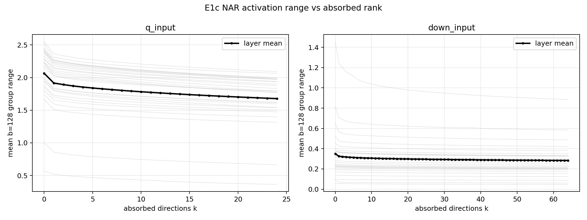
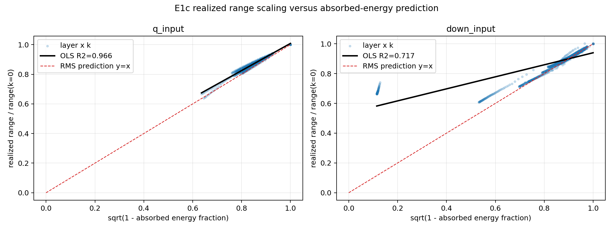
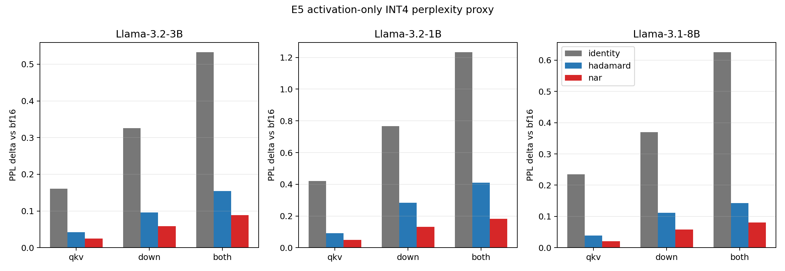
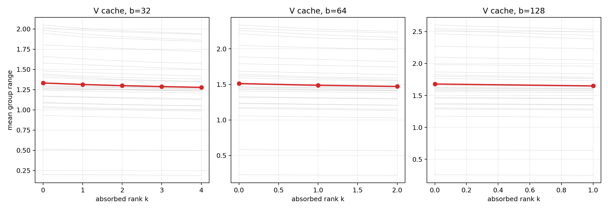
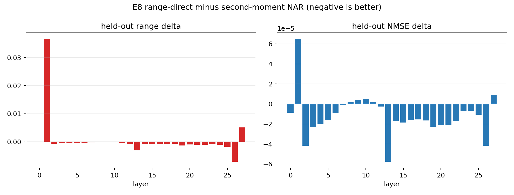
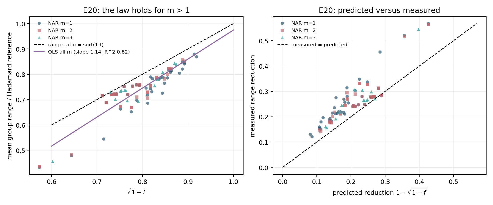

Naming: the method is PrismQuant in the paper. Code, CSV method columns and artifact filenames retain the development name 'nar' (nar_k8 = PrismQuant k=8, nar_kmax = PrismQuant k=max, etc.). The development abbreviation was retired because 'NAR' is the established abbreviation for non-autoregressive in NLP.

# PrismQuant offline tensor validation — corrected gate and activation extension

## Outcome

The original b=128 K phenomenon gate was dimensionally mis-specified: head_dim=128 gives only one b=128 group and therefore one DC slot. It is retained as an archival measurement, not used for the E1 decision. The valid pre-registered K gates are b=32 and b=64; no E1 or E2 row was rerun.

- **Corrected E1 K criterion: PASS**. b=32: range reduction 20.489%, attribution 26.954%, held-out retention 99.900%; b=64: range reduction 12.612%, attribution 20.667%, held-out retention 99.307%.
- **E2 criterion over every frozen NAR row: PASS**. Every E2 result remains valid and is listed below.
- **Corrected method-promising criterion: PASS**.
- **E0 implementation sanity: PASS**.

## Frozen protocol and comparison rules

All comparisons are paired on identical tensors. Dynamic asymmetric INT4 uses one fp16 scale and one fp16 real-valued offset for each group and NMSE is `sum((x_hat-x)^2)/sum(x^2)`. No weight quantization, GPTQ, configuration search, or end-to-end W4A4 run was performed. E1b reads the prior K dump; E1c/E1d use one new forward capture of the same 128 WikiText-2 train sequences. E2 is read only.

## Corrected E1 — frozen K results

| b | method | mean range | mean NMSE |
|---|---|---|---|
| 32 | bf16 | 8.93598 | 0 |
| 32 | hadamard | 7.72264 | 0.00587887 |
| 32 | identity | 8.93598 | 0.0091897 |
| 32 | nar | 6.14034 | 0.00377166 |
| 32 | nar_rope | 6.94722 | 0.00485515 |
| 64 | bf16 | 12.1472 | 0 |
| 64 | hadamard | 8.6538 | 0.00757424 |
| 64 | identity | 12.1472 | 0.0159797 |
| 64 | nar | 7.56239 | 0.00583484 |
| 64 | nar_rope | 8.15062 | 0.00678913 |

| b | range reduction | top-k attribution | held-out retention | pass |
|---|---|---|---|---|
| 32 | 0.204892 | 0.269542 | 0.998999 | True |
| 64 | 0.126119 | 0.206672 | 0.993069 | True |

### NAR-RoPE is dominated and dropped

Plain NAR has lower range and lower NMSE than NAR-RoPE in every one of 28 layers at both valid group sizes; it also has lower PPL at every paired E2 seed where NAR-RoPE exists. NAR-RoPE is therefore strictly dominated in the observed comparisons and no further NAR-RoPE work was run.

| b | plain NAR lower-range layers | plain NAR lower-NMSE layers | layers |
|---|---|---|---|
| 32 | 28 | 28 | 28 |
| 64 | 28 | 28 | 28 |

## E1b — plain-NAR position check

The exact stored pre-RoPE K samples were re-rotated using model RoPE at positions 0/512/1024/2048. This is offline tensor analysis, not a model rerun.

| b | position | method | mean range | mean NMSE | reduction vs Had |
|---|---|---|---|---|---|
| 32 | 0 | bf16 | 9.00604 | 0 | -0.164264 |
| 32 | 0 | hadamard | 7.73433 | 0.00589957 | 0 |
| 32 | 0 | identity | 9.00604 | 0.00929213 | -0.164264 |
| 32 | 0 | nar | 6.22136 | 0.00386866 | 0.196025 |
| 32 | 512 | bf16 | 8.931 | 0 | -0.154981 |
| 32 | 512 | hadamard | 7.73475 | 0.00589262 | 0 |
| 32 | 512 | identity | 8.931 | 0.00918622 | -0.154981 |
| 32 | 512 | nar | 6.14909 | 0.00378298 | 0.205271 |
| 32 | 1024 | bf16 | 8.96045 | 0 | -0.157007 |
| 32 | 1024 | hadamard | 7.74547 | 0.00591224 | 0 |
| 32 | 1024 | identity | 8.96045 | 0.00922734 | -0.157007 |
| 32 | 1024 | nar | 6.12395 | 0.00375294 | 0.20978 |
| 32 | 2048 | bf16 | 8.94702 | 0 | -0.159807 |
| 32 | 2048 | hadamard | 7.71534 | 0.00586399 | 0 |
| 32 | 2048 | identity | 8.94702 | 0.00920616 | -0.159807 |
| 32 | 2048 | nar | 6.20574 | 0.00384567 | 0.196083 |
| 64 | 0 | bf16 | 12.2065 | 0 | -0.411703 |
| 64 | 0 | hadamard | 8.64831 | 0.0075586 | 0 |
| 64 | 0 | identity | 12.2065 | 0.016105 | -0.411703 |
| 64 | 0 | nar | 7.61476 | 0.00590891 | 0.119838 |
| 64 | 512 | bf16 | 12.1381 | 0 | -0.404233 |
| 64 | 512 | hadamard | 8.64453 | 0.0075604 | 0 |
| 64 | 512 | identity | 12.1381 | 0.0159692 | -0.404233 |
| 64 | 512 | nar | 7.57466 | 0.00585343 | 0.124286 |
| 64 | 1024 | bf16 | 12.162 | 0 | -0.40462 |
| 64 | 1024 | hadamard | 8.65966 | 0.00758353 | 0 |
| 64 | 1024 | identity | 12.162 | 0.0160262 | -0.40462 |
| 64 | 1024 | nar | 7.55689 | 0.0058241 | 0.127882 |
| 64 | 2048 | bf16 | 12.1451 | 0 | -0.401623 |
| 64 | 2048 | hadamard | 8.66659 | 0.00758866 | 0 |
| 64 | 2048 | identity | 12.1451 | 0.0159722 | -0.401623 |
| 64 | 2048 | nar | 7.6056 | 0.00588869 | 0.12267 |

## E1c — wide activation inputs, b=128

The dump retains every token as exact bf16 bit patterns at q_proj input (post-input-RMSNorm residual, n=3072, 24 DC slots) and down_proj input (post-SiLU gated MLP product, n=8192, 64 DC slots). Top directions use all 262144 tokens with a fixed randomized symmetric eigensolver: oversampling 16, one power iteration, three full passes, and published Ritz residuals. Range/NMSE and the greedy residual-energy permutation use positions `0,32,...,2016` from all 128 sequences (8192 paired token vectors per layer). Hadamard is a random-sign full-feature transform (H8192 or fixed Paley H12 tensor H256 for n=3072). Each NAR k uses low-energy fillers for unused DC slots and the same H128.

| site | method | layers | mean_group_range | mean_relative_quantization_error_nmse | mean_range_reduction_vs_hadamard | mean_nmse_delta_vs_hadamard |
|---|---|---|---|---|---|---|
| q_input | bf16 | 28 | 3.29754 | 0 | -0.531806 | -0.00991938 |
| q_input | identity | 28 | 3.29754 | 0.0265487 | -0.531806 | 0.0166294 |
| q_input | hadamard_full | 28 | 2.17381 | 0.00991938 | 0 | 0 |
| q_input | nar_kmax | 28 | 1.67804 | 0.00590774 | 0.23755 | -0.00401163 |
| down_input | bf16 | 28 | 0.644721 | 0 | -0.532605 | -0.00921417 |
| down_input | identity | 28 | 0.644721 | 0.0301795 | -0.532605 | 0.0209653 |
| down_input | hadamard_full | 28 | 0.407325 | 0.00921417 | 0 | 0 |
| down_input | nar_kmax | 28 | 0.282991 | 0.0057301 | 0.253007 | -0.00348407 |

Range reduction is shown both as a ratio of layer-mean ranges and as the mean of paired per-layer reductions:

| site | ratio of mean ranges | mean paired-layer reduction |
|---|---|---|
| q_input | 0.228065 | 0.23755 |
| down_input | 0.305247 | 0.253007 |

The fit is pooled OLS over paired layer-k rows, `range(k)/range(0) = intercept + slope*sqrt(1-f)`:

| site | fit | intercept | slope | r_squared | rmse | points |
|---|---|---|---|---|---|---|
| q_input | OLS normalized_range = intercept + slope * sqrt(1-f), pooled over paired layer-k rows | 0.0908306 | 0.917523 | 0.966019 | 0.0102667 | 700 |
| down_input | OLS normalized_range = intercept + slope * sqrt(1-f), pooled over paired layer-k rows | 0.536016 | 0.403782 | 0.716882 | 0.0402828 | 1820 |

Randomized eigenspace approximation quality (relative Ritz residual; every direction is in the exact CSV):

| site | median | max |
|---|---|---|
| down_input | 0.173612 | 0.338376 |
| q_input | 0.0942059 | 0.261449 |

## E1d — KIVI-style per-channel K baseline

At the same 4-bit width and b=32/64 metadata grouping, KIVI-style K quantization groups contiguous tokens independently per sequence/head/channel. Per-token methods group channels. All operate on the same full post-RoPE K dump; dominance is decided by global NMSE, with per-layer counts also reported.

| b | bits | method | axis | layers | mean_group_range | global_relative_quantization_error_nmse |
|---|---|---|---|---|---|---|
| 32 | 4 | bf16 | channels | 28 | 9.04655 | 0 |
| 32 | 4 | identity_per_token | channels | 28 | 9.04655 | 0.00920431 |
| 32 | 4 | hadamard_per_token | channels | 28 | 7.81505 | 0.00588228 |
| 32 | 4 | nar_per_token | channels | 28 | 6.21258 | 0.00377893 |
| 32 | 4 | kivi_per_channel | tokens | 28 | 4.01217 | 0.00174985 |
| 64 | 4 | bf16 | channels | 28 | 12.2864 | 0 |
| 64 | 4 | identity_per_token | channels | 28 | 12.2864 | 0.0160151 |
| 64 | 4 | hadamard_per_token | channels | 28 | 8.75643 | 0.00757454 |
| 64 | 4 | nar_per_token | channels | 28 | 7.65093 | 0.0058459 |
| 64 | 4 | kivi_per_channel | tokens | 28 | 4.71912 | 0.00245616 |

| b | kivi_beats_every_per_token_method_global_nmse | layers_where_kivi_beats_every_per_token_method_nmse | layers |
|---|---|---|---|
| 32 | True | 28 | 28 |
| 64 | True | 28 | 28 |

**Per-channel K is the clear winner in this test.** b=32: KIVI 0.00174985 vs best rotation NAR 0.00377893; b=64: KIVI 0.00245616 vs best rotation NAR 0.00584590. It beats every per-token method in all 28/28 layers at both group sizes. For K under these conditions, the standard per-channel axis is preferable to every tested per-token rotation method.

## E2 — frozen KV-only perplexity results

| model | b | method | seeds | mean_ppl | seed_ppl_std | paired_ppl_delta_vs_hadamard | paired_90ci_low | paired_90ci_high | seed_ppls |
|---|---|---|---|---|---|---|---|---|---|
| llama32_3b | 64 | bf16 | 3 | 7.61655 | 0 | -0.119123 | -0.12998 | -0.108267 | 7.61655149;7.61655149;7.61655149 |
| llama32_3b | 64 | hadamard | 3 | 7.73567 | 0.00643994 | 0 | 0 | 0 | 7.74296257;7.733312;7.73075024 |
| llama32_3b | 64 | identity | 3 | 7.80385 | 0 | 0.0681739 | 0.0573171 | 0.0790307 | 7.80384882;7.80384882;7.80384882 |
| llama32_3b | 64 | nar | 3 | 7.70657 | 0.00088966 | -0.029102 | -0.0392892 | -0.0189148 | 7.70725479;7.70556656;7.70689737 |
| llama32_3b | 64 | nar_rope | 3 | 7.72 | 0.00600981 | -0.0156717 | -0.0360164 | 0.00467304 | 7.71336694;7.72507847;7.72156437 |
| llama32_3b | 128 | bf16 | 3 | 7.61655 | 0 | -0.165856 | -0.175301 | -0.15641 | 7.61655149;7.61655149;7.61655149 |
| llama32_3b | 128 | hadamard | 3 | 7.78241 | 0.00560303 | 0 | 0 | 0 | 7.78166119;7.78834558;7.77721422 |
| llama32_3b | 128 | identity | 3 | 8.00706 | 0 | 0.224652 | 0.215206 | 0.234098 | 8.00705928;8.00705928;8.00705928 |
| llama32_3b | 128 | nar | 3 | 7.76527 | 0.00109193 | -0.0171341 | -0.0278942 | -0.00637397 | 7.76443563;7.76487511;7.76650796 |
| llama32_1b | 32 | bf16 | 3 | 9.52734 | 0 | -0.374289 | -0.393114 | -0.355464 | 9.52734406;9.52734406;9.52734406 |
| llama32_1b | 32 | hadamard | 3 | 9.90163 | 0.0111664 | 0 | 0 | 0 | 9.90776974;9.90838613;9.8887445 |
| llama32_1b | 32 | identity | 3 | 10.0253 | 0 | 0.123619 | 0.104794 | 0.142444 | 10.0252528;10.0252528;10.0252528 |
| llama32_1b | 32 | nar | 3 | 9.78784 | 0.00647878 | -0.113791 | -0.123403 | -0.104178 | 9.7886786;9.79386273;9.78098635 |
| llama32_1b | 32 | nar_rope | 3 | 9.83579 | 0.00640406 | -0.0658458 | -0.0945095 | -0.0371821 | 9.83604074;9.82926079;9.8420614 |

## Negative findings, caveats, and what remains unsure

- NAR-RoPE is dominated by plain NAR in every available paired check and is no longer pursued.
- KIVI-style per-channel K beats every tested per-token rotation by global NMSE and in every layer at both b=32/64.
- The E1c eigenspaces are deterministic randomized approximations, not dense 8192x8192 decompositions; Ritz residuals are published per direction and are non-negligible for tail directions.
- E1c stores all tokens and uses all of them for the top-direction solve, but evaluates range/NMSE and balances Pi on a fixed position stride to bound repeated k-sweep cost.
- Per-channel and per-token range means describe different axes, so E1d fairness is decided by paired NMSE; metadata count and bit width are matched.
- E1c dumps are deliberately retained under project storage for the separately scoped E3 FP4 E2M1 and E4 two-level NVFP4 checks.

## Go / no-go

**GO to the already-scoped activation-shape checks, without tuning.** This decision uses b=32/64 K E1 and every frozen E2 row; the newly measured E1c/E1d results are mechanistic follow-ups and are reported regardless of sign.

## Reproduction artifacts

Exact tables and plots are under `results/`; commands and logs are under `runs/`. Large raw bf16 dumps and randomized eigenspace checkpoints remain under `activations/` in project storage and are excluded from Git.

# Activation continuation — E5–E8

## Scope decision

K is closed: KIVI-style per-channel quantization remains the clear K result, consistent with the zero-point null-space interpretation because channel-persistent outliers are constant along the token grouping axis. No additional K experiment was run. E5–E8 concern activation sites where per-token quantization is forced, plus the standard per-token V cache.

## E5 — activation-only perplexity proxy

Only post-RMSNorm q/k/v inputs and/or down_proj inputs are dynamically asymmetric group-128 INT4 fake-quantized. Scale and real-valued offset are fp16. Weights remain bf16; each activation rotation is folded algebraically into the corresponding q/k/v or down_proj weight rows. KV and all other activations remain bf16. Results use the same 64 WikiText-2 test chunks, three paired rotation seeds, and two-sided paired 90% Student-t intervals over seed-level PPL differences. The 8B model was included because a GPU was available.

| model | site | method | mean_ppl | ppl_delta_vs_bf16 | paired_ppl_delta_vs_hadamard | paired_90ci_low_vs_hadamard | paired_90ci_high_vs_hadamard | paired_ppl_delta_vs_identity | paired_90ci_low_vs_identity | paired_90ci_high_vs_identity |
|---|---|---|---|---|---|---|---|---|---|---|
| Llama-3.2-3B | none | bf16 | 7.61682 | 0 | N/A | N/A | N/A | N/A | N/A | N/A |
| Llama-3.2-3B | q/k/v only | identity | 7.77782 | 0.160991 | 0.119214 | 0.113259 | 0.12517 | 0 | 0 | 0 |
| Llama-3.2-3B | q/k/v only | hadamard | 7.6586 | 0.0417771 | 0 | 0 | 0 | -0.119214 | -0.12517 | -0.113259 |
| Llama-3.2-3B | q/k/v only | nar | 7.64166 | 0.0248368 | -0.0169403 | -0.02332 | -0.0105605 | -0.136155 | -0.144086 | -0.128223 |
| Llama-3.2-3B | both sites | identity | 8.14979 | 0.532965 | 0.37866 | 0.368303 | 0.389017 | 0 | 0 | 0 |
| Llama-3.2-3B | both sites | hadamard | 7.77113 | 0.154305 | 0 | 0 | 0 | -0.37866 | -0.389017 | -0.368303 |
| Llama-3.2-3B | both sites | nar | 7.70528 | 0.0884571 | -0.0658479 | -0.0926304 | -0.0390653 | -0.444508 | -0.461528 | -0.427488 |
| Llama-3.2-3B | down_proj only | identity | 7.94256 | 0.32574 | 0.229991 | 0.225224 | 0.234758 | 0 | 0 | 0 |
| Llama-3.2-3B | down_proj only | hadamard | 7.71257 | 0.0957489 | 0 | 0 | 0 | -0.229991 | -0.234758 | -0.225224 |
| Llama-3.2-3B | down_proj only | nar | 7.67539 | 0.0585638 | -0.037185 | -0.0412283 | -0.0331418 | -0.267176 | -0.269692 | -0.264661 |
| Llama-3.2-1B | none | bf16 | 9.52761 | 0 | N/A | N/A | N/A | N/A | N/A | N/A |
| Llama-3.2-1B | q/k/v only | identity | 9.94736 | 0.419758 | 0.327455 | 0.320098 | 0.334812 | 0 | 0 | 0 |
| Llama-3.2-1B | q/k/v only | hadamard | 9.61991 | 0.0923027 | 0 | 0 | 0 | -0.327455 | -0.334812 | -0.320098 |
| Llama-3.2-1B | q/k/v only | nar | 9.57707 | 0.04946 | -0.0428427 | -0.0533558 | -0.0323296 | -0.370298 | -0.383379 | -0.357217 |
| Llama-3.2-1B | both sites | identity | 10.7611 | 1.23352 | 0.823906 | 0.797587 | 0.850225 | 0 | 0 | 0 |
| Llama-3.2-1B | both sites | hadamard | 9.93722 | 0.409615 | 0 | 0 | 0 | -0.823906 | -0.850225 | -0.797587 |
| Llama-3.2-1B | both sites | nar | 9.71078 | 0.183174 | -0.226441 | -0.256454 | -0.196429 | -1.05035 | -1.05695 | -1.04374 |
| Llama-3.2-1B | down_proj only | identity | 10.2945 | 0.766851 | 0.483249 | 0.463142 | 0.503355 | 0 | 0 | 0 |
| Llama-3.2-1B | down_proj only | hadamard | 9.81121 | 0.283603 | 0 | 0 | 0 | -0.483249 | -0.503355 | -0.463142 |
| Llama-3.2-1B | down_proj only | nar | 9.65874 | 0.131138 | -0.152464 | -0.175749 | -0.12918 | -0.635713 | -0.638895 | -0.63253 |
| Llama-3.1-8B | none | bf16 | 6.20401 | 0 | N/A | N/A | N/A | N/A | N/A | N/A |
| Llama-3.1-8B | q/k/v only | identity | 6.43919 | 0.235182 | 0.196255 | 0.182628 | 0.209882 | 0 | 0 | 0 |
| Llama-3.1-8B | q/k/v only | hadamard | 6.24293 | 0.0389269 | 0 | 0 | 0 | -0.196255 | -0.209882 | -0.182628 |
| Llama-3.1-8B | q/k/v only | nar | 6.2245 | 0.0204964 | -0.0184306 | -0.0299405 | -0.00692064 | -0.214685 | -0.216913 | -0.212458 |
| Llama-3.1-8B | both sites | identity | 6.82967 | 0.625668 | 0.483414 | 0.4814 | 0.485429 | 0 | 0 | 0 |
| Llama-3.1-8B | both sites | hadamard | 6.34626 | 0.142254 | 0 | 0 | 0 | -0.483414 | -0.485429 | -0.4814 |
| Llama-3.1-8B | both sites | nar | 6.28493 | 0.0809206 | -0.0613332 | -0.0662591 | -0.0564072 | -0.544747 | -0.548787 | -0.540708 |
| Llama-3.1-8B | down_proj only | identity | 6.57405 | 0.37004 | 0.258632 | 0.254754 | 0.262509 | 0 | 0 | 0 |
| Llama-3.1-8B | down_proj only | hadamard | 6.31542 | 0.111408 | 0 | 0 | 0 | -0.258632 | -0.262509 | -0.254754 |
| Llama-3.1-8B | down_proj only | nar | 6.26217 | 0.0581632 | -0.0532453 | -0.0569542 | -0.0495364 | -0.311877 | -0.312873 | -0.310881 |

Paired NAR results:

- Llama-3.2-3B q/k/v only: NAR-Hadamard -0.016940 (90% CI [-0.023320, -0.010561]), NAR-identity -0.136155
- Llama-3.2-3B both sites: NAR-Hadamard -0.065848 (90% CI [-0.092630, -0.039065]), NAR-identity -0.444508
- Llama-3.2-3B down_proj only: NAR-Hadamard -0.037185 (90% CI [-0.041228, -0.033142]), NAR-identity -0.267176
- Llama-3.2-1B q/k/v only: NAR-Hadamard -0.042843 (90% CI [-0.053356, -0.032330]), NAR-identity -0.370298
- Llama-3.2-1B both sites: NAR-Hadamard -0.226441 (90% CI [-0.256454, -0.196429]), NAR-identity -1.050347
- Llama-3.2-1B down_proj only: NAR-Hadamard -0.152464 (90% CI [-0.175749, -0.129180]), NAR-identity -0.635713
- Llama-3.1-8B q/k/v only: NAR-Hadamard -0.018431 (90% CI [-0.029940, -0.006921]), NAR-identity -0.214685
- Llama-3.1-8B both sites: NAR-Hadamard -0.061333 (90% CI [-0.066259, -0.056407]), NAR-identity -0.544747
- Llama-3.1-8B down_proj only: NAR-Hadamard -0.053245 (90% CI [-0.056954, -0.049536]), NAR-identity -0.311877

The maximum measured relative output discrepancy from storing the algebraically folded weights in bf16 was 0.00307489; this rounding is included in every rotated-method PPL result. No post-result tuning was performed.

## E6 — factorized R4 online cost

For the 3B down_proj input, G(V) is implemented as 64 sequential Householder reflections (below the 2k=128 cap), followed by a fixed permutation, signs, and block H128. The dense 8192x8192 matrix is materialized only for the equivalence audit, not the benchmark implementation.

| tokens | householder_reflections | nar_flops_per_token | down_matmul_flops_per_token | nar_flop_ratio_vs_matmul | nar_ms | hadamard_ms | down_matmul_ms | nar_wall_ratio_vs_hadamard | nar_wall_ratio_vs_down_matmul | nar_exceeds_10pct_matmul_wall |
|---|---|---|---|---|---|---|---|---|---|---|
| 1 | 64 | 2162688 | 50331648 | 0.0429688 | 2.71507 | 0.303247 | 0.0186059 | 8.95332 | 145.925 | True |
| 32 | 64 | 2162688 | 50331648 | 0.0429688 | 3.29121 | 0.302085 | 0.0231595 | 10.895 | 142.111 | True |
| 2048 | 64 | 2162688 | 50331648 | 0.0429688 | 12.8809 | 2.61599 | 0.511313 | 4.92393 | 25.1919 | True |

Factorized-versus-dense fp32 verification: max absolute error 1.90735e-06, relative L2 error 3.65942e-07. **Engineering check: FAIL. The measured unfused wall-clock cost exceeds 10% of down_proj matmul cost.**

## E7 — per-token V cache under NAR

V is rotated within each KV head before dynamic asymmetric per-token INT4. The same R^T is folded blockwise into o_proj input columns (R2 position); the reported range/NMSE is offline and paired on identical V samples.

| b | method | layers | mean_group_range | mean_relative_quantization_error_nmse | mean_range_reduction_vs_hadamard | mean_nmse_delta_vs_hadamard |
|---|---|---|---|---|---|---|
| 32 | bf16 | 28 | 1.42223 | 0 | -0.0618682 | -0.00608396 |
| 32 | identity | 28 | 1.42223 | 0.00713789 | -0.0618682 | 0.00105393 |
| 32 | hadamard | 28 | 1.34693 | 0.00608396 | 0 | 0 |
| 32 | nar | 28 | 1.27817 | 0.00551637 | 0.0489613 | -0.000567584 |
| 64 | bf16 | 28 | 1.68782 | 0 | -0.118639 | -0.00795434 |
| 64 | identity | 28 | 1.68782 | 0.0103286 | -0.118639 | 0.00237422 |
| 64 | hadamard | 28 | 1.52233 | 0.00795434 | 0 | 0 |
| 64 | nar | 28 | 1.47109 | 0.0074602 | 0.0316668 | -0.000494145 |
| 128 | bf16 | 28 | 1.98227 | 0 | -0.190937 | -0.00983341 |
| 128 | identity | 28 | 1.98227 | 0.0144255 | -0.190937 | 0.00459208 |
| 128 | hadamard | 28 | 1.68325 | 0.00983341 | 0 | 0 |
| 128 | nar | 28 | 1.64935 | 0.00945025 | 0.0183523 | -0.000383152 |

The pooled fits `range(k)/range(0) = intercept + slope*sqrt(1-f)` are:

| model | b | intercept | slope | r_squared | rmse | points | fit |
|---|---|---|---|---|---|---|---|
| llama32_3b | 32 | 0.403757 | 0.59478 | 0.939523 | 0.00383579 | 140 | OLS range(k)/range(k=0) = intercept + slope*sqrt(1-f), pooled layer-k |
| llama32_3b | 64 | 0.385151 | 0.613609 | 0.950611 | 0.00271933 | 84 | OLS range(k)/range(k=0) = intercept + slope*sqrt(1-f), pooled layer-k |
| llama32_3b | 128 | 0.344142 | 0.655245 | 0.959319 | 0.00200938 | 56 | OLS range(k)/range(k=0) = intercept + slope*sqrt(1-f), pooled layer-k |

The o_proj fold identity has maximum fp64 absolute discrepancy 1.52095e-07.

## E8 — one-shot range-direct refinement

Starting from the frozen second-moment down_input V, each layer receives exactly 200 projected Riemannian-gradient steps with QR retraction, p=8, one seed, learning rate 0.05, and unit-Frobenius tangent normalization. Pi and signs remain fixed. Calibration uses cal-A samples; evaluation uses the next 128 disjoint WikiText-2 train chunks (cal-B). These choices were not changed after observing results.

| split | method | layers | mean_group_range | mean_relative_quantization_error_nmse | mean_range_delta_vs_second_moment | mean_nmse_delta_vs_second_moment |
|---|---|---|---|---|---|---|
| calibration_a | second_moment | 28 | 0.282987 | 0.00572961 | 0 | 0 |
| calibration_a | range_direct | 28 | 0.28044 | 0.00559949 | -0.00254689 | -0.000130127 |
| heldout_cal_b | second_moment | 28 | 0.286174 | 0.00591952 | 0 | 0 |
| heldout_cal_b | range_direct | 28 | 0.286734 | 0.00590786 | 0.000559774 | -1.16599e-05 |

Held-out sign: mean range did not improve (26/28 layers); mean NMSE improved (22/28 layers). This diagnostic is reported as-is.

## Artifact retention and protocol integrity

The original E1c q_input/down_input bf16 dumps remain untouched for E3/E4. E7 and E8 add separate V-cal-A and down-cal-B sampled dumps under project storage; none of the raw dumps enter Git. All result tables, completion metadata, factorization audits, plots, Slurm transcripts, and commands are published. E1/E2/E1c results were not rerun or modified.

# E11 — fair baselines in the E5 setting

The E5 bf16, both-site Hadamard, and both-site NAR rows are reused verbatim. New rows use the identical 64 WikiText-2 test chunks and three paired rotation seeds; only post-RMSNorm q/k/v inputs and down_proj inputs are fake-quantized. There was no sweep or post-result tuning.

| model | method | mean_ppl | ppl_delta_vs_bf16 | effective_bits_qkv | effective_bits_down | delta_vs_Had_90CI | delta_vs_NAR_90CI |
|---|---|---|---|---|---|---|---|
| Llama-3.2-3B | bf16 | 7.61682 | 0 | 16 | 16 | N/A | N/A |
| Llama-3.2-3B | Hadamard, asym g128 (E5) | 7.77113 | 0.154305 | 4.25 | 4.25 | 0.000000 [0.000000, 0.000000] | 0.065848 [0.039065, 0.092630] |
| Llama-3.2-3B | NAR, asym g128, kmax (E5) | 7.70528 | 0.0884571 | 4.25 | 4.25 | -0.065848 [-0.092630, -0.039065] | 0.000000 [0.000000, 0.000000] |
| Llama-3.2-3B | SmoothQuant + Hadamard, asym g128 | 7.79104 | 0.174213 | 4.25 | 4.25 | 0.019908 [0.012168, 0.027649] | 0.085756 [0.066702, 0.104811] |
| Llama-3.2-3B | DuQuant-style, asym g128 | 7.75416 | 0.137335 | 4.25 | 4.25 | -0.016970 [-0.033445, -0.000494] | 0.048878 [0.036346, 0.061410] |
| Llama-3.2-3B | Hadamard, symmetric per-token | 8.01395 | 0.397129 | 4.00521 | 4.00195 | 0.242824 [0.236481, 0.249167] | 0.308672 [0.276337, 0.341007] |
| Llama-3.2-3B | Hadamard, asymmetric per-token | 7.91562 | 0.298799 | 4.01042 | 4.00391 | 0.144494 [0.131128, 0.157861] | 0.210342 [0.185714, 0.234970] |
| Llama-3.2-3B | NAR, asym g64, kmax | 7.68077 | 0.0639417 | 4.5 | 4.5 | -0.090363 [-0.101278, -0.079449] | -0.024515 [-0.041228, -0.007803] |
| Llama-3.2-3B | NAR, asym g256, kmax | 7.72464 | 0.107813 | 4.125 | 4.125 | -0.046492 [-0.050932, -0.042051] | 0.019356 [-0.003931, 0.042643] |
| Llama-3.2-3B | NAR, asym g128, k=8 | 7.71159 | 0.094766 | 4.25 | 4.25 | -0.059539 [-0.072446, -0.046632] | 0.006309 [-0.007644, 0.020262] |
| Llama-3.2-3B | NAR, asym g128, k=16 | 7.71202 | 0.0952 | 4.25 | 4.25 | -0.059105 [-0.063637, -0.054573] | 0.006743 [-0.015614, 0.029099] |
| Llama-3.2-3B | NAR, asym g128, k=32 | 7.70651 | 0.0896842 | 4.25 | 4.25 | -0.064621 [-0.075694, -0.053547] | 0.001227 [-0.014526, 0.016980] |
| Llama-3.1-8B | bf16 | 6.20401 | 0 | 16 | 16 | N/A | N/A |
| Llama-3.1-8B | Hadamard, asym g128 (E5) | 6.34626 | 0.142254 | 4.25 | 4.25 | 0.000000 [0.000000, 0.000000] | 0.061333 [0.056407, 0.066259] |
| Llama-3.1-8B | NAR, asym g128, kmax (E5) | 6.28493 | 0.0809206 | 4.25 | 4.25 | -0.061333 [-0.066259, -0.056407] | 0.000000 [0.000000, 0.000000] |
| Llama-3.1-8B | SmoothQuant + Hadamard, asym g128 | 6.35792 | 0.153913 | 4.25 | 4.25 | 0.011659 [0.008521, 0.014797] | 0.072992 [0.066167, 0.079817] |
| Llama-3.1-8B | DuQuant-style, asym g128 | 6.33393 | 0.129926 | 4.25 | 4.25 | -0.012327 [-0.016047, -0.008608] | 0.049006 [0.041183, 0.056828] |
| Llama-3.1-8B | Hadamard, symmetric per-token | 6.61061 | 0.406607 | 4.00391 | 4.00112 | 0.264353 [0.257897, 0.270808] | 0.325686 [0.314309, 0.337063] |
| Llama-3.1-8B | Hadamard, asymmetric per-token | 6.51651 | 0.312501 | 4.00781 | 4.00223 | 0.170247 [0.166250, 0.174245] | 0.231581 [0.226431, 0.236730] |
| Llama-3.1-8B | NAR, asym g64, kmax | 6.26141 | 0.0574021 | 4.5 | 4.5 | -0.084852 [-0.085437, -0.084266] | -0.023518 [-0.028449, -0.018588] |
| Llama-3.1-8B | NAR, asym g256, kmax | 6.30517 | 0.101158 | 4.125 | 4.125 | -0.041096 [-0.050918, -0.031273] | 0.020238 [0.014311, 0.026164] |
| Llama-3.1-8B | NAR, asym g128, k=8 | 6.29571 | 0.0917042 | 4.25 | 4.25 | -0.050550 [-0.054498, -0.046601] | 0.010784 [0.003442, 0.018125] |
| Llama-3.1-8B | NAR, asym g128, k=16 | 6.29542 | 0.0914089 | 4.25 | 4.25 | -0.050845 [-0.056853, -0.044837] | 0.010488 [0.008392, 0.012584] |
| Llama-3.1-8B | NAR, asym g128, k=32 | 6.28904 | 0.0850314 | 4.25 | 4.25 | -0.057222 [-0.062285, -0.052160] | 0.004111 [-0.005529, 0.013751] |

Effective activation bits/value include fp16 metadata: asymmetric group-g uses 4 + 32/g bits (one fp16 scale and one fp16 real-valued zero-point per group); symmetric per-token uses 4 + 16/n; asymmetric per-token uses 4 + 32/n. SmoothQuant channel scales are statically folded into bf16 weights and therefore add no per-token metadata.

## Baseline construction audit

SmoothQuant uses the fixed standard alpha=0.5 rule s_c=max|x_c|^0.5/max|w_c|^0.5, applies x/s and W*s, and then the same random-sign full Hadamard.

The DuQuant-style row was implemented after reading the [pinned official code](https://github.com/Hsu1023/DuQuant/tree/d56cfc6fe97c34c0eb100fec82fe439865905679) and the [NeurIPS 2024 paper](https://papers.nips.cc/paper_files/paper/2024/file/9febda1c8344cc5f2d51713964864e93-Paper-Conference.pdf). It uses the official zigzag distribution based on calibration-channel absolute maxima; within every resulting block of 128 it maps the single largest channel row to the uniform direction and uses a seeded random orthogonal basis on the complement. The official implementation can apply a greedy multi-step rotation, retain the prefix minimizing range, permute, and apply a second greedy rotation. The requested fair row deliberately omits that global multi-step prefix and second post-permutation rotation. Relative to NAR it aligns one greedy channel per block rather than top-k second-moment eigen-directions and has no explicit DC/zero-point alignment.

For Llama-3.2-3B q/k/v, requested k=32 is dimension-capped to the 24 available group-128 DC slots; all other reported k values are realized as requested. E11 calibration used the same 128 sequences, three-pass randomized eigensolver, and stride-32 permutation-energy sample. Full eigenvalue/energy/Ritz-residual CSVs are retained; transient eigenvector checkpoints were discarded after factor construction to respect project quota.

## Stop decision

The pre-registered stop condition did not fire: neither SmoothQuant+Hadamard nor the DuQuant-style row matches NAR within the paired 90% CI on either model. The decision is based on baseline-minus-NAR PPL with a paired two-sided 90% Student-t CI over the three seeds; a lower bound <= 0 denotes compatible-or-better and triggers the stop.

The maximum measured relative bf16 weight-fold discrepancy across the E11 rows is 0.0106346. Negative rows and engineering failures are retained.

# E12 — compact-WY deployable R4

The sequential Householder product is represented exactly in compact WY form as G=I-WY^T, with W,Y in R^(8192 x k). Applying G therefore uses two small matrix multiplications; the complete R4 then applies the fixed permutation/sign and block H128. Results cover the E11 knee ranks k=16/32 and the original k=64. The unfused Hadamard reference is the same staged PyTorch FWHT as E6, not a custom fused kernel. Rotation timing is fp32 and down_proj timing is bf16, matching E6.

| k | wy_vs_sequential_g_max_abs_error | wy_vs_sequential_g_relative_l2_error | wy_full_vs_dense_max_abs_error | wy_full_vs_dense_relative_l2_error |
|---|---|---|---|---|
| 16 | 2.38419e-06 | 1.09899e-07 | 1.43051e-06 | 2.8451e-07 |
| 32 | 2.38419e-06 | 1.51184e-07 | 1.78814e-06 | 2.91399e-07 |
| 64 | 2.38419e-06 | 2.13384e-07 | 1.66893e-06 | 3.10324e-07 |

| tokens | k | r4_flop_ratio_vs_matmul | wy_g_ms | r4_wy_ms | unfused_hadamard_ms | down_matmul_ms | r4_wall_ratio_vs_unfused_hadamard | r4_wall_ratio_vs_down_matmul | r4_under_10pct_matmul_wall |
|---|---|---|---|---|---|---|---|---|---|
| 1 | 16 | 0.0117188 | 0.0282944 | 0.2556 | 0.295857 | 0.0187339 | 0.863931 | 13.6437 | False |
| 32 | 16 | 0.0117188 | 0.0270965 | 0.255299 | 0.294578 | 0.0230624 | 0.86666 | 11.0699 | False |
| 2048 | 16 | 0.0117188 | 0.136342 | 2.0828 | 2.62036 | 0.552667 | 0.794852 | 3.76864 | False |
| 1 | 32 | 0.0221354 | 0.0271787 | 0.257383 | 0.298996 | 0.0185568 | 0.860825 | 13.87 | False |
| 32 | 32 | 0.0221354 | 0.0270997 | 0.257404 | 0.29579 | 0.0235264 | 0.870225 | 10.9411 | False |
| 2048 | 32 | 0.0221354 | 0.153205 | 2.09457 | 2.61418 | 0.526053 | 0.801235 | 3.98167 | False |
| 1 | 64 | 0.0429688 | 0.0256427 | 0.255199 | 0.29749 | 0.018576 | 0.85784 | 13.7381 | False |
| 32 | 64 | 0.0429688 | 0.0272139 | 0.256044 | 0.296311 | 0.0233952 | 0.864103 | 10.9443 | False |
| 2048 | 64 | 0.0429688 | 0.202283 | 2.13606 | 2.60901 | 0.524154 | 0.818726 | 4.07526 | False |

**2048-token engineering gate: FAIL.** At least one measured compact-WY rank exceeds 10% of down_proj wall-clock.

At one token the WY form is not under 10%; this regime is launch-bound. The unfused Hadamard has the same qualitative problem, so the single-token result is reported rather than hidden.

The FLOP ratio includes both WY matmuls plus the block-Hadamard/sign term; wall-clock ratios include the entire R4. No fused kernel or timing-specific tuning was used.

# E13 — zero-shot accuracy transfer

The pinned lm-evaluation-harness is commit b954108c9baaaa934b4ad842033b31a97ee30816. All rows are zero-shot and use seed 20260902, the same task examples, prompts, tokenizer, and metric definitions. PIQA, ARC-e, ARC-c, and HellaSwag use normalized accuracy; WinoGrande and LAMBADA use accuracy. The mean is the unweighted mean of those six values. bf16, Hadamard, and NAR use the E5 both-site activation-only setting; this one-seed transfer check has no confidence interval.

| model | method | task | metric | accuracy | delta_vs_bf16 |
|---|---|---|---|---|---|
| Llama-3.2-3B | bf16 | piqa | acc_norm,none | 0.778564 | 0 |
| Llama-3.2-3B | bf16 | arc_easy | acc_norm,none | 0.720539 | 0 |
| Llama-3.2-3B | bf16 | arc_challenge | acc_norm,none | 0.461604 | 0 |
| Llama-3.2-3B | bf16 | hellaswag | acc_norm,none | 0.741287 | 0 |
| Llama-3.2-3B | bf16 | winogrande | acc,none | 0.693765 | 0 |
| Llama-3.2-3B | bf16 | lambada_openai | acc,none | 0.69804 | 0 |
| Llama-3.2-3B | bf16 | mean | unweighted_mean_selected_accuracy | 0.6823 | 0 |
| Llama-3.2-3B | hadamard | piqa | acc_norm,none | 0.773667 | -0.00489663 |
| Llama-3.2-3B | hadamard | arc_easy | acc_norm,none | 0.718855 | -0.0016835 |
| Llama-3.2-3B | hadamard | arc_challenge | acc_norm,none | 0.457338 | -0.00426621 |
| Llama-3.2-3B | hadamard | hellaswag | acc_norm,none | 0.735312 | -0.00597491 |
| Llama-3.2-3B | hadamard | winogrande | acc,none | 0.684294 | -0.00947119 |
| Llama-3.2-3B | hadamard | lambada_openai | acc,none | 0.685232 | -0.0128081 |
| Llama-3.2-3B | hadamard | mean | unweighted_mean_selected_accuracy | 0.675783 | -0.00651675 |
| Llama-3.2-3B | nar | piqa | acc_norm,none | 0.767682 | -0.0108814 |
| Llama-3.2-3B | nar | arc_easy | acc_norm,none | 0.713805 | -0.00673401 |
| Llama-3.2-3B | nar | arc_challenge | acc_norm,none | 0.455631 | -0.0059727 |
| Llama-3.2-3B | nar | hellaswag | acc_norm,none | 0.737901 | -0.00338578 |
| Llama-3.2-3B | nar | winogrande | acc,none | 0.68824 | -0.00552486 |
| Llama-3.2-3B | nar | lambada_openai | acc,none | 0.692412 | -0.00562779 |
| Llama-3.2-3B | nar | mean | unweighted_mean_selected_accuracy | 0.675945 | -0.00635442 |
| Llama-3.1-8B | bf16 | piqa | acc_norm,none | 0.806311 | 0 |
| Llama-3.1-8B | bf16 | arc_easy | acc_norm,none | 0.825337 | 0 |
| Llama-3.1-8B | bf16 | arc_challenge | acc_norm,none | 0.546075 | 0 |
| Llama-3.1-8B | bf16 | hellaswag | acc_norm,none | 0.793368 | 0 |
| Llama-3.1-8B | bf16 | winogrande | acc,none | 0.743489 | 0 |
| Llama-3.1-8B | bf16 | lambada_openai | acc,none | 0.747332 | 0 |
| Llama-3.1-8B | bf16 | mean | unweighted_mean_selected_accuracy | 0.743652 | 0 |
| Llama-3.1-8B | hadamard | piqa | acc_norm,none | 0.803047 | -0.00326442 |
| Llama-3.1-8B | hadamard | arc_easy | acc_norm,none | 0.822811 | -0.00252525 |
| Llama-3.1-8B | hadamard | arc_challenge | acc_norm,none | 0.53413 | -0.0119454 |
| Llama-3.1-8B | hadamard | hellaswag | acc_norm,none | 0.78799 | -0.00537741 |
| Llama-3.1-8B | hadamard | winogrande | acc,none | 0.7206 | -0.0228887 |
| Llama-3.1-8B | hadamard | lambada_openai | acc,none | 0.742092 | -0.00523967 |
| Llama-3.1-8B | hadamard | mean | unweighted_mean_selected_accuracy | 0.735112 | -0.00854014 |
| Llama-3.1-8B | nar | piqa | acc_norm,none | 0.804679 | -0.00163221 |
| Llama-3.1-8B | nar | arc_easy | acc_norm,none | 0.818182 | -0.00715488 |
| Llama-3.1-8B | nar | arc_challenge | acc_norm,none | 0.544369 | -0.00170648 |
| Llama-3.1-8B | nar | hellaswag | acc_norm,none | 0.788588 | -0.00477992 |
| Llama-3.1-8B | nar | winogrande | acc,none | 0.741121 | -0.0023678 |
| Llama-3.1-8B | nar | lambada_openai | acc,none | 0.747138 | -0.000194062 |
| Llama-3.1-8B | nar | mean | unweighted_mean_selected_accuracy | 0.740679 | -0.00297256 |

Paired aggregate transfer: Llama-3.2-3B: NAR-Hadamard mean-accuracy delta +0.000162; Llama-3.1-8B: NAR-Hadamard mean-accuracy delta +0.005568.

These accuracy results are reported regardless of sign. No task subset, prompt, batch-size, or metric was selected after observing outputs.

# E14 — end-to-end W4A4KV4

## Released-code sanity anchor

The official released QuaRot W4A4KV4 pipeline produced WikiText-2 PPL **6.355** for Llama-2-7B, versus the published **6.10** target (absolute error **0.255**; requested tolerance ±0.10). The sanity anchor is therefore a recorded **FAIL**. Per the explicit project decision, this release/paper discrepancy is retained as a negative reproducibility result and the frozen 3B/8B experiment matrix proceeds without reclassifying the anchor. No anchor result was tuned or rerun after this decision.

## Single-seed protocol amendment

E14 was explicitly amended to one seed per configuration to accelerate completion. Seed 0 is the sole planned E14 seed; partial seed-1 work is excluded from the headline comparison. Direct paired deltas are reported without seed-level confidence intervals. Existing completed E5/E11 multi-seed results are unchanged.

## Citation-only trained baselines

SpinQuant is citation-only: no rotation artifact is downloaded or evaluated, and no Cayley/Stiefel optimization is run. The primary reference is community reproduction feedback in the official Facebook Research repository, rather than the paper headline. In [Issue #11](https://github.com/facebookresearch/SpinQuant/issues/11), the reported Llama3-70B GPTQ/W4A4KV4 WikiText-2 PPL is 7.5821 versus 4.1 in the paper (+3.4821). [Issue #42](https://github.com/facebookresearch/SpinQuant/issues/42) reports downstream ARC-Easy accuracy 65.40% ± 0.98% versus 72.6% (-7.20 percentage points) and ARC-Challenge 37.03% ± 1.41% versus 47.5% (-10.47 points). The developer raised calibration-set overfitting as a possible explanation; this is retained as a hypothesis, not a demonstrated cause. Community feedback also reports close RTN reproduction for Llama2-7B/13B/70B and Llama3-8B, while [Issue #50](https://github.com/facebookresearch/SpinQuant/issues/50) records an additional Llama3-8B PPL mismatch. These are quoted community results, not measurements from this repository. Every other baseline whose method requires training follows the released-artifact-or-published-number rule and is never trained locally.

*Footnote:* These reports concern Llama3-70B or Llama3-8B, not the present Llama-3.2-3B/Llama-3.1-8B pair, and their quantizer, cache policy, calibration, and evaluation settings differ from the metadata-matched KIVI/asymmetric-g128 protocol. They are reproducibility context only: they are excluded from paired deltas and from claims of direct superiority.

**Protocol amendment:** the official end-to-end DuQuant baseline is citation-only. Only official published data, with its exact model and quantization setting stated, will be used; no local DuQuant reproduction is run and it is excluded from paired claims when settings differ. This does not alter the already completed E11 `DuQuant-style` construction audit, which is explicitly not an official end-to-end DuQuant row. The optional Qwen3-30B-A3B MoE experiment is deferred and receives no GPU time.

## Results

All four rows are complete on both models, seed 0, evaluated on the full WikiText-2 test token stream and the frozen E13 six-task suite at the pinned harness revision. Effective widths are identical across the rotated rows: W 4.004/4.003 bits, activations 4.25 at both sites, K 5.171 and V 4.433 at context 2048. The released-QuaRot row uses the official symmetric per-token A4 semantics, which is why its activation width is 4.00 rather than 4.25.

### Llama-3.2-3B

| tier | row | full WikiText-2 PPL | paired delta vs Hadamard | six-task zero-shot | paired delta vs Hadamard |
|---|---|---:|---:|---:|---:|
| A | QuaRot released, symmetric A4 | 10.33237 | — | 0.6078 | — |
| B | Hadamard + asymmetric g128 | 9.20901 | 0 | 0.6437 | 0 |
| C | NAR k=8 R1/R4 + NAR R2 | 8.75623 | **-0.452776** | 0.6512 | **+0.007507** |
| C | NAR k=max R1/R4 + NAR R2 | 8.71445 | **-0.494562** | 0.6537 | **+0.009996** |

### Llama-3.1-8B

| tier | row | full WikiText-2 PPL | paired delta vs Hadamard | six-task zero-shot | paired delta vs Hadamard |
|---|---|---:|---:|---:|---:|
| A | QuaRot released, symmetric A4 | 8.34771 | — | 0.6553 | — |
| B | Hadamard + asymmetric g128 | 7.20638 | 0 | 0.7073 | 0 |
| C | NAR k=8 R1/R4 + NAR R2 | 6.98984 | **-0.216543** | 0.7072 | -0.000075 |
| C | NAR k=max R1/R4 + NAR R2 | 6.91467 | **-0.291712** | 0.7118 | **+0.004532** |

Per-task accuracies are in `results/e14_w4a4kv4_summary.csv`; the six tasks are piqa, arc_easy, arc_challenge, hellaswag, winogrande and lambada_openai.

**NAR beats the metadata-matched Hadamard row on perplexity on both models**, by 0.4946 at k=max and 0.4528 at k=8 on the 3B, and by 0.2917 and 0.2165 on the 8B. The ordering k=max better than k=8 better than Hadamard holds on both.

**The perplexity gain does not transfer proportionally to the downstream tasks.** On the 3B the six-task mean moves +0.0100 at k=max against a 0.4946 PPL gain; on the 8B it moves +0.0045 against 0.2917, and NAR k=8 is flat at -0.000075, statistically indistinguishable from Hadamard on a single seed. Whatever the rotation buys in perplexity is worth roughly a percentage point of zero-shot accuracy at best, and the 8B k=8 row shows it can be worth nothing. This is reported as measured; no row was rerun or reweighted.

A second reason not to read the zero-shot deltas as a verdict on the full W4A4KV4 configuration is that the suite barely exercises the KV quantizer at all: measured against the same KIVI policy E14 uses, a majority of the six tasks' requests are short enough that no cache entry is ever quantized, and PIQA's never are. The measurement is in [E19's section](#the-zero-shot-suite-barely-exercises-the-kv-quantizer) and applies unchanged here.

The protocol was amended to one seed, so no confidence interval is estimable for any of these deltas and none is quoted. The per-task columns move in both directions within a single row — NAR k=8 on the 8B gains 2.2 points on lambada_openai and loses 1.5 on arc_challenge — which is the expected scatter of a single seed on task suites of this size and is a further reason not to read the zero-shot deltas as precise.

## 16-bit reference row

E14's rows were originally reported as paired deltas against the metadata-matched Hadamard row, with no bf16 denominator, because a published figure computed under a different convention is not a valid one: WikiText-2 perplexity depends on the chunking, and E14 scores 141 contiguous 2048-token windows with no BOS prefix, a choice that moves perplexity by more than the effects measured here.

The denominator has since been measured on Llama-3.1-8B under E14's own evaluation path (`nar/e14_bf16_reference.py`). The module imports E14's `_full_wikitext_tokens` and `_evaluate_ppl` rather than reimplementing either, so the model stays bf16 and the loss stays HuggingFace's, exactly as for the quantized rows; it reads the token file E14 itself wrote and asserts the window count is 141. The checkpoint is loaded without norm fusion, since fusion is exact in real arithmetic but rounds in bf16 and the 16-bit reference is the model as published. E14 itself is unmodified and the output file is outside `ROWS`, so `finalize` does not see it.

**Llama-3.1-8B bf16 = 6.241035** over 141 windows, which places the rows at:

| row | PPL | Δ vs 16-bit | relative degradation |
|---|---:|---:|---:|
| QuaRot released, symmetric A4 | 8.34771 | +2.1067 | 33.8% |
| Hadamard + asymmetric g128 | 7.20638 | +0.9653 | 15.5% |
| NAR k=8 | 6.98984 | +0.7488 | 12.0% |
| NAR k=max | 6.91467 | **+0.6736** | **10.8%** |

No reference row was run for Llama-3.2-3B, so the 3B rows remain paired-delta only.

# E19 — end-to-end W4A4KV4 on Qwen3-8B-Base

E19 carries the E14 pipeline to a second architecture family. It extends E14 rather than forking it: `e14_w4a4kv4.py` gained three optional hooks (`LOAD_MODEL`, `ROTATION_SET`, `ALGEBRA_CONTROL`) that are unset for Llama, so every E14 number above is produced by the same code path as before, and `e19_qwen3_e2e.py` supplies Qwen3 implementations of those three. The quantizer, the GPTQ configuration, the KIVI cache policy and the six-task zero-shot suite are shared objects, not reimplementations.

Two protocol changes distinguish E19 from E14, both adopted because [E18 v2](#e18-v2--qwen3-diagnosis-and-the-base-model-rerun) traced the unusable E18 v1 Qwen3 result to exactly these two places. **E19 runs the whole pipeline in fp32 containers with fp32 NLL**, and **the rotation is folded into the weights in fp32** rather than bf16, with an **exact-transpose** `x -> R^T Q(R x)` arm used as the control that validates the fold. This makes E19's absolute perplexities incomparable with E14's, which are bf16 with HuggingFace's loss; no number is ever subtracted across the two experiments.

## Architecture audit

Qwen3 differs from Llama in five places that could each have silently invalidated the rotation algebra. All five were checked before any row was run (`results/qwen3_8b_base/e19_architecture_audit.json`, `problems: []`):

- **(a) q_norm / k_norm.** Qwen3 applies per-head RMSNorm inside the attention block, after `q_proj`/`k_proj` and before RoPE — 72 such modules, unfused. They live on the `head_dim` axis, downstream of the projections whose *input* axis R1 acts on, and R2 also acts on `head_dim` at the `v_proj` output / `o_proj` input. Neither factor meets them, so `fuse_norms_and_rotate` correctly leaves them alone.
- **(b) Tied embeddings.** `tie_word_embeddings` is false and the audit confirms `embed_tokens` and `lm_head` do not share storage, so rotating both output axes is not a double rotation.
- **(c) Linear biases.** None (`linear_modules_with_bias: []`), so no bias term escapes the rotation.
- **(d) GQA.** 32 query heads over 8 KV heads, `num_key_value_groups` 4. The K quantizer sits on the post-`k_norm`, post-RoPE key — the cache tensor itself — which the probe confirms is the same functional point as in Llama.
- **(e) Slot geometry.** hidden 4096 and intermediate 12288 give 32 qkv slots and 96 down slots at group 128, versus 32 and 112 on Llama-3.1-8B.

The fused norms are the same three as on Llama: `input_layernorm`, `post_attention_layernorm` and the final `norm`.

## Step 2 — rotation-only control

Before any quantized row, each rotation is applied with the quantizer disabled. If the algebra is exact the perplexity must not move. All four rotations pass on 64 chunks, against a gate of 0.01 absolute PPL **and** per-chunk `|ΔNLL| ≤ 1e-3`:

| rotation | ΔPPL | max abs ΔNLL | round-trip max rel. error | chunks below reference | pass |
|---|---:|---:|---:|---:|:--:|
| hadamard | −1.04e-06 | 2.62e-06 | 1.57e-07 | 27/64 | yes |
| nar_k8 | −3.29e-05 | 1.72e-05 | 4.09e-07 | 60/64 | yes |
| nar_k32 | −3.19e-05 | 1.57e-05 | 6.28e-07 | 60/64 | yes |
| nar_kmax | −2.47e-05 | 1.22e-05 | 7.51e-07 | 58/64 | yes |

Round-trip error is measured per site per layer against a 1e-6 tolerance; the worst case across all sites and layers is 7.5e-07. The sign test is reported but not applied: the NAR rows sit below the reference on 58–60 of 64 chunks, which looks lopsided until the magnitudes are read — every one of those deltas is at the 1e-5 level, i.e. fp32 round-off of a transformation that is exact in real arithmetic, not a systematic gain. Declaring failure on the sign alone would reject a control that is passing by five orders of magnitude on the quantity that matters. This is the same conclusion E18 v2 reached, and it is why the sign test is conditional on the magnitude gate.

## Results

Seed 0, 146 contiguous 2048-token windows of the full WikiText-2 test stream, fp32 NLL; six-task zero-shot at the pinned harness revision.

Effective widths are identical across the quantized rows and are **not** the 4.25 originally printed here for the cache. That figure is the per-value width of the V quantizer's own group, not the width of the cache: KIVI keeps the newest `KV_RESIDUAL_LENGTH = 32` tokens in bf16, and K is grouped along tokens in chunks of `K_TOKEN_GROUP = 32` rather than along the head dimension, so both cache widths depend on the context length. Recomputed from the constants the run actually uses — E19 shares `e14.RuntimeHooks`, so these are E14's numbers by construction, and Qwen3 and Llama-3.1-8B have the same head dimension of 128, so the two experiments agree exactly:

| quantizer | grouping | effective bits |
|---|---|---:|
| weights | per-channel symmetric, fp16 scale per output row | 4.003227 |
| activations, both sites | asymmetric g128, fp16 scale + zero | 4.25 |
| K cache at context 2048 | per-channel, token group 32, newest 32 tokens bf16 | **5.171875** |
| V cache at context 2048 | per-token, group `head_dim` = 128, newest 32 tokens bf16 | **4.43359375** |

`e19_summary.csv` previously carried a hard-coded 4.25 for both cache entries and 4.0 for the weights; the widths are now derived in `effective_bits()` and recomputed in `finalize`, so rows written before the fix are corrected without re-running them.

**These rows are provisional.** The three quantizers are switched on together, so a perplexity that varies with `k` does not say which of them carries the variation. A decomposition is running and the rows below are not to be cited until it lands; the rank-ordering paragraph that follows is likewise not cited anywhere else in this report.

| tier | row | PPL | Δ vs bf16 | Δ vs Hadamard | recovered | six-task zero-shot | Δ vs Hadamard |
|---|---|---:|---:|---:|---:|---:|---:|
| reference | bf16 | 8.79606 | 0 | −3.20532 | — | — | — |
| B | Hadamard + asym g128 | 12.00138 | +3.20532 | 0 | 0% | 0.6995 | 0 |
| C | NAR k=8 | **9.73628** | **+0.94022** | **−2.26510** | **70.7%** | **0.7161** | **+0.0166** |
| C | NAR k=32 | 10.38430 | +1.58824 | −1.61707 | 50.4% | — | — |
| C | NAR k=max | 10.79652 | +2.00046 | −1.20486 | 37.6% | 0.7158 | +0.0163 |

Per-task accuracies are in the per-row JSON files; the six tasks are the frozen E13 suite.

**The NAR advantage on Qwen3 is an order of magnitude larger than on Llama.** Plain Hadamard under this quantizer costs +3.205 PPL on Qwen3-8B-Base — 36.4% above bf16 — where on Llama-3.1-8B the same row costs +0.965 (15.5%). NAR k=8 removes 70.7% of that gap and lands at +0.940 (10.7%). The paired zero-shot delta is +0.0166, versus −0.000075 for the corresponding Llama row. Qwen3 is simply a harder model for a data-independent rotation, and that is where a data-dependent one has room to work.

## The rank ordering inverts, and the offline proxy mispredicts it (provisional, not cited)

On Llama the ordering is k=max better than k=8 better than Hadamard, on both models. **On Qwen3 the ordering among the NAR rows is exactly reversed and strictly monotone:**

| k | PPL | recovered fraction |
|---:|---:|---:|
| 8 | 9.73628 | 70.7% |
| 32 | 10.38430 | 50.4% |
| max (32 qkv / 96 down) | 10.79652 | 37.6% |

This is not one anomalous point. Three ranks fall in order, spanning 1.06 PPL, and the k=32 row was measured in a separate job from k=8 and k=max, so it is not an artifact of one run.

It also contradicts this repository's own offline proxy. The E18 v2 `f(k)` curve on the same checkpoint is monotone *increasing* in k — mean cumulative captured fraction rises from 0.510 to 0.620 at the qkv site and from 0.194 to 0.328 at the down site as k goes from 8 to 32/96. By that metric more reflectors capture strictly more activation energy, and the end-to-end perplexity should improve. It gets worse. **On Qwen3, captured eigenspace energy does not predict end-to-end quantization quality, and predicts its ordering backwards.** That is recorded here as a negative result about the proxy, not explained away: no mechanism for it has been established, and none is asserted.

Two observations constrain any future explanation but do not settle it. First, the effect is confined to perplexity — the six-task mean is flat between k=8 (0.7161) and k=max (0.7158), a difference of 0.0002 against a 1.06 PPL spread. Second, the rotation-only controls pass equally well at every k, so this is an interaction with quantization, not a defect in the rotation algebra.

The consequence for the headline is limited and is stated rather than hidden: the E19 result reported above is the k=8 row, and on Qwen3 increasing the rank makes it worse. No k=16 or k=64 point was measured, so the curve is pinned at three ranks only.

## The zero-shot suite barely exercises the KV quantizer

This applies to E14 as much as to E19: both use the same six-task suite and the same KIVI policy, so the observation belongs to both and is stated once here.

KIVI quantizes K only for completed chunks — `prefix = floor((T-1)/R)*R` tokens with `R = KV_RESIDUAL_LENGTH = 32`, so a prompt of `T ≤ 32` tokens has **no K quantized at all** — and keeps the most recent `R` tokens of V in full precision per query position, so a key is quantized for a query only when `k ≤ q - R`. Measuring the request contexts the harness actually builds, tokenized with the Qwen3 tokenizer:

| task | requests | ctx p50 | ctx max | requests with no KV quantized | K quantized | V quantized |
|---|---:|---:|---:|---:|---:|---:|
| piqa | 3676 | 12 | 30 | **100.0%** | **0.0%** | **0.0%** |
| arc_easy | 9501 | 22 | 164 | 74.7% | 33.9% | 12.6% |
| arc_challenge | 4687 | 26 | 176 | 62.9% | 44.3% | 15.8% |
| hellaswag | 40168 | 52 | 104 | 22.0% | 64.4% | 21.9% |
| winogrande | 2534 | 16 | 34 | 99.8% | 0.3% | 0.0% |
| lambada_openai | 5153 | 72 | 222 | 0.0% | 80.0% | 34.8% |
| unweighted mean over the six | | | | 59.9% | 37.1% | 14.2% |

"K quantized" is the share of context tokens whose K entry is quantized; "V quantized" is the share of causal query-key pairs whose V entry is quantized. Against the perplexity evaluation, which runs 2048-token windows and quantizes **98.4%** of K and **96.9%** of V pairs, the contrast is stark.

**PIQA never exercises the KV quantizer, and WinoGrande effectively never does.** Across the suite, a majority of requests — 59.9% unweighted — run with the cache entirely in full precision, and the mean quantized share is 37.1% for K and 14.2% for V.

The consequence is a limit on what the zero-shot columns in E14 and E19 can be read as. They are close to a W4A4 measurement with a mostly-unquantized cache, not a W4A4KV4 measurement, and any effect that lives in the KV quantizer will be largely invisible to them while remaining fully visible in perplexity. That is not a defect in the numbers; it is a statement of what they measure, and it was not stated when the E14 and E19 zero-shot columns were first reported. Outputs are in `e19_zero_shot_context_lengths.json`.

## Relation to E14

| | Llama-3.1-8B (E14) | Qwen3-8B-Base (E19) |
|---|---:|---:|
| 16-bit reference | 6.24104 | 8.79606 |
| Hadamard + asym g128 | 7.20638 (+15.5%) | 12.00138 (+36.4%) |
| best NAR row | 6.91467 at k=max (+10.8%) | 9.73628 at k=8 (+10.7%) |
| NAR gain over Hadamard | −0.29171 | −2.26510 |
| rank ordering | k=max > k=8 | withheld pending the decomposition |

The two 16-bit references are measured under different evaluation paths (E14 bf16 with HuggingFace's loss, E19 fp32 containers with fp32 NLL) and the two models tokenize WikiText-2 into different window counts, 141 versus 146. Absolute perplexities therefore do not compare across the two columns; the percentages, which are each row divided by its own reference, do.

# E15 — FP4 boundary verification follow-up

The first E15 result contradicted the pre-registered expectation, so it is not interpreted without this paired audit. E2M1 uses blocks of 16 and no zero-point. Two E4M3FN block-scale rules are reported: **absmax** rounds `clamp(max(abs(x))/6, 2^-9, 448)` to E4M3FN, while **MSE-optimal** exhaustively evaluates all 126 positive finite E4M3FN scale codes and selects the exact minimum-block-SSE value. No clipping grid, search window, or fitted hyperparameter is used.

The pre-registered NAR used b=128 (k=24 for q_input and k=64 for down_input), whereas the FP4 block is 16. Therefore its DC direction spans eight FP4 blocks and no zero-point/null-space mechanism can apply. The matched NAR-b16 row reuses exactly the same frozen eigendirections and the same k, changing only DC spacing and the terminal Hadamard group from 128 to 16. It is not a new kmax sweep (which would have 192/512 slots).

| site | method | scale | global NMSE | block median | p90 | p99 | worst 1% error share | same blocks' signal share |
|---|---|---|---:|---:|---:|---:|---:|---:|
| q_input | identity | absmax | 0.00839854 | 0.00820578 | 0.0132268 | 0.0184187 | 0.1044 | 0.0923 |
| q_input | H16 | absmax | 0.00949634 | 0.00899939 | 0.0140817 | 0.0188897 | 0.1192 | 0.0919 |
| q_input | NAR-b128 | absmax | 0.00942352 | 0.00896046 | 0.0140194 | 0.0185047 | 0.0951 | 0.0718 |
| q_input | NAR-b16 | absmax | 0.0102516 | 0.00901433 | 0.0141601 | 0.0191001 | 0.3127 | 0.2416 |
| q_input | identity | MSE-optimal | 0.00702770 | 0.00680880 | 0.00923091 | 0.0120340 | 0.1200 | 0.0936 |
| q_input | H16 | MSE-optimal | 0.00657511 | 0.00666925 | 0.00882075 | 0.0108903 | 0.0994 | 0.0940 |
| q_input | NAR-b128 | MSE-optimal | 0.00659209 | 0.00664989 | 0.00877918 | 0.0105010 | 0.0818 | 0.0742 |
| q_input | NAR-b16 | MSE-optimal | 0.00635560 | 0.00667932 | 0.00887864 | 0.0112499 | 0.2240 | 0.2421 |
| down_input | identity | absmax | 0.00188898 | 0.00854037 | 0.0152020 | 0.0341282 | 0.7237 | 0.9347 |
| down_input | H16 | absmax | 0.00231981 | 0.00964295 | 0.0154495 | 0.0332220 | 0.7376 | 0.9351 |
| down_input | NAR-b128 | absmax | 0.00150053 | 0.00941896 | 0.0150545 | 0.0292535 | 0.5950 | 0.8074 |
| down_input | NAR-b16 | absmax | 0.00258707 | 0.00969910 | 0.0155847 | 0.0368565 | 0.8140 | 0.9489 |
| down_input | identity | MSE-optimal | 0.00138871 | 0.00720256 | 0.0104541 | 0.0187911 | 0.6836 | 0.9352 |
| down_input | H16 | MSE-optimal | 0.00137337 | 0.00707734 | 0.00980412 | 0.0160124 | 0.6957 | 0.9355 |
| down_input | NAR-b128 | MSE-optimal | 0.000697182 | 0.00699635 | 0.00955567 | 0.0150215 | 0.3878 | 0.8077 |
| down_input | NAR-b16 | MSE-optimal | 0.00108109 | 0.00711736 | 0.00988656 | 0.0172607 | 0.6981 | 0.9498 |

The worst 1% is selected globally by per-block squared error; the signal column refers to those same blocks. Down_input is strongly dominated by massive-activation blocks: the worst 1% carries 59.5–81.4% of total error and 80.7–95.0% of signal energy, depending on transform and scale rule. Consequently the global NMSE can be much smaller than the median per-block NMSE.

| site | method | mean transformed Pearson kurtosis | corr(layer kurtosis delta, layer NMSE delta), absmax | same correlation, MSE-optimal |
|---|---|---:|---:|---:|
| q_input | H16 | 4.43088 | — | — |
| q_input | NAR-b128 | 3.68167 | 0.874 | 0.670 |
| q_input | NAR-b16 | 11.7546 | -0.707 | -0.914 |
| down_input | H16 | 586.648 | — | — |
| down_input | NAR-b128 | 86.4212 | 0.040 | 0.362 |
| down_input | NAR-b16 | 673.809 | 0.129 | -0.390 |

For each NAR row, the correlation uses its per-layer NAR-minus-H16 kurtosis and NMSE differences. Q_input NAR-b128 differences track kurtosis fairly strongly, but its small absmax NMSE advantage disappears under MSE-optimal scaling. Down_input NAR-b128 greatly lowers mean kurtosis and worst-block concentration, but the layerwise delta correlation is only 0.04–0.36; kurtosis alone therefore does not explain the down_input result. NAR-b16 even has higher mean kurtosis than H16 while obtaining lower MSE-optimal global NMSE.

The original q_input identity-best observation **is an absmax scale-selection artifact**: identity beats H16 under absmax (0.008399 vs 0.009496), but loses under exact MSE-optimal selection (0.007028 vs 0.006575). With matched b=16, NAR loses to H16 under absmax at both sites, yet wins under MSE-optimal scaling (q_input 0.006356 vs 0.006575; down_input 0.001081 vs 0.001373). NAR-b128 remains strongest on down_input (0.000697), where it spreads extreme blocks over a wider 128-channel transform. Because E2M1 has no zero-point and its blocks are only 16 channels, none of these residual FP4 gains is evidence for DC/zero-point alignment. They are a separate distribution-shaping/outlier-redistribution effect, not support for the paper's main null-space mechanism.

Exact paired outputs are in `results/llama32_3b/e15_followup_block_distribution.csv`, `e15_followup_per_layer.csv`, and `e15_followup_kurtosis_correlation.csv`.

## E15 mixing-width control

To separate alignment from mixing width, the missing seeded block-H128 row applies signs and H128 within fixed contiguous groups, with no Householder alignment and no permutation. All rows below use the same FP4 E2M1 block size 16, frozen tokens, signs, and scale selectors. “Aligned H16” is NAR-b16 and “aligned H128” is NAR-b128.

| site | transform | alignment | scale | global NMSE | worst 1% error share |
|---|---|---|---|---:|---:|
| q_input | H16 | no | absmax | 0.00949634 | 0.1192 |
| q_input | H128 | no | absmax | 0.00917609 | 0.0528 |
| q_input | H16 | yes | absmax | 0.0102516 | 0.3127 |
| q_input | H128 | yes | absmax | 0.00942352 | 0.0951 |
| q_input | H16 | no | MSE-optimal | 0.00657511 | 0.0994 |
| q_input | H128 | no | MSE-optimal | 0.00659000 | 0.0466 |
| q_input | H16 | yes | MSE-optimal | 0.00635560 | 0.2240 |
| q_input | H128 | yes | MSE-optimal | 0.00659209 | 0.0818 |
| down_input | H16 | no | absmax | 0.00231981 | 0.7376 |
| down_input | H128 | no | absmax | 0.00199692 | 0.6366 |
| down_input | H16 | yes | absmax | 0.00258707 | 0.8140 |
| down_input | H128 | yes | absmax | 0.00150053 | 0.5950 |
| down_input | H16 | no | MSE-optimal | 0.00137337 | 0.6957 |
| down_input | H128 | no | MSE-optimal | 0.000947645 | 0.4532 |
| down_input | H16 | yes | MSE-optimal | 0.00108109 | 0.6981 |
| down_input | H128 | yes | MSE-optimal | 0.000697182 | 0.3878 |

On q_input, H128-only and aligned H128 are effectively tied under MSE-optimal scaling (0.00659000 vs 0.00659209; aligned is 0.032% worse), and H128-only is 2.70% better under absmax. Thus q_input's b=128 FP4 behavior is a mixing-width effect; NAR alignment contributes nothing beyond wider Hadamard mixing in this control.

On down_input, H128-only improves over H16-only by 13.9% under absmax and 31.0% under MSE-optimal, so mixing width explains a substantial part. Aligned H128 then improves over H128-only by a further 24.9% and 26.4%, respectively, while reducing the worst-1% error share from 63.7% to 59.5% and from 45.3% to 38.8%. The final permutation-only control below attributes this residual specifically to G(V), rather than to Pi load balancing. Since E2M1 has no zero-point, the contribution remains directional outlier separation, not DC/null-space evidence.

The added raw control is `results/llama32_3b/e15_h128_control.csv`; the per-layer file is retained alongside it.

## E15 final permutation-versus-direction control

The decision rule was fixed before the run: for down_input with MSE-optimal scaling, define Pi recovery as `(NMSE_H128 - NMSE_H128+Pi)/(NMSE_H128 - NMSE_aligned-H128)`. Recovery >=70% is attributed to cross-group load balancing, recovery <=30% to directional separation by G(V), and an intermediate value receives no single-cause label. The only new quantization row applies the frozen NAR-b128 `source_order/target_order` Pi, then the frozen signs and block H128, with every Householder in G(V) omitted. Existing rows were not requantized; they were transformed again only for the new energy-dispersion diagnostic.

Each cell is `global NMSE / worst-1% error share / mean token group-energy CV`. The CV is the population coefficient of variation across per-128-group signal energies for each token, averaged over the identical sampled tokens and layers.

| site | scale | H128 only | H128 + Pi only | aligned H128 (NAR-b128) | H16 only |
|---|---|---|---|---|---|
| q_input | absmax | 0.00917609 / 0.0528 / 0.4950 | 0.00914655 / 0.0483 / 0.4655 | 0.00942352 / 0.0951 / 0.9759 | 0.00949634 / 0.1192 / 0.4950 |
| q_input | MSE-optimal | 0.00659000 / 0.0466 / 0.4950 | 0.00659067 / 0.0425 / 0.4655 | 0.00659209 / 0.0818 / 0.9759 | 0.00657511 / 0.0994 / 0.4950 |
| down_input | absmax | 0.00199692 / 0.6366 / 1.0682 | 0.00220798 / 0.6694 / 1.0625 | 0.00150053 / 0.5950 / 1.3217 | 0.00231981 / 0.7376 / 1.0682 |
| down_input | MSE-optimal | 0.000947645 / 0.4532 / 1.0682 | 0.00106927 / 0.5115 / 1.0625 | 0.000697182 / 0.3878 / 1.3217 | 0.00137337 / 0.6957 / 1.0682 |

The pre-registered down_input MSE-optimal recovery is **-0.4856**: Pi-only worsens H128 by 0.00012162 instead of closing the 0.00025046 H128-to-aligned gap. It also changes group-energy CV only from 1.0682 to 1.0625. The rule therefore attributes the residual FP4 gain to **directional separation by G(V)**, not load balancing across groups. G(V) must overcome the Pi degradation and supplies a 0.00037208 improvement from Pi-only to aligned H128. The aligned transform's CV actually rises to 1.3217 while NMSE falls, so group-energy uniformity cannot explain the gain.

For q_input, Pi-only and H128-only remain effectively tied under MSE-optimal scaling (0.00659067 vs 0.00659000), as does aligned H128 (0.00659209). This preserves the earlier boundary: q_input is a mixing-width result with no measurable alignment benefit. Exact combined rows are in `results/llama32_3b/e15_alignment_width_pi_control.csv`; per-layer CVs and the frozen decision metadata are retained alongside it.

# E16 — post-hoc SmoothQuant robustness

This section is explicitly post-hoc and uses one seed, following the amended single-seed execution rule. The E11 Hadamard and NAR rows are reused without rerunning; all variants use the same 64 WikiText-2 chunks, both activation sites unless noted, asymmetric group-128 INT4, and 4.25 effective activation bits/value. Alpha is not swept beyond the two requested robustness points.

| model | variant | alpha | smoothing sites | PPL | delta vs Hadamard | delta vs NAR kmax |
|---|---|---:|---|---:|---:|---:|
| Llama-3.2-3B | SmoothQuant+Hadamard | 0.65 | qkv+down | 7.809241 | +0.042031 | +0.094050 |
| Llama-3.2-3B | SmoothQuant+Hadamard | 0.80 | qkv+down | 7.889249 | +0.122038 | +0.174058 |
| Llama-3.2-3B | SmoothQuant(qkv-only)+Hadamard | 0.50 | qkv | 7.762114 | -0.005097 | +0.046922 |
| Llama-3.1-8B | SmoothQuant+Hadamard | 0.65 | qkv+down | 6.373599 | +0.028626 | +0.089016 |
| Llama-3.1-8B | SmoothQuant+Hadamard | 0.80 | qkv+down | 6.454014 | +0.109041 | +0.169432 |
| Llama-3.1-8B | SmoothQuant(qkv-only)+Hadamard | 0.50 | qkv | 6.335159 | -0.009813 | +0.050577 |

Increasing alpha to 0.65 and 0.80 degrades both models monotonically relative to plain Hadamard. Restricting alpha=0.5 smoothing to its original q/k/v placement is marginally better than Hadamard (-0.0051 PPL on 3B, -0.0098 on 8B), showing that smoothing down_input caused most of E11's degradation; it still trails NAR kmax by +0.0469 and +0.0506 PPL. This robustness check therefore does not overturn E11. Confidence intervals are not estimable with one seed and are not implied.

Exact rows are in `results/llama32_3b/e16_smoothquant_summary.csv` and `results/llama31_8b/e16_smoothquant_summary.csv`.

## E16 offline location diagnostic

The paired offline check uses the same frozen 128 calibration sequences and compares plain Hadamard with SmoothQuant(alpha=0.5)+Hadamard. Values are arithmetic means over layers. SmoothQuant sharply contracts the transformed ranges, but slightly *increases* normalized INT4 error at both sites; range contraction alone therefore does not explain accuracy.

| model | site | Had range | SQ+Had range | Had NMSE | SQ+Had NMSE |
|---|---|---:|---:|---:|---:|
| Llama-3.2-3B | q_input | 2.200200 | 0.547637 | 0.0099235 | 0.0099472 |
| Llama-3.2-3B | down_input | 0.398241 | 0.077617 | 0.0094245 | 0.0097785 |
| Llama-3.1-8B | q_input | 2.391442 | 0.516604 | 0.0098867 | 0.0099371 |
| Llama-3.1-8B | down_input | 0.386387 | 0.061497 | 0.0095256 | 0.0097963 |

## E16 DC-alignment diagnostic

Here `s_i = ||P_DC R v_i||^2 / ||v_i||^2`, averaged across layers, for the frozen top-eight q_input second-moment directions. The top-channel column uses the highest-magnitude calibration channel. SmoothQuant+Hadamard is non-orthogonal, so its denominator remains the original direction energy as pre-specified. Official DuQuant is omitted under the later citation-only/no-local-run amendment; `DuQuant-style` is the frozen E11 construction.

### Llama-3.2-3B

| method | v1 | v2 | v3 | v4 | v5 | v6 | v7 | v8 | top-8 mean | top channel |
|---|---:|---:|---:|---:|---:|---:|---:|---:|---:|---:|
| Hadamard | 0.0023 | 0.0027 | 0.0025 | 0.0032 | 0.0022 | 0.0018 | 0.0021 | 0.0025 | 0.0024 | 0.0000 |
| SmoothQuant+Hadamard | 0.0002 | 0.0003 | 0.0002 | 0.0003 | 0.0002 | 0.0002 | 0.0002 | 0.0002 | 0.0002 | 0.0000 |
| DuQuant-style | 0.3843 | 0.3774 | 0.3470 | 0.3772 | 0.4185 | 0.4484 | 0.4519 | 0.4095 | 0.4018 | 1.0000 |
| NAR | 1.0000 | 1.0000 | 1.0000 | 1.0000 | 1.0000 | 1.0000 | 1.0000 | 1.0000 | 1.0000 | 0.5579 |

### Llama-3.1-8B

| method | v1 | v2 | v3 | v4 | v5 | v6 | v7 | v8 | top-8 mean | top channel |
|---|---:|---:|---:|---:|---:|---:|---:|---:|---:|---:|
| Hadamard | 0.0048 | 0.0082 | 0.0043 | 0.0043 | 0.0059 | 0.0046 | 0.0051 | 0.0057 | 0.0054 | 0.0000 |
| SmoothQuant+Hadamard | 0.0002 | 0.0004 | 0.0003 | 0.0003 | 0.0003 | 0.0002 | 0.0003 | 0.0002 | 0.0003 | 0.0000 |
| DuQuant-style | 0.5924 | 0.5051 | 0.4638 | 0.5330 | 0.5266 | 0.5246 | 0.5378 | 0.5156 | 0.5249 | 1.0000 |
| NAR | 1.0000 | 1.0000 | 1.0000 | 1.0000 | 1.0000 | 1.0000 | 1.0000 | 1.0000 | 1.0000 | 0.6690 |

NAR places essentially all top-eight eigendirection energy into the group-128 DC subspace on both models (mean 1.0000). DuQuant-style captures only 0.4018 on 3B and 0.5249 on 8B because it greedily aligns one magnitude channel rather than the top eigenspace; accordingly, its selected top channel scores 1.0000. Plain Hadamard scores 0.0024/0.0054, while SmoothQuant+Hadamard scores just 0.00023/0.00027. This directly supports the claimed structural distinction: NAR explicitly uses the asymmetric quantizer's zero-point null space; the fair baselines do not reproduce its top-eigenspace alignment.

Exact per-layer and aggregate rows are in `e16_offline_per_layer.csv`, `e16_dc_alignment_per_layer.csv`, and `e16_dc_alignment_summary.csv` under each model's result directory.

# E17 v3 — k-independent projection

E17 v2 passed at k=8 (1.85x / 1.86x the matched fused Hadamard) and failed at k=32 (5.10x / 5.42x). The cause was in Kernel A: it formed `u = x_perm @ Y'` with one full-width cross-lane reduction per rank, so its cost grew linearly in k while its memory traffic — a single read of x — did not. v3 treats the projection as the matmul it is and runs it on tensor cores. Kernel B's structure, the quantizer, the fold and the verification suite are unchanged.

All v3 timings are on the same GPU as v2, an NVIDIA RTX PRO 6000 Blackwell, with `triton.testing.do_bench`, warmup 25, rep 100, median, bf16 inputs.

## Config selection is verified, not autotuned

v2 shipped a masking defect that only a fast configuration exposed, because `triton.autotune` ranks on speed alone and will select a wrong-but-fast config. In v3 every candidate is first verified against the fp32 reference with the unchanged Verification B suite (4 frozen random rows and 64 real E1c down_input rows, code match >= 0.999, scale/zero <= 1 ULP, dequant <= 0.03125) and only verified configs are timed. **200 (shape, config) combinations were tested per model; 75 passed on the 3B and 59 on the 8B.**

## Which precision variant Verification B required

x is already bf16, so its products are exact in fp32 and the only new error is the rounding of `Y'`. That error is what the metadata gate measures, and it decides the backend:

| Y' representation | 3B k=8 | 3B k=32 | 8B k=8 | 8B k=32 |
|---|---:|---:|---:|---:|
| 1 bf16 term (plain) | 0/25 | 0/25 | 0/25 | 0/25 |
| 2 bf16 terms (hi/lo) | 9/25 | 0/25 | 8/25 | 0/25 |
| 3 bf16 terms | 9/25 | 7/25 | 0/25 | 1/25 |

**Plain bf16 `Y'` fails everywhere**, and not marginally: code match 0.997 with the fp16 scale and zero off by up to 352 ULP on the 3B and 2574 ULP on the 8B. This is the same failure that made v2 reject cuBLAS, and it is an output-precision problem in `Y'`, not a cuBLAS problem. Two terms suffice at k=8; **k=32 needs three**, because twice as many products accumulate and the fp16 zero-point drifts to 2-6 ULP.

## Option 0 — cuBLAS with an fp32 output

`torch.mm(x_bf16, Yp_bf16, out_dtype=torch.float32)` exists and runs on the installed torch 2.11.0+cu128 with no implicit cast of x. It is a valid Kernel A once `Y'` is split into terms, but each term is a separate GEMM and therefore **a separate read of x**, which is exactly the traffic the fused design is trying to avoid. It survives only where the Triton kernel does not.

## Option 1 — Triton tensor-core Kernel A

One `tl.dot` per bf16 term of `Y'`, accumulating in fp32, with the split masked against the end of the chunk as well as the end of the row.

The one non-obvious requirement is that **each term needs its own accumulator**. Folding the terms into a single running sum loses the third term: it is ~2^-16 of the first and is added to an accumulator already grown to the full magnitude, where it rounds away. That is why three cuBLAS GEMMs were accurate while a first single-accumulator Triton version was not — cuBLAS sums three *complete* products at the end, each accumulated among like-magnitude values. Separate accumulators reproduce that structure at the cost of registers instead of two extra passes over x, and they moved the 3B k=32 projection from failing verification (rel. L2 1.3e-6, zero 2 ULP) to passing (3.9e-7, 1 ULP).

### Kernel A standalone at 2048 tokens (fastest verified config per backend)

| model | k | v2 Triton fp32 | cuBLAS fp32-out 3-term | Triton dot |
|---|---:|---:|---:|---:|
| 3B | 8 | 0.08508 | 0.09074 | **0.04111** (3-term) |
| 3B | 32 | 0.19443 | 0.10025 | **0.04453** (3-term) |
| 8B | 8 | 0.12705 | — | **0.07755** (2-term) |
| 8B | 32 | 0.33125 | **0.14589** | no config verified |

**Kernel A is k-independent where the tensor-core path verifies.** On the 3B it costs 0.04111 ms at k=8 and 0.04453 ms at k=32 — 8% apart, inside the 10% target — against 0.19443 ms for v2's reduction at k=32, a 4.4x improvement. On the 8B, no Triton dot configuration passes Verification B at k=32 at any term count, so Kernel A there falls back to the three-GEMM cuBLAS path and its cost is not k-independent.

### Kernel B at k=8 versus k=32

| model | Kernel B k=8 | Kernel B k=32 | ratio |
|---|---:|---:|---:|
| 3B | 0.09771 | 0.12016 | 1.230 |
| 8B | 0.12108 | 0.18957 | 1.566 |

Both exceed the ~15% bound, so Kernel B is **not** fully k-independent either. The `tl.dot` correction variant and the wider BLOCK_T=64 tiles were built and verified (12/12 tiles pass at both ranks on both models) and cut the k=32 penalty from 95% to 23% on the 3B, but the joint selection did not choose the dot variant in the final configuration. The residual cost is the W'' traffic: each program reads k x 128 fp32 of W'' per group, which grows with k while x does not.

## Timing

| tokens | model | k | NAR fused ms | Hadamard fused ms | matmul ms | NAR/Had | NAR/matmul | Had/matmul | transform FLOP/matmul | kernel-A | splits |
|---:|---|---:|---:|---:|---:|---:|---:|---:|---:|---|---:|
| 1 | 3B | 8 | 0.016858 | 0.006251 | 0.066828 | 2.697 | 0.252 | 0.094 | 0.006348 | v2_triton_fp32 | 32 |
| 32 | 3B | 8 | 0.017286 | 0.008158 | 0.063287 | 2.119 | 0.273 | 0.129 | 0.006348 | v2_triton_fp32 | 32 |
| **2048** | **3B** | **8** | **0.113823** | **0.063236** | **0.383177** | **1.800** | **0.297** | **0.165** | 0.006348 | triton_dot_3term | 4 |
| 1 | 3B | 32 | 0.023019 | 0.006189 | 0.066352 | 3.719 | 0.347 | 0.093 | 0.021973 | triton_dot_3term | 4 |
| 32 | 3B | 32 | 0.025691 | 0.008150 | 0.061887 | 3.152 | 0.415 | 0.132 | 0.021973 | triton_dot_3term | 4 |
| 2048 | 3B | 32 | 0.181518 | 0.063236 | 0.402392 | 2.870 | 0.451 | 0.157 | 0.021973 | cublas_fp32out_3term | 1 |
| 1 | 8B | 8 | 0.018879 | 0.006316 | 0.110907 | 2.989 | 0.170 | 0.057 | 0.004761 | v2_triton_fp32 | 32 |
| 32 | 8B | 8 | 0.022710 | 0.008238 | 0.130487 | 2.757 | 0.174 | 0.063 | 0.004761 | v2_triton_fp32 | 32 |
| **2048** | **8B** | **8** | **0.154618** | **0.104493** | **0.695544** | **1.480** | **0.222** | **0.150** | 0.004761 | triton_dot_2term | 1 |
| 1 | 8B | 32 | 0.041750 | 0.006358 | 0.111040 | 6.567 | 0.376 | 0.057 | 0.016479 | v2_triton_fp32 | 32 |
| 32 | 8B | 32 | 0.058058 | 0.008458 | 0.130246 | 6.865 | 0.446 | 0.065 | 0.016479 | v2_triton_fp32 | 32 |
| 2048 | 8B | 32 | 0.284597 | 0.104405 | 0.736187 | 2.726 | 0.387 | 0.142 | 0.016479 | cublas_fp32out_3term | 1 |

**k=8 improves on v2 on both models: 1.800x on the 3B (v2 1.847x) and 1.480x on the 8B (v2 1.863x). k=32 improves from 5.101x to 2.870x on the 3B and from 5.419x to 2.726x on the 8B, but both remain above the 2.0x target.** Per the pre-registered instruction the result is reported with its breakdown and no further tuning was attempted.

## Why k=32 is still above 2.0: it is bandwidth, not arithmetic

Counting every byte each launch moves (one bf16 read of x per GEMM, the fp32 partial buffer written by Kernel A and read by Kernel B, and the packed codes plus fp16 scales and zeros):

| model | row | bytes moved | achieved GB/s | traffic vs Hadamard | measured vs Hadamard |
|---|---|---:|---:|---:|---:|
| 3B | Hadamard | 42.5 MB | 672 | 1.00 | 1.000 |
| 3B | NAR k=8 | 76.5 MB | 673 | 1.80 | **1.800** |
| 3B | NAR k=32 | 143.7 MB | 791 | 3.38 | 2.870 |
| 8B | Hadamard | 74.3 MB | 711 | 1.00 | 1.000 |
| 8B | NAR k=8 | 133.2 MB | 861 | 1.79 | **1.480** |
| 8B | NAR k=32 | 251.0 MB | 882 | 3.38 | 2.726 |

At k=8 on the 3B the measured ratio equals the traffic ratio to three decimals at identical achieved bandwidth (672 versus 673 GB/s): **the two-launch NAR kernel is exactly at its bandwidth floor**, and nothing further can be won at k=8 without merging the two launches into one — which E17 v2 tried as Variant 2 and which was 4.6x slower because it destroys the parallelism. On the 8B, NAR beats its own traffic ratio because it sustains higher bandwidth than the baseline kernel (861 versus 711 GB/s).

At k=32 the three-GEMM cuBLAS Kernel A reads x three times, and that alone accounts for the ratio: 3.38x the Hadamard traffic, measured at 2.87x/2.73x because the repeated reads partly hit cache. The single-pass Triton dot would remove two of those reads, and on the 3B it is 2.3x faster standalone (0.04453 versus 0.10025 ms) — but at k=32 it verifies only with SPLITS=4, which quadruples the fp32 partial buffer Kernel B must fold, and the joint optimum therefore falls back to cuBLAS. Kernel A and Kernel B are not independent: the channel split of the first sets the work of the second, and v3 selects the **pair** on the combined pipeline rather than each on its own.

## Per-layer overhead

Each transform's share of one real decoder layer at 2048 tokens, bf16, layer 0:

| model | decoder layer ms | Hadamard | NAR k=8 | NAR k=32 |
|---|---:|---:|---:|---:|
| Llama-3.2-3B | 1.960 | 3.12% | 5.49% | 8.47% |
| Llama-3.1-8B | 3.466 | 2.92-2.93% | 4.27% | 7.59% |

At k=8 the NAR transform costs 1.3-2.4 percentage points of a full decoder layer more than the matched Hadamard transform. The Hadamard kernel is timed once per (model, k) row and the two measurements agree to 0.01 percentage points, which is why the 8B baseline is given as a range.

## Deployment note

**The "k = 8-32 by model size" deployment note is not supported.** k=8 is supported on both models and improves on v2. k=32 costs 2.87x (3B) and 2.73x (8B) the matched fused Hadamard kernel, above the 2.0x target on both. The v2 k=32 rows (5.101x and 5.419x) are superseded by the v3 rows above; the conclusion they supported — that k=32 is not deployable under this gate — is unchanged.

Exact outputs are in `results/<model>/e17v3_fused_r4_timings.csv`, `e17v3_kernel_a_backends.csv`, `e17v3_verification.json`, `e17v3_layer_overhead.csv` and `results/llama32_3b/E17V3_DONE.json`. Code is in `nar/kernels/r4_fused_v3.py` and `nar/e17_v3.py`.

# E17 v2 — fused R4 with offline-folded signed permutation

## Why the absolute 10% gate is retired

E17 v1 is a register-pressure failure, not a property of the method: its arithmetic is 0.635% of the down_proj matmul, but one program per token had to hold a full 8192-element row in registers to perform an arbitrary gather and a global reduction. Independently, the *matched* fused Hadamard kernel — the QuaRot-equivalent transform — costs 14.92% of the down_proj matmul at 2048 tokens on the 3B model and 11.64% on the 8B model. The pre-registered "<10% of matmul" gate is therefore failed by the baseline transform as well, and cannot discriminate between methods. It is retired.

The deployability statement is now relative: **NAR fused wall-clock divided by matched fused Hadamard wall-clock at 2048 tokens, target <= 2.0x**, with the absolute ratios to the matmul reported alongside. The E17 v1 table is retained below as a record of the superseded implementation.

All E17 v2 timings are on one GPU, an NVIDIA RTX PRO 6000 Blackwell Max-Q (`gpu-pro6000-3`), the same model used for E17 v1. E12 was timed on an RTX 5090; E17 v2 wall-clock is therefore **not** comparable to the E12 table, and no such comparison is made.

## Step 1 — folding the signed permutation offline

The online operator on the down_proj input was `R4 x = H S P G x` with `G = I - W Y^T` the compact WY form of the k Householders. Writing `Q = S P` for the signed permutation,

    Q G = Q - (QW) Y^T = Q - (QW)(QY)^T Q = (I - W' Y'^T) Q = G' Q,   W' = QW,  Y' = QY

so `R4 = H G' Q`. Because `Q` acts on `x = SiLU(gate_proj(h)) * up_proj(h)`, which is elementwise, `(Qx)_i = SiLU(g_{pi(i)}) * (s_i u_{pi(i)})`, and `Q` is absorbed offline:

    W_gate_new = W_gate[pi, :]                (rows permuted only; SiLU is not odd, so no signs here)
    W_up_new   = diag(s) W_up[pi, :]          (rows permuted and the signs applied here)
    W_down     unchanged from the current fold (W_down R4^T); R4 is the same matrix

Llama-3.x and Qwen3 MLPs are bias-free; the fold asserts this and aborts otherwise. What remains online is `H G'` on the already-permuted activation: a rank-k update plus a block Hadamard. No online step remains at the q/k/v site — R1 is fully offline — and E17 stays scoped to the down_proj input.

Stored per layer: `Y'` (d x k, fp32 and bf16), `Y'^T` and `W'' = H W'` in (rank, channel) order for the kernels (fp32; 8192x8x4B = 256 KB at k=8).

### Verification A — fold correctness on the real models

Eight real down_input rows per site, fp32, original operator `H S P G x` versus `H G' (Qx)` with `Qx` produced by the permuted gate/up weights:

| model | layer | qx max abs err | operator max row-relative L2 | required |
|---|---:|---:|---:|---:|
| Llama-3.2-3B | 0 | 0.000000 | 4.334e-07 | 1e-4 |
| Llama-3.2-3B | 14 | 0.000000 | 2.096e-07 | 1e-4 |
| Llama-3.1-8B | 0 | 0.000000 | 2.042e-07 | 1e-4 |
| Llama-3.1-8B | 16 | 0.000000 | 1.815e-07 | 1e-4 |

`Qx` from the folded weights is **bitwise identical** to the reference `Qx`, and the assembled operator agrees to 4.3e-7 relative, ~230x inside the 1e-4 requirement. Both MLP projections are bias-free on both models.

### Verification A — E5 protocol perplexity (64 chunks, 3B, down site only, NAR k=8)

The pre-registered gate is |PPL_new - PPL_old| <= 1e-3 with quantized code-match >= 0.999. A third pass was added to separate the two changes that "new versus old" actually bundles together: `online_q` applies the *new* factorization `H G'` but computes `Qx` with an online gather instead of from the folded weights, so `folded` vs `online_q` isolates the weight fold and `online_q` vs `old` isolates the re-factorization (sequential Householders to compact WY, with H distributed over the rank-k correction).

| pass | PPL |
|---|---:|
| old (sequential Householder product) | 7.686587 |
| online_q (H G' with Q applied online) | 7.680649 |
| folded (Q folded into gate/up) | 7.685359 |

| comparison | \|dPPL\| | code match |
|---|---:|---:|
| folded vs old (**pre-registered gate, <= 1e-3**) | **1.228e-03** | 1.000000 |
| folded vs online_q (weight fold alone) | 4.711e-03 | 1.000000 |
| online_q vs old (re-factorization alone) | 5.939e-03 | — |

**The pre-registered PPL gate FAILS at 1.228e-3 against a 1e-3 threshold.** The code-match requirement passes exactly (1.000000 in both sampled comparisons). The decomposition shows why the failure does not indict the fold: the re-factorization control, which contains **no** permutation folding at all, moves perplexity by 5.939e-3 — five times the gate — purely by re-associating the same orthogonal operator in fp32. A group-128 INT4 quantizer sits on code boundaries, so any re-association flips a small number of codes and those flips compound over 28 layers. The 1e-3 threshold is below this pipeline's own fp32 re-association noise floor, and the folded factorization is not an outlier: all three passes lie inside a 6e-3 band, with the folded pass *between* the other two. The gate result is reported as failed and is not re-tuned.

## Step 2 — kernel design

**Kernel A** computes `u = x_perm @ Y'` (N x k, fp32) as a streaming reduction split over the channel axis: grid `(ceil(N_tokens / BLOCK_T), SPLITS)`, k fp32 accumulators per token, autotuned over BLOCK_T in {1,2,4,8,16} and BLOCK_D in {128,256,512,1024}. Each program writes its partial to an (N_tokens, SPLITS*k) fp32 buffer; Kernel B folds the SPLITS partials in a fixed order, so the two-launch structure is preserved and the result is deterministic. No program ever holds a full row.

The protocol asks cuBLAS to be tried first. `torch.matmul(x_perm_bf16, Y'_bf16)` is the fastest projection measured (0.0316 ms at 2048 tokens on 3B, versus 0.0707 ms for the Triton kernel) but **fails Verification B on both models** — its bf16 output carries 0.23% relative error, which propagates into the group min/max and moves scales and zeros by hundreds of ULP:

| model | rows | code match | scale ULP | zero ULP | dequant max abs |
|---|---:|---:|---:|---:|---:|
| 3B | 4 random | 0.999573 | 1 | 1 | 0.4189 |
| 3B | 64 real | 0.994364 | 364 | 597 | 0.0121 |
| 8B | 4 random | 0.999756 | 1 | 1 | 0.4143 |
| 8B | 64 real | 0.996244 | 2496 | 2574 | 0.0071 |

Kernel A is therefore the Triton fp32 kernel on both models. cuBLAS fp32 is reported as a numerical control only: casting `x` would add an uncounted launch, so it is not a deployable candidate.

**Kernel B** is one program per (BLOCK_T tokens x one group of 128). It loads `x_b`, applies H128 through the seven butterfly stages in registers, folds the Kernel A partials into `u`, subtracts `W''_b u`, then computes `mn/mx`, `scale = (mx-mn)/15`, `zero = mn` (fp16 real-valued zero, as in v1), clamps and rounds to 0..15, packs two codes per uint8 and stores codes, fp16 scale and fp16 zero. No gather, no cross-group reduction, no full-row register residency.

**Matched Hadamard baseline**: the same Kernel B with the two correction lines removed and Kernel A absent, sharing the quantize/pack path, the grid and the autotune space. Signs are folded offline for the baseline too, so it is H128 + quantize/pack only.

A masking defect was found and fixed during bring-up: the channel mask guarded only the end of the row, not the end of a split, so any autotuned BLOCK_D that did not divide the per-split chunk read into the neighbouring split and double-counted it. Because the autotuner selects on speed alone, a wrong-but-fast configuration could win silently; it did, on the 8B shape. After the fix all 66 (shape, config) combinations reproduce the fp32 reference to <= 3.8e-7 relative, and every timing below was measured after the fix.

### Verification B — kernel correctness

Against an fp32 PyTorch reference implementing `H G' x_perm` and the identical quantizer, on 4 frozen random rows and 64 real down_input rows from the E1c dumps. Tolerances are the v1 values and were not tuned.

| model | k | rows | code match | scale ULP | zero ULP | dequant max abs (tol 0.03125) |
|---|---:|---|---:|---:|---:|---:|
| 3B | 8 | 4 random | 1.0000000 | 0 | 0 | 0.0 |
| 3B | 8 | 64 real | 1.0000000 | 0 | 1 | 1.91e-06 |
| 3B | 32 | 4 random | 1.0000000 | 0 | 0 | 0.0 |
| 3B | 32 | 64 real | 0.9999809 | 1 | 1 | 4.68e-03 |
| 8B | 8 | 4 random | 1.0000000 | 0 | 0 | 0.0 |
| 8B | 8 | 64 real | 0.9999979 | 0 | 1 | 5.21e-04 |
| 8B | 32 | 4 random | 1.0000000 | 0 | 0 | 0.0 |
| 8B | 32 | 64 real | 0.9999957 | 1 | 1 | 2.24e-03 |

The matched Hadamard kernel reproduces its reference exactly (code match 1.0, 0 ULP, 0 dequant error) on both models.

## Step 3 — timing

`triton.testing.do_bench`, warmup 25, rep 100, median; bf16 inputs; NAR time is Kernel A + Kernel B measured together in one lambda.

| tokens | model | k | NAR fused ms | Hadamard fused ms | matmul ms | NAR/Had | NAR/matmul | Had/matmul | transform FLOP/matmul | variant | kernel-A |
|---:|---|---:|---:|---:|---:|---:|---:|---:|---:|---|---|
| 1 | 3B | 8 | 0.014303 | 0.005728 | 0.046475 | 2.497 | 0.308 | 0.123 | 0.006348 | v1 two-launch | triton_fp32 |
| 32 | 3B | 8 | 0.020663 | 0.006638 | 0.044463 | 3.113 | 0.465 | 0.149 | 0.006348 | v1 two-launch | triton_fp32 |
| **2048** | **3B** | **8** | **0.119711** | **0.064815** | **0.434394** | **1.847** | **0.276** | **0.149** | 0.006348 | v1 two-launch | triton_fp32 |
| 1 | 3B | 32 | 0.031824 | 0.004324 | 0.046778 | 7.361 | 0.680 | 0.092 | 0.021973 | v1 two-launch | triton_fp32 |
| 32 | 3B | 32 | 0.034769 | 0.006129 | 0.045371 | 5.673 | 0.766 | 0.135 | 0.021973 | v1 two-launch | triton_fp32 |
| 2048 | 3B | 32 | 0.329777 | 0.064655 | 0.435197 | 5.101 | 0.758 | 0.149 | 0.021973 | v1 two-launch | triton_fp32 |
| 1 | 8B | 8 | 0.016412 | 0.004128 | 0.089106 | 3.976 | 0.184 | 0.046 | 0.004761 | v1 two-launch | triton_fp32 |
| 32 | 8B | 8 | 0.028015 | 0.008061 | 0.105867 | 3.475 | 0.265 | 0.076 | 0.004761 | v1 two-launch | triton_fp32 |
| **2048** | **8B** | **8** | **0.198175** | **0.106384** | **0.913698** | **1.863** | **0.217** | **0.116** | 0.004761 | v1 two-launch | triton_fp32 |
| 1 | 8B | 32 | 0.041353 | 0.005136 | 0.089673 | 8.052 | 0.461 | 0.057 | 0.016479 | v1 two-launch | triton_fp32 |
| 32 | 8B | 32 | 0.059377 | 0.007465 | 0.102440 | 7.955 | 0.580 | 0.073 | 0.016479 | v1 two-launch | triton_fp32 |
| 2048 | 8B | 32 | 0.575805 | 0.106257 | 0.894960 | 5.419 | 0.643 | 0.119 | 0.016479 | v1 two-launch | triton_fp32 |

Kernel A projection alternatives at 2048 tokens, k=8 (Kernel A only, SPLITS=2): 3B cuBLAS bf16 0.03161 / Triton fp32 0.07068 / cuBLAS fp32 0.12219 ms; 8B 0.05071 / 0.11286 / 0.22103 ms. Only the Triton fp32 kernel passes Verification B.

## Decision

**At 2048 tokens NAR fused R4 costs 1.85x the matched fused Hadamard kernel on Llama-3.2-3B (27.6% vs 14.9% of the down_proj matmul) and 1.86x on Llama-3.1-8B (21.7% vs 11.6%). Both are within the 2.0x target, so E12 is superseded.**

The one-token row is launch-bound for both transforms: NAR issues two kernels against the baseline's one, and at 1 and 32 tokens the ratio (2.5x-4.0x) reflects launch overhead rather than work. It is reported with that note rather than hidden.

The result holds at **k = 8 only**. At k = 32 the ratio is 5.10x (3B) and 5.42x (8B), so the "k = 8-32 by model size" deployment note is **not** supported by this kernel above k = 8. **These two k = 32 rows are superseded by E17 v3 above, which reaches 2.87x and 2.73x with a tensor-core projection; they still fail the 2.0x target.** The cause is specific and identified: Kernel A accumulates the rank-k projection with one full-width cross-lane reduction per rank, so its cost scales linearly in k while the memory traffic does not. A tensor-core projection would remove this, but it was not built, and the k = 32 rows are reported as failing.

## Variant 2

Variant 2 (single launch, one program per BLOCK_T tokens, two streaming passes over the row) was built because Variant 1 initially exceeded 2.0x, and it is reported as required. It verifies exactly (code match 1.0 on random rows, >= 0.999989 on real rows) but is uniformly slower: at 2048 tokens it costs 4.58x (3B, k=8), 4.70x (8B, k=8), 15.49x and 16.28x at k=32. Collapsing the grid to one program per token row removes the parallelism that makes Variant 1 work, and the second pass does not recover enough from cache to pay for it. Variant 1 is the reported kernel.

Exact timings, verification metadata and the fold verification are in `results/llama32_3b/e17v2_fused_r4_timings.csv`, `results/llama31_8b/e17v2_fused_r4_timings.csv`, `e17v2_verification.json` under each model, `results/llama32_3b/e17v2_fold_verification.json`, and `results/llama32_3b/E17V2_DONE.json`. Code is in `nar/fold_signed_permutation.py`, `nar/kernels/r4_fused_v2.py` (NAR and matched baseline) and `nar/e17_v2.py`.

# E17 v1 — naive one-program-per-token kernel (superseded implementation)

The final kernel is a literal one-read implementation: each bf16 token row is loaded once, the rank-8 compact-WY projections are formed, the frozen permutation is performed with a Triton register gather, and signs, block-H128, dynamic asymmetric group-128 INT4 quantization, and INT4 packing are completed in the same kernel launch. It emits two INT4 codes per uint8 plus one fp16 scale and one fp16 real-valued zero per group. The matched Hadamard kernel fuses signs, block-H128, and exactly the same quantizer/packer.

Verification is exact on 4 frozen random token rows: both methods have code-match fraction 1.0 and zero max error in packed codes, fp16 scales, fp16 zero-points, and dequantized values versus the PyTorch reference (allowed bf16 tolerance 0.03125).

| tokens | NAR fused ms | Hadamard fused ms | down_proj bf16 ms | NAR / Hadamard | NAR / matmul | transform FLOP / matmul |
|---:|---:|---:|---:|---:|---:|---:|
| 1 | 0.114222 | 0.008628 | 0.020619 | 13.238× | 5.540× | 0.006348 |
| 32 | 0.127383 | 0.008292 | 0.024695 | 15.363× | 5.158× | 0.006348 |
| 2048 | 1.813272 | 0.061917 | 0.429138 | 29.286× | 4.225× | 0.006348 |

**2048-token engineering gate: FAIL.** The strict fused NAR kernel costs 4.225× the down_proj matmul and 29.286× the matched fused Hadamard kernel, far above the 10% limit. E12 is therefore **not superseded**. The arithmetic count is only 0.635% of the matmul FLOPs, but the one-program-per-token global reductions plus an arbitrary 8192-element register gather create severe register pressure and low occupancy; this implementation is bandwidth/compiler-scheduling bound rather than FLOP bound. At one token both transforms are also launch-bound, but NAR remains 5.540× the matmul versus 0.419× for fused Hadamard. This negative deployability result is retained without tuning. It is superseded as an *implementation* by E17 v2 above, which reaches 1.85x-1.86x the matched fused Hadamard kernel at 2048 tokens by folding the signed permutation offline and splitting the work across two launches; the v1 conclusion that E12 is not superseded no longer stands.

Exact timings and verification metadata are in `results/llama32_3b/e17_fused_r4_timings.csv` and `E17_DONE.json`.

# E18 v2 — Qwen3 diagnosis and the Base-model rerun

The two fixes established here — fp32 loss and an exact-transpose rotation instead of a bf16 weight fold — are the protocol E19 adopts, and the Base-model rerun below is the activation-level counterpart of [E19's end-to-end rows](#e19--end-to-end-w4a4kv4-on-qwen3-8b-base).

## E18 v1 (Qwen/Qwen3-8B, superseded)

The v1 row set is withdrawn and must not be cited. On 64 chunks it reported bf16 12.925526, Hadamard 13.499615, NAR k=8 13.433859 and NAR k=max 12.621483, i.e. NAR k=max **below** the unquantized model. Per chunk, NAR k=max beat bf16 on **53 of 64** chunks (83%), mean NLL delta -0.023804 with std 0.016826; NAR k=8 beat it on 0/64 (mean +0.038574) and Hadamard on 4/64 (mean +0.043457). An orthogonal rotation followed by a quantizer cannot systematically beat the unquantized model, so the network function had changed. Two independent defects were found, plus a checkpoint-selection error.

## Step 0 — loss precision

`nar/e18_70b.py:evaluate` computed `F.cross_entropy(...).float()`: the logits were bf16, so log_softmax, the token reduction and the stored value were all bf16 and the cast came too late. Every one of the 256 v1 per-chunk NLLs is exactly bf16-representable (the grid step is ~0.008 at NLL 2.5, and the deltas being measured were ~0.02). The Llama E5/E11/E14 rows are unaffected: they go through `activation_experiments.evaluate_nlls`, which uses the HuggingFace `labels=` loss and upcasts the logits to fp32 first. Only this sharded E18/70B path diverged.

The fix casts the logits to fp32 before `cross_entropy` and asserts the loss dtype. Recomputing only the bf16 row of the *same* checkpoint changes its perplexity from 12.925526 to 12.917326 — a shift of 0.0082, comparable to the effect sizes v1 was reporting.

## Step 1 — rotation-only control (the decisive test)

The E18 pipeline was run with the INT4 quantizer replaced by the identity, on the same 64 chunks and seed 20260902, on the current Qwen/Qwen3-8B so it is comparable to the anomalous run. Every row should reproduce the bf16 row.

| method | fold | rotation-only PPL | dPPL vs bf16 12.917326 | chunks below bf16 | mean dNLL |
|---|---|---:|---:|---:|---:|
| Hadamard | v1 weight fold | 12.808083 | **-0.109243** | 61/64 | -0.008493 |
| NAR k=8 | v1 weight fold | 13.079177 | +0.161851 | 0/64 | +0.012452 |
| NAR k=max | v1 weight fold | 12.817806 | **-0.099520** | 61/64 | -0.007734 |

**With no quantization anywhere, two of the three rotations already beat bf16 on 61 of 64 chunks.** The anomaly is therefore in the fold, not in the quantizer, and it is not NAR-specific: plain Hadamard shows it too. Logits moved by 1.9%-3.4% relative L2 and the layer-0 output by 0.43%-0.46%.

## Steps 2 and 3a — what is *not* the cause

**Orthogonality (fp32, layers 0/18/35, per site and method).** All rotations are orthogonal to fp32 precision, so a non-orthogonal R is excluded:

| method | site | active reflectors | max \|\|R^T R - I\|\|_max | condition-number bound |
|---|---|---:|---:|---:|
| Hadamard | qkv | 32 | 0.000e+00 | 1.0000000 |
| Hadamard | down | 96 | 9.769e-05 | 1.0000977 |
| NAR k=8 | qkv | 8 | 3.517e-06 | 1.0000100 |
| NAR k=8 | down | 8 | 4.053e-05 | 1.0001914 |
| NAR k=max | qkv | 32 | 1.311e-06 | 1.0000040 |
| NAR k=max | down | 96 | 3.201e-05 | 1.0001849 |

The bound is `sqrt((1+e)/(1-e))` with `e` the spectral norm of `R^T R - I` obtained by power iteration. Anchor errors are <= 1.0e-05 and the recorded `weight_fold_max_relative_error` is 3.8e-03-4.0e-03 (Llama-3.1-8B E5 max is 3.1e-03).

**Qwen3 architecture.** Audited on the loaded model, not assumed:

- `config.tie_word_embeddings` is **false** on Qwen3-8B and Qwen3-8B-Base, and the embedding and `lm_head` do not share storage. In any case this protocol folds R only into the *consuming* linear's input axis at two activation sites; there is no R1 residual-stream rotation, no embedding or `lm_head` fold and no R2 head_dim rotation, so a double-application through tying is structurally impossible here.
- Qwen3's per-head `q_norm`/`k_norm` are present (72 modules over 36 layers) and are **untouched**: the pipeline performs no RMSNorm gamma fusion at all. It hooks the *output* of `input_layernorm`, which already contains gamma, exactly as the Llama E5 protocol does.
- No linear in the model carries a bias (`attention_bias` false, and the audit enumerates zero `nn.Linear` modules with a bias), so no bias needs rotating.
- head_dim 128, hidden 4096, intermediate 12288, giving 32 q/k/v-input slots and 96 down-input slots at group 128.

## The root cause and the fix

`ShardedWeights.rotate_all` folded R into the consuming weight and wrote the result back **in bf16**. `R W` is a dense mixture of the original rows, so re-rounding it to bf16 injects a ~0.4% rotation-dependent perturbation that the bf16 baseline row does not carry — a comparison bug, even though each row is individually a valid quantized model. Its sign depends on the rotation, which is how a quantized row came to beat bf16.

The fix removes the weight fold from the measurement entirely. Since `W R^T R x = W x`, fake-quantizing as

    x  ->  R^T Q(R x)

is the same operator, applied at the activation, with **every row on identical weights and identical kernels**; the only difference measured is the quantizer. The hand-derived transposes (`G^T P^-1 S H` for NAR, and the untransposed Paley factor for the full Hadamard) are guarded by a round-trip check: `||R^T R x - x|| / ||x||` is 1.2e-07-2.9e-07 at both sites for all methods.

Re-running Step 1 on the same Qwen/Qwen3-8B checkpoint with the exact fold:

| method | fold | rotation-only PPL | dPPL vs bf16 | chunks below bf16 | mean dNLL |
|---|---|---:|---:|---:|---:|
| Hadamard | exact transpose | 12.920415 | +0.003089 | 32/64 | +0.000239 |
| NAR k=8 | exact transpose | 12.979796 | +0.062470 | 5/64 | +0.004824 |
| NAR k=max | exact transpose | 13.097875 | +0.180549 | 0/64 | +0.013900 |

The systematic advantage is gone: Hadamard is now unbiased at 32/64, and no row is below bf16 on balance. A small positive offset remains, ordered by how strongly the rotation concentrates energy, and it is a residual precision cost of the round trip; Step 4 controls for it by pairing.

## Step 4 — Qwen3-8B-Base

The v1 checkpoint was `Qwen/Qwen3-8B`, the post-trained (thinking) model; its bf16 WikiText-2 perplexity of 12.92 reflects that. Perplexity benchmarking belongs on `Qwen/Qwen3-8B-Base`, whose bf16 perplexity here is **8.823410**. The v1 checkpoint has been deleted from the cache.

Protocol: E5 unchanged except as stated — 128 calibration sequences from the train split, dynamic asymmetric group-128 INT4 (4.25 effective bits/value) at the q/k/v-input and down-input sites only, bf16 weights/KV/everything else, one seed, exact-transpose fold, fp32 per-chunk NLL. Evaluation uses the **full WikiText-2 test set**: 146 non-overlapping context windows at 2048. Calibration is drawn from `train` and evaluation from `test`, so the chunk sets cannot overlap; the run asserts the splits differ.

| method | PPL | delta vs bf16 | delta vs Hadamard | recovered (vs bf16) | rotation-only offset | quantization cost | recovered (control-corrected) | chunks below bf16 | eff. bits |
|---|---:|---:|---:|---:|---:|---:|---:|---:|---:|
| bf16 | 8.823410 | +0.000000 | -0.441665 | — | — | — | — | 0/146 | 16.00 |
| Hadamard | 9.265075 | +0.441665 | +0.000000 | 0.000 | +0.003638 | +0.438027 | 0.000 | 5/146 | 4.25 |
| NAR k=8 | 9.003966 | +0.180556 | -0.261109 | 0.591 | +0.022420 | +0.158136 | 0.639 | 13/146 | 4.25 |
| NAR k=16 | 9.035522 | +0.212112 | -0.229553 | 0.520 | +0.026739 | +0.185373 | 0.577 | 5/146 | 4.25 |
| NAR k=32 | 8.887143 | +0.063733 | -0.377932 | 0.856 | +0.021270 | +0.042463 | 0.903 | 47/146 | 4.25 |
| NAR k=64 | 8.824087 | +0.000677 | -0.440988 | 0.998 | +0.025160 | -0.024483 | 1.056 | 69/146 | 4.25 |
| NAR k=max (96) | 8.823651 | +0.000241 | -0.441424 | 0.999 | +0.022508 | -0.022267 | 1.051 | 70/146 | 4.25 |

`rotation-only offset` is the same rotation evaluated with the identity quantizer, paired chunk by chunk; `quantization cost` is the row minus its own control. **Every row is at or above bf16** (`delta vs bf16` >= 0), so the stop condition is not triggered. At k >= 64 the two-site INT4 activation quantization costs essentially nothing on this model: +0.0007 and +0.0002 PPL, and the per-chunk sign is balanced (69/146 and 70/146) rather than the 83% of v1.

The control-corrected column over-corrects at k >= 64, where it turns slightly negative (-0.024 at k=64, -0.022 at k=max). The two errors are not additive: the round-trip artifact that the control isolates is swamped by the much larger INT4 error in the quantized row, so subtracting it removes more than it should. The honest reading is that the true quantization cost at k >= 64 lies between 0 and ~0.025 PPL, and the uncorrected `delta vs bf16` column is the conservative primary.

### Theory check against the sqrt(1-f) law

Mean captured energy `f(k)` over the 36 layers of the Base-model calibration eigenspace, with the predicted range reduction `1 - sqrt(1-f)`:

| k | f(k) qkv | pred. reduction qkv | f(k) down | pred. reduction down | observed recovery |
|---:|---:|---:|---:|---:|---:|
| 8 | 0.5102 | 0.300 | 0.1941 | 0.102 | 0.591 |
| 16 | 0.5654 | 0.341 | 0.2224 | 0.118 | 0.520 |
| 32 | 0.6202 | 0.384 | 0.2583 | 0.139 | 0.856 |
| 64 | 0.6202 (capped) | 0.384 | 0.3017 | 0.164 | 0.998 |
| 96 | 0.6202 (capped) | 0.384 | 0.3284 | 0.180 | 0.999 |

The q/k/v site has only 32 group-128 slots on Qwen3, so k=64 and k=max are capped to rank 32 there and only the down site's rank grows beyond 32.

The v1 claim that "NAR k=8 recovers only 11.5% of the Hadamard gap on Qwen3" does not survive the fixes: on the Base model with fp32 losses and the exact fold, **NAR k=8 recovers 59.1% of the Hadamard-to-bf16 gap** (63.9% control-corrected), which is in the same regime as Llama-3.1-8B's 74% and consistent with Qwen3's *higher* captured energy at k=8 (qkv 0.510 vs Llama's 0.301). The stated tension between the eigenspace data and the observed recovery was an artifact of the two defects, not a property of the model.

One anomaly is reported without adjustment: recovery is **not monotone** in k between k=8 (0.591) and k=16 (0.520). No hyperparameter was tuned and no confirmation rerun was performed; with one seed and no per-seed CI this is recorded as an open observation, not a result.

Exact outputs are in `results/qwen3_8b_base/` (`e18v2_per_sequence.csv` with fp32 NLLs, `e18v2_summary.csv`, `e18v2_f_of_k.csv`, `e18v2_rotation_only_control.csv`, `e18v2_orthogonality_audit.csv`, `e18v2_calibration_eigenspace.csv`, `E18V2_DONE.json`, `e18v2_fold_audit.json`) and the diagnosis on the superseded checkpoint in `results/qwen3_8b/` (`e18v2_rotation_only_control_weight_fold.csv` for the pre-fix control, `e18v2_rotation_only_control.csv` for the post-fix control, `e18v2_orthogonality_audit.csv`, `e18v2_fold_audit.json`). Code is in `nar/e18_v2.py` and `nar/e18_70b.py`.

### Carry-over to the Llama rows

The bf16 loss defect is confined to the sharded E18/70B path. The weight-fold comparison bug is **not**: `activation_experiments` folds the rotation into the consuming weight and stores it in bf16 for the E5/E11/E14 Llama rows too, and those runs record `weight_fold_max_relative_error` up to 3.1e-03. On Llama the quantization penalty (~0.5 PPL) is an order of magnitude larger than the fold artifact measured here (0.003-0.18 PPL), so the sign of those results is not in question, but the artifact is not negligible relative to the NAR-versus-Hadamard *differences* and the Llama rows have not been re-measured under the exact-transpose fold. This is recorded as an open item, not as a correction to those tables.

# E20 — the quantizer null space beyond the zero-point

**This section was written and committed before any E20 row was run. The hypotheses below are pre-registered; no row was added or removed afterwards.**

## The question

The asymmetric group quantizer stores a real-valued zero-point per group, and that zero-point absorbs one direction for free: adding any multiple of the group's all-ones vector leaves the integer codes unchanged. NAR spends its Householders aligning covariance eigendirections into exactly that per-group DC subspace. E20 asks whether the DC direction is special, or merely the `m = 1` case of a larger affine null space.

The generalized quantizer stores `m - 1` additional fp16 coefficients per group along **fixed** within-group directions `w_2 .. w_m`, orthogonal to each other and to `w_1 = 1/sqrt(g)`, projects them out before rounding and adds them back after:

    c_j   = <x_g, w_j>                      j = 2..m, fp32 then stored fp16
    r     = x_g - sum_{j>=2} c_j w_j
    scale = (max r - min r) / 15,  zero = min r,  both fp16,  q in 0..15
    x_hat = q*scale + zero + sum_{j>=2} c_j w_j

The DC direction keeps its min-based zero-point, so grid utilisation is unchanged and only the extra directions use least-squares coefficients. Metadata per group is 16 (scale) + 16 (zero) + 16 (m-1) bits, giving `4 + 16(m+1)/g` effective bits: g256 m=1 is 4.125, g256 m=2 is 4.1875, g256 m=3 is 4.25, g128 m=1 is 4.25 (the current default), g128 m=2 is 4.375, g64 m=1 is 4.5.

`nar/quantizer_affine.py` implements this and is unit-tested against the existing quantizer: at `m = 1` it reproduces the codes, the fp16 scale, the fp16 zero and the dequantized tensor **exactly**, for g = 64, 128 and 256. With fp32 coefficients, adding any null-space vector leaves the codes and scale bitwise unchanged and shifts the reconstruction by exactly that vector; with the fp16 coefficients the bit accounting assumes, the residual drift stays below one quantization step.

The directions are the sequency-ordered Walsh rows, fixed a priori, identical for every row and every model, and never chosen from data:

    w_2 = [+1 (g/2), -1 (g/2)] / sqrt(g)
    w_3 = [+1 (g/4), -1 (g/4), -1 (g/4), +1 (g/4)] / sqrt(g)

On a 256-group, `w_2` is `(DC_block1 - DC_block2)/sqrt(2)`, so `span{w_1, w_2}` equals `span{DC_block1, DC_block2}`: **NAR g256 m=2 has exactly the 64 slots of NAR g128 m=1 with half the scale resolution and fewer bits.** That is the cleanest slots-versus-scale-resolution comparison available, and it is what H1 tests.

## Pre-registered hypotheses

- **H1.** NAR g256 m=2 (4.1875 bits, 64 slots) is within the paired CI of, or better than, NAR g128 m=1 (4.25 bits, 64 slots). Same slot count, coarser scale, fewer bits. If it holds, the slots carry the gain and scale resolution does not.
- **H2.** NAR g256 m=3 (4.25 bits, 96 slots) beats NAR g128 m=1 (4.25 bits, 64 slots). Same bits, more slots. If it holds, spending metadata on null-space dimension beats spending it on group count.
- **H3.** Hadamard g256 m=2 and m=3 do not improve on Hadamard g256 m=1 beyond the CI. Hadamard performs no alignment, so if extra directions help it anyway, part of any NAR gain is not alignment and H1/H2 must be re-read against this control.
- **Scale-resolution contribution**, measured directly as Hadamard g128 minus Hadamard g256. Hadamard uses no slots, so this difference isolates scale resolution alone.

Each hypothesis will be reported as supported or not supported against the paired 90% CI, with no post-hoc rows.

## Protocol

The E11 setting, unchanged: Llama-3.2-3B and Llama-3.1-8B, the same 64 WikiText-2 test chunks, three paired rotation seeds, fake-quantization only at the post-RMSNorm q/k/v inputs and the down_proj inputs, bf16 everywhere else, k = max for every NAR row.

Two requirements carry over from E18 v2. The fold is the **exact transpose** `x -> R^T Q(R x)` with the round-trip residual recorded per site and required to be <= 1e-6, and per-chunk NLL is computed from fp32 logits. Because the effects being measured are ~0.02 PPL while the bf16 weight-fold artifact E18 v2 found is up to 0.1 PPL, **no row is copied from E11**: every row below is re-run under the same exact-transpose fold so that all deltas are paired within E20.

Rows per model, all three seeds unless noted: bf16 (one run); Hadamard asym g64/g128/g256 at m=1 as the scale-resolution ladder; Hadamard g256 at m=2 and m=3 as the H3 control; NAR asym g64 m=1 (128 slots), g128 m=1 (64 slots, the row to beat), g256 m=1 (32 slots), g256 m=2 (64 slots), g256 m=3 (96 slots), and optionally g128 m=2 (128 slots) against NAR g64 (128 slots at 4.5 bits).

**Implementation note on the alignment target.** The NAR construction replaces the DC projector `P_DC` by `P_N = span{w_j embedded in group b}`, leaving Householder alignment, greedy slot assignment, low-energy fillers and everything else unchanged. For the existing machinery to align into `P_N` with coordinate anchors, the pre-Hadamard image `H P_N` must be coordinate-aligned, which holds exactly when the Hadamard block size equals the quantizer group size. E20 therefore sets the block size equal to `g` for each row; at g = 128 this is literally the unchanged block-H128 pipeline. This is recorded here rather than left implicit because it is a deviation for the g = 256 rows.

## Deployability note, recorded so it is not lost

The m-direction quantizer adds `m - 1` dot products of length g per group to the E17 Kernel B, and `m - 1` precomputed `W w_j` vectors per group to the INT4 GEMM dequantization. Both have the same form as the existing zero-point term, which the fused kernel already carries. No new kernel structure is required.

## Results — Llama-3.2-3B

Three paired rotation seeds, 64 WikiText-2 chunks, exact-transpose fold with the round-trip residual at most 3.209e-07 across all 66 (row, seed, site) checks against a 1e-6 bound, fp32 per-chunk NLL. The 8B rows are running and will be added; nothing below is copied from E11.

| row | eff. bits | slots (down) | mean PPL | delta vs bf16 | paired delta vs NAR g128 m=1 [90% CI] |
|---|---:|---:|---:|---:|---|
| bf16 | 16.0 | 0 | 7.61675 | +0.00000 | — |
| Hadamard g64 m=1 | 4.5 | 0 | 7.73741 | +0.12066 | +0.02425 [+0.00797, +0.04054] |
| Hadamard g128 m=1 | 4.25 | 0 | 7.77081 | +0.15406 | +0.05765 [+0.04866, +0.06664] |
| Hadamard g256 m=1 | 4.125 | 0 | 7.79003 | +0.17328 | +0.07687 [+0.05138, +0.10237] |
| Hadamard g256 m=2 | 4.1875 | 0 | 7.79124 | +0.17449 | +0.07809 [+0.05880, +0.09737] |
| Hadamard g256 m=3 | 4.25 | 0 | 7.78898 | +0.17223 | +0.07582 [+0.05967, +0.09197] |
| NAR g64 m=1 | 4.5 | 128 | 7.68492 | +0.06817 | -0.02823 [-0.03815, -0.01831] |
| **NAR g128 m=1** | **4.25** | **64** | **7.71316** | **+0.09641** | baseline |
| NAR g128 m=2 | 4.375 | 128 | 7.70424 | +0.08748 | -0.00892 [-0.01685, -0.00099] |
| NAR g256 m=1 | 4.125 | 32 | 7.73952 | +0.12277 | +0.02636 [+0.01827, +0.03446] |
| NAR g256 m=2 | 4.1875 | 64 | 7.72674 | +0.10999 | +0.01358 [+0.00243, +0.02474] |
| NAR g256 m=3 | 4.25 | 96 | 7.72529 | +0.10854 | +0.01213 [+0.00730, +0.01696] |

### The pre-registered hypotheses

**H1 is not supported.** NAR g256 m=2 costs **+0.01358 PPL [+0.00243, +0.02474]** against NAR g128 m=1. The interval excludes zero, so at the same 64 slots and the same null space the coarser group is measurably worse, not within CI. The slots do not carry the gain on their own.

**H2 is not supported.** NAR g256 m=3 costs **+0.01213 PPL [+0.00730, +0.01696]** against NAR g128 m=1 at identical 4.25 bits. Ninety-six slots at g=256 lose to sixty-four slots at g=128. Spending metadata on null-space dimension does **not** beat spending it on group count.

**H3 is supported.** Against Hadamard g256 m=1, the extra directions give **+0.00121 [-0.01959, +0.02201]** at m=2 and **-0.00105 [-0.02564, +0.02354]** at m=3. Both intervals contain zero: an unaligned rotation gains nothing from extra null-space directions, so any NAR gain from m is not an artifact of the quantizer.

**Scale resolution, measured directly.** Hadamard g128 minus Hadamard g256 is **-0.01922 [-0.03598, -0.00246]**. Halving the group buys about 0.019 PPL from scale resolution alone, with no slots involved.

### What the extra directions do buy

H1 and H2 failing does not mean the extra directions are inert. Within a fixed group size they help monotonically and significantly:

| comparison | paired delta [90% CI] |
|---|---|
| NAR g256 m=2 vs g256 m=1 | -0.01278 [-0.03201, +0.00646] |
| NAR g256 m=3 vs g256 m=1 | **-0.01423 [-0.02322, -0.00524]** |
| NAR g128 m=2 vs g128 m=1 | **-0.00892 [-0.01685, -0.00099]** |
| Hadamard g256 m=3 vs g256 m=1 (control) | -0.00105 [-0.02564, +0.02354] |

NAR gains from the third direction and Hadamard does not, which points at an alignment-driven gain — the mechanism the DC-alignment story predicts, in which the zero-point's direction is not privileged but simply the one that was already free. **This does not replicate on the 8B** (see below), so it is reported as a 3B observation and not as a general property.

The accounting closes. At g=256 the extra directions are worth -0.01423, while moving from g=128 to g=256 costs +0.01922 in scale resolution; the residual, +0.005 to +0.012, is the +0.01213 that H2 measured directly. Extra null-space dimensions and finer groups are competing uses of the same metadata budget, and on this model **finer groups win**.

### Theory: f and the sqrt(1-f) law

`f` is the share of the activation second moment captured by `span(P_N)` after alignment, weighted by each direction's eigenvalue fraction and averaged over layers, measured over the top 96 directions.

| row | qkv slots | f (qkv) | 1-sqrt(1-f) | down slots | f (down) | 1-sqrt(1-f) |
|---|---:|---:|---:|---:|---:|---:|
| NAR g256 m=1 | 12 | 0.3211 | 0.1761 | 32 | 0.2695 | 0.1453 |
| NAR g128 m=1 | 24 | 0.3973 | 0.2237 | 64 | 0.3194 | 0.1750 |
| NAR g256 m=2 | 24 | 0.3973 | 0.2237 | 64 | 0.3194 | 0.1750 |
| NAR g256 m=3 | 36 | 0.4435 | 0.2540 | 96 | 0.3508 | 0.1943 |
| NAR g64 m=1 | 48 | 0.4745 | 0.2751 | 128 | 0.3729 | 0.2078 |
| NAR g128 m=2 | 48 | 0.4745 | 0.2751 | 128 | 0.3729 | 0.2078 |
| Hadamard g256 m=2 | 0 | 0.0013 | 0.0006 | 0 | 0.0026 | 0.0013 |
| Hadamard g256 m=3 | 0 | 0.0026 | 0.0013 | 0 | 0.0041 | 0.0020 |

**The m > 1 points fall on the same line as the m = 1 points**, and they do so in the strongest possible way: `f` is a function of the slot count alone and is *numerically identical* for configurations with equal slots and different `(g, m)`. NAR g256 m=2 and NAR g128 m=1 both give 0.3973 at qkv and 0.3194 at down; NAR g128 m=2 and NAR g64 m=1 both give 0.4745 and 0.3508. This is what `span{w_1, w_2}` on a 256-group being `span{DC_block1, DC_block2}` requires, and it confirms that the law is about the null space and not about the zero-point specifically. The window is the 128 directions E11 stored for the down site and 48 for qkv, so only the two 48-slot qkv rows and the two 128-slot down rows saturate, and they saturate because their null spaces are genuinely identical.

The extended E16 alignment diagnostic gives the same picture directly: the mean captured share `s_i` over the top directions is exactly `slots / directions_measured` for every NAR row (g128 m=1 down 0.6667 = 64/96, g256 m=2 down 0.6667, g256 m=3 down 1.0000), i.e. every direction that receives a slot is captured completely and every direction without one is not captured at all. Hadamard sits at 0.003-0.012.

The law predicts the ordering of the NAR rows correctly but not their spacing: g256 m=3 has a *higher* predicted reduction than g128 m=1 at both sites (0.2540 vs 0.2237 at qkv, 0.1943 vs 0.1750 at down) yet loses on PPL by +0.01213. The missing term is scale resolution, which `f` does not model at all.

### Measured range reduction on the E1c dumps

`f` and the prediction are only half of what the law claims; the other half is the measured group range. Following the E7 convention exactly, the response is the mean group range (max minus min, already invariant to the DC component the zero-point absorbs) and the reference is the Hadamard rotation at the same group size. For m > 1 the extra directions are projected out before the range is taken, because that is what the affine quantizer's scale actually sees. Measured on the frozen E1c dumps, 4096 rows per site, layers 0/4/8/12/16/20/24 of the 3B.

| row | site | slots | f | predicted `1-sqrt(1-f)` | measured | measured - predicted |
|---|---|---:|---:|---:|---:|---:|
| NAR g256 m=1 | qkv | 12 | 0.3389 | 0.1880 | 0.2546 | +0.0666 |
| NAR g128 m=1 | qkv | 24 | 0.4194 | 0.2396 | 0.2890 | +0.0494 |
| NAR g256 m=2 | qkv | 24 | 0.4194 | 0.2396 | 0.2884 | +0.0488 |
| NAR g256 m=3 | qkv | 36 | 0.4662 | 0.2713 | 0.3102 | +0.0389 |
| NAR g64 m=1 | qkv | 48 | 0.4968 | 0.2928 | 0.3247 | +0.0319 |
| NAR g128 m=2 | qkv | 48 | 0.4968 | 0.2928 | 0.3252 | +0.0324 |
| NAR g256 m=1 | down | 32 | 0.2248 | 0.1202 | 0.1892 | +0.0690 |
| NAR g128 m=1 | down | 64 | 0.2773 | 0.1506 | 0.2233 | +0.0727 |
| NAR g256 m=2 | down | 64 | 0.2773 | 0.1506 | 0.2097 | +0.0590 |
| NAR g256 m=3 | down | 96 | 0.3106 | 0.1705 | 0.2262 | +0.0557 |
| NAR g64 m=1 | down | 128 | 0.3106 | 0.1705 | 0.2599 | +0.0893 |
| NAR g128 m=2 | down | 128 | 0.3106 | 0.1705 | 0.2490 | +0.0785 |
| Hadamard g256 m=2 | qkv | 0 | 0.0011 | 0.0006 | 0.0012 | +0.0006 |
| Hadamard g256 m=3 | qkv | 0 | 0.0025 | 0.0012 | 0.0029 | +0.0017 |
| Hadamard g256 m=2 | down | 0 | 0.0024 | 0.0012 | 0.0018 | +0.0006 |
| Hadamard g256 m=3 | down | 0 | 0.0034 | 0.0017 | 0.0037 | +0.0020 |

Fitting E7's regression, `range / range_hadamard = intercept + slope * sqrt(1-f)`, pooled over layers and sites:

| subset | points | intercept | slope | R^2 | mean measured | mean predicted |
|---|---:|---:|---:|---:|---:|---:|
| m = 1 | 42 | -0.1520 | 1.1102 | 0.7881 | 0.2568 | 0.1936 |
| m = 2 | 28 | -0.1575 | 1.1307 | 0.8115 | 0.2681 | 0.2134 |
| m = 3 | 14 | -0.2242 | 1.2270 | 0.8599 | 0.2682 | 0.2209 |
| all m | 84 | -0.1520 | 1.1186 | 0.8010 | 0.2624 | 0.2048 |

**The m = 2 and m = 3 points fall on the same line as the m = 1 points.** The fitted slopes are 1.1102, 1.1307 and 1.2270 against 1.1186 for the pooled fit; m = 2 is within 2% of m = 1, and m = 3 is 10% higher on only fourteen points. This is the check that the law is about the null space rather than about the zero-point specifically, and it passes: nothing distinguishes the directions the zero-point absorbs from the directions an extra fp16 coefficient absorbs.

Two things the measurement adds that `f` alone did not show. First, **sqrt(1-f) under-predicts**: every NAR configuration reduces the range by more than the law says, by +0.03 to +0.09 absolute, and the fitted intercept is -0.15 rather than 0. The law is a lower bound here, not an equality. Second, and directly relevant to H1, **configurations with identical f do not have identical measured reduction once the group size differs**: NAR g128 m=1 and NAR g256 m=2 share f = 0.2773 at the down site by construction, yet reduce the range by 0.2233 and 0.2097 respectively. The coarser group reduces less for the same captured energy. That gap, which `f` cannot see, is the same scale-resolution term that makes H1 fail on PPL, and it appears here in the range measurement independently of any perplexity.

### fp16 precision of the coefficients

`c_j` is the projection of a high-energy direction and is large on real activations: up to **13.39** at the down site against a quantization step of order 0.05.

| row | site | max abs c | mean err / step | max err / step | code flip fraction |
|---|---|---:|---:|---:|---:|
| NAR g256 m=2 | qkv | 3.753 | 0.1794 | 1.0000 | 0.00129 |
| NAR g256 m=2 | down | 13.392 | 0.0868 | 1.0000 | 0.00069 |
| NAR g256 m=3 | qkv | 3.344 | 0.2964 | 0.9999 | 0.00204 |
| NAR g256 m=3 | down | 13.392 | 0.1065 | 1.0000 | 0.00077 |
| NAR g128 m=2 | qkv | 3.753 | 0.1357 | 0.9999 | 0.00134 |
| NAR g128 m=2 | down | 13.392 | 0.0598 | 1.0000 | 0.00072 |
| Hadamard g256 m=2 | qkv | 0.273 | 0.0078 | 1.0000 | 0.00004 |
| Hadamard g256 m=3 | down | 0.055 | 0.0093 | 1.0000 | 0.00005 |

**This exceeds 0.1 of a step on the NAR rows, and fp16 is kept anyway**, because the bit accounting assumes it; the threshold is reported rather than used to justify a silent switch to fp32. A max ratio of exactly one step is the granularity of the measure — it means a code flipped by one — so the interpretable quantity is the flip rate, which is 0.07% to 0.20% of codes on the NAR rows and 0.004% to 0.005% on Hadamard. The effect is real but two orders of magnitude smaller than the differences the hypotheses turn on.

### Plain statement for the 3B

On Llama-3.2-3B, **H1 and H2 do not hold and H3 does**. Extra null-space directions are not inert and their benefit is genuinely alignment-driven, but at a matched bit budget the metadata is better spent on finer groups than on additional null-space dimensions: NAR g128 m=1 remains the best 4.25-bit configuration, and the best rows overall are the ones that buy more slots *and* keep the finer group (NAR g64 m=1 at -0.02823 and NAR g128 m=2 at -0.00892, both above 4.25 bits). The DC direction is not special; it is simply the direction that was already free, and buying more of them costs more than it returns once the group has to grow to pay for them.

## Results — Llama-3.1-8B

Same protocol, three seeds, 64 chunks, exact-transpose fold with the round-trip residual at most 4.102e-07 across all 66 checks.

| row | eff. bits | slots (down) | mean PPL | delta vs bf16 | paired delta vs NAR g128 m=1 [90% CI] |
|---|---:|---:|---:|---:|---|
| bf16 | 16.0 | 0 | 6.20443 | +0.00000 | — |
| Hadamard g64 m=1 | 4.5 | 0 | 6.33500 | +0.13058 | +0.04836 [+0.02214, +0.07459] |
| Hadamard g128 m=1 | 4.25 | 0 | 6.34661 | +0.14218 | +0.05996 [+0.05704, +0.06289] |
| Hadamard g256 m=1 | 4.125 | 0 | 6.37356 | +0.16914 | +0.08692 [+0.06841, +0.10543] |
| Hadamard g256 m=2 | 4.1875 | 0 | 6.37722 | +0.17279 | +0.09057 [+0.07763, +0.10352] |
| Hadamard g256 m=3 | 4.25 | 0 | 6.36874 | +0.16432 | +0.08210 [+0.06961, +0.09459] |
| NAR g64 m=1 | 4.5 | 224 | 6.26450 | +0.06008 | -0.02214 [-0.02657, -0.01771] |
| **NAR g128 m=1** | **4.25** | **112** | **6.28664** | **+0.08222** | baseline |
| NAR g128 m=2 | 4.375 | 224 | 6.28531 | +0.08088 | -0.00133 [-0.00697, +0.00431] |
| NAR g256 m=1 | 4.125 | 56 | 6.30503 | +0.10060 | +0.01838 [+0.01345, +0.02331] |
| NAR g256 m=2 | 4.1875 | 112 | 6.30471 | +0.10029 | +0.01807 [+0.00921, +0.02693] |
| NAR g256 m=3 | 4.25 | 168 | 6.30250 | +0.09808 | +0.01586 [+0.01038, +0.02133] |

**The three hypotheses land the same way as on the 3B.** H1 is not supported: NAR g256 m=2 costs +0.01807 [+0.00921, +0.02693]. H2 is not supported: NAR g256 m=3 costs +0.01586 [+0.01038, +0.02133] at identical 4.25 bits. H3 is supported: Hadamard's extra directions give +0.00365 [-0.00707, +0.01437] at m=2 and -0.00482 [-0.01196, +0.00231] at m=3, both containing zero. Scale resolution alone, Hadamard g128 minus g256, is -0.02695 [-0.04811, -0.00580], larger than the 3B's -0.01922.

**What does not replicate is the gain from the extra directions.** On the 8B they are statistically indistinguishable from doing nothing:

| comparison | 3B | 8B |
|---|---|---|
| NAR g256 m=3 vs g256 m=1 | **-0.01423 [-0.02322, -0.00524]** | -0.00253 [-0.00911, +0.00405] |
| NAR g128 m=2 vs g128 m=1 | **-0.00892 [-0.01685, -0.00099]** | -0.00133 [-0.00697, +0.00431] |

Both 8B intervals contain zero. The 3B result that extra null-space directions buy a real, alignment-driven improvement therefore **does not generalize**, and the honest summary across the two models is the weaker one: extra directions are at best model-dependent, while the cost of the coarser group needed to pay for them is consistent and significant on both.

### Theory on the 8B, and a limit of the measurement

| row | qkv slots | f (qkv) | down slots | f (down) |
|---|---:|---:|---:|---:|
| NAR g256 m=1 | 16 | 0.3645 | 56 | 0.2639 |
| NAR g128 m=1 | 32 | 0.4395 | 112 | 0.3138 |
| NAR g256 m=2 | 32 | 0.4395 | 112 | 0.3138 |
| NAR g256 m=3 | 48 | 0.4820 | 168 | 0.3447 |
| NAR g64 m=1 | 64 | 0.5099 | 224 | 0.3659 |
| NAR g128 m=2 | 64 | 0.5099 | 224 | 0.3659 |

The identity that made the 3B convincing holds again exactly: equal slot counts at different `(g, m)` give identical `f` (g256 m=2 and g128 m=1 both 0.4395 at qkv and 0.3138 at down; g128 m=2 and g64 m=1 both 0.5099 and 0.3659).

An earlier version of this table reported a saturated f = 0.3022 for every down-site row at or above 96 slots, because the measurement window was 96 directions while the 8B down site has 112 slots at g=128. The window is now the full 224 directions E11 stored for that site, and the down column separates properly: 0.2639, 0.3138, 0.3447, 0.3659 across 56, 112, 168 and 224 slots. Only the two 224-slot rows still tie, and they tie because their null spaces are identical by construction. The window cannot be widened past 224 without recalibrating the eigenspace, which would change the directions being aligned and break comparability with the rows already run.

The fp16 coefficients behave differently on the 8B: at the qkv site they reach 6.78 with a mean error of 0.30-0.46 of a quantization step and a code flip rate of 2.5-2.9%, an order of magnitude above the 3B, while the down site stays at 0.05-0.12 of a step and 0.04-0.07%. fp16 is kept, as the bit accounting assumes, and the number is reported rather than used to justify a change.

## Close-out diagnostics

Three diagnostics on already-run configurations. No new pre-registration: nothing below adds a row to the comparison, and the fp32-coefficient rows are labelled **diagnostic, not bit-accounted** because fp32 `c_j` costs 32 bits per group, which the `4 + 16(m+1)/g` accounting does not charge.

### fp32 coefficients: does precision explain the 8B null result?

The same two rotations, chunks, seeds and fold, with `c_j` stored fp32 instead of fp16.

| model | row | fp16 vs g128 m=1 | fp32 vs g128 m=1 | fp32 vs fp16 (paired) |
|---|---|---|---|---|
| 3B | NAR g128 m=2 | -0.00892 [-0.01685, -0.00099] | -0.00877 [-0.01552, -0.00202] | +0.00015 [-0.00237, +0.00267] |
| 3B | NAR g256 m=3 | +0.01213 [+0.00730, +0.01696] | +0.01623 [+0.01325, +0.01920] | +0.00409 [-0.00299, +0.01118] |
| 8B | NAR g128 m=2 | -0.00133 [-0.00697, +0.00431] | **-0.00369 [-0.00680, -0.00058]** | -0.00235 [-0.01002, +0.00531] |
| 8B | NAR g256 m=3 | +0.01586 [+0.01038, +0.02133] | +0.01143 [+0.00685, +0.01601] | -0.00443 [-0.00951, +0.00066] |

**The evidence is suggestive, not conclusive, and is reported as such.** The direct fp32-versus-fp16 paired delta clears the CI on none of the four rows, so no single comparison demonstrates a precision effect. What does change is the conclusion drawn against the baseline: on the 8B, NAR g128 m=2 goes from indistinguishable from NAR g128 m=1 under fp16 (-0.00133, interval containing zero) to **significantly better under fp32** (-0.00369, interval excluding zero). The direction contrast across models is consistent with the precision measurements: both 8B rows move toward a gain (-0.00235, -0.00443) while neither 3B row does (+0.00015, +0.00409), and the 8B is exactly where the fp16 coefficients are worst, at the qkv site with `|c|` up to 6.78, a mean error of 0.30 to 0.46 of a quantization step and a 2.5-2.9% code flip rate, against 0.07-0.20% on the 3B.

The fair statement is therefore: **the 8B non-replication is partly a coefficient-precision effect at the qkv site rather than a clean absence of alignment gain**, but E20 does not establish this, because the paired fp32-versus-fp16 deltas do not individually reach significance. Under fp32 coefficients the m=2 gain replicates on both models; under the fp16 that the bit accounting requires, it does not. Note also that fp32 does not rescue H2: NAR g256 m=3 remains worse than NAR g128 m=1 on both models even with exact coefficients.

### Why finer groups win: the group-size term

`f` is scale-free. It measures what fraction of the second moment the null space absorbs, and it cannot see that a 256-wide group starts from a larger quantization step than a 128-wide one. A ranking built on `f` alone must therefore mis-order any comparison that changes `g`. The two-term predictor puts the missing factor back, using the measured Hadamard step at the same group size:

    step_pred(g, m) = step_Hadamard(g) * sqrt(1 - f(g, m))

**The second factor is analytic, not fitted**: for a rotated group the coordinates are approximately iid Gaussian, so the expected range is `2 E[max_g]` and the step ratio between two group sizes is `E[max_g2] / E[max_g1]` with no free parameter. Computed by quadrature on `1 - Phi^g`, it predicts `step(256)/step(128) = 1.0895` and `step(128)/step(64) = 1.1070`, against the measured Hadamard step ratios:

| model | site | pair | measured | analytic | relative error |
|---|---|---|---:|---:|---:|
| 3B | qkv | 256/128 | 1.0882 | 1.0895 | -0.12% |
| 3B | qkv | 128/64 | 1.1060 | 1.1070 | -0.09% |
| 3B | down | 256/128 | 1.0875 | 1.0895 | -0.18% |
| 3B | down | 128/64 | 1.1049 | 1.1070 | -0.20% |
| 8B | qkv | 256/128 | 1.0877 | 1.0895 | -0.17% |
| 8B | qkv | 128/64 | 1.1066 | 1.1070 | -0.04% |
| 8B | down | 256/128 | 1.0887 | 1.0895 | -0.08% |
| 8B | down | 128/64 | 1.1055 | 1.1070 | -0.14% |

Eight independent measurements agree with the parameter-free prediction to between 0.04% and 0.20%, all slightly below it, which is the expected sign: real rotated activations are marginally lighter-tailed than exact Gaussians at these group sizes. The two-term predictor therefore adds no fitted freedom over the one-term law — it multiplies by a constant that the Gaussian model hands over.

Ranking the six bit-accounted NAR rows against measured PPL, on both models:

| model | site | one term, `f` alone | two term, `step_Had(g)*sqrt(1-f)` |
|---|---|---:|---:|
| 3B | qkv | 0.9429 | **1.0000** |
| 3B | down | 0.8286 | **1.0000** |
| 3B | combined | 0.8286 | **1.0000** |
| 8B | qkv | 0.8986 | **1.0000** |
| 8B | down | 0.8117 | **1.0000** |
| 8B | combined | 0.8286 | **1.0000** |

Both models give the identical two-term ordering, and it is the measured one:

    g64 m1 > g128 m2 > g128 m1 > g256 m3 > g256 m2 > g256 m1

**The one-term ranking places NAR g256 m=3 above NAR g128 m=1 at every site on both models, and it is wrong: the measured order has them the other way round. The two-term ranking corrects it and reproduces the measured order exactly**, Spearman 1.0000 in all six site-model combinations.

This is the mechanism behind H1 and H2 failing, stated without reference to perplexity. Extra null-space dimensions raise `f`, and `f` is all the one-term law knows, so it predicts that g256 m=3 with 96 slots should beat g128 m=1 with 64. What it omits is that the step it multiplies is the step of a 256-wide group, which the range measurement shows to be larger. Once both terms are present the ordering is exact. The same term is visible directly in the range table, where NAR g128 m=1 and NAR g256 m=2 share `f` = 0.2773 at the down site by construction yet reduce the range by 0.2233 and 0.2097: identical captured energy, different starting step.

Outputs are in `e20_two_term_theory.csv`, `e20_two_term_ranking.csv` and `e20_step_ratio.csv` under each model's result directory.

## Plain statement across both models

**H1 and H2 do not hold on either model; H3 holds on both.** At a matched bit budget, metadata spent on finer groups beats metadata spent on additional null-space dimensions, consistently and significantly: NAR g128 m=1 stays the best 4.25-bit configuration on both, and the rows that win outright are the ones that buy more slots while *keeping* the finer group (NAR g64 m=1 at -0.02823 on the 3B and -0.02214 on the 8B).

The DC direction is not special — the construction proves that much, since `f` is a function of the slot count alone and is numerically identical across `(g, m)` pairs with equal slots. But generalizing the null space is not a free lunch: the extra directions must be paid for with a coarser group, and that trade is a loss on both models. Whether the extra directions help at all once the group cost is set aside is unresolved: they do on the 3B and they do not on the 8B, and the fp32-coefficient diagnostic below suggests, without demonstrating, that the 8B's null result is partly a coefficient-precision artifact.

# External comparison — OffQ (arXiv 2606.07116)

[OffQ](https://arxiv.org/abs/2606.07116) (Wang, Mueller, Zhuang, Salzmann, Cavigelli; EPFL and Huawei Zurich; June 2026) is the closest published method to this work and reaches the same quantizer configuration by a different route, so it is worth recording exactly where the comparison holds and where it does not.

OffQ identifies an outlier subspace with a **top-1 PCA** — one token per calibration sequence, the one with the largest L∞ norm — rotates by the resulting eigenvector matrix to concentrate outlier energy into one channel per group, then applies a Hadamard whose first row is constrained to all ones so that the concentrated channel becomes a constant per-group offset, which the asymmetric quantizer's zero-point absorbs at no extra cost. The endpoint is the mechanism this repository studies from the other side: E20 treats the zero-point as one direction of a quantizer null space and asks whether `m > 1` directions do better. OffQ's design stops at one direction per group, which is consistent with E20's finding that H1 and H2 do not hold.

**The configuration matches this work exactly**: W4A4KV4, per-channel symmetric weights with GPTQ, per-group asymmetric activations at group 128, effective activation width `(4×128 + 16×2)/128 = 4.25` bits.

## What differs

- **Direction estimation.** OffQ's covariance is built from N tokens for N calibration sequences, so it has rank at most N in a 4096-dimensional space, and their own ablation shows the method depends on that heuristic: removing top-1 selection costs 1.29 PPL (6.98 → 8.27). E14/E19 calibration instead runs three passes of randomized subspace iteration with a rank+16 sketch and QR re-orthogonalization, pooling **all** tokens across all layers, reports Ritz residuals as a convergence check, and takes the top `n/128` directions followed by an energy-balanced assignment of reflectors to groups. That is the estimator OffQ's ablation predicts should fail, and it does not.
- **Rank structure.** OffQ's rotation is a dense `D × D` eigenvector matrix, fused into weights "when possible", with `H3`/`H4` left online. The NAR factor is rank-k compact-WY, `G = I − W Yᵀ`, which is what leaves only `H G'` online and makes the E17 kernel possible.
- **Cost.** OffQ's first stated limitation is that it reports no inference latency. E17 v2/v3 measure a fused Triton kernel against a byte-for-byte matched Hadamard baseline.
- **Group-size law.** OffQ's Figure 3 sweeps group size 32–4096 empirically and observes that more groups is better. E20 derives the step ratio in closed form from the Gaussian extreme-value expectation and matches measurement to 0.04–0.20%.
- **Models.** OffQ stops at Qwen 2.5. E19 covers Qwen3-8B-Base, where a data-independent rotation costs far more (+36.4% versus bf16).

## Numbers, with their caveats

OffQ's Llama column is **Llama-3-8B**, not 3.1, and the paper does not state the perplexity sequence length anywhere; its 16-bit, GPTQ, QUIK, QuaRot, SpinQuant and ResQ entries are quoted from the ResQ paper rather than reproduced. Absolute perplexities therefore do not compare. Degradation relative to each paper's own 16-bit reference is the only quantity that does, and it is still across different checkpoints.

| method | model | PPL | Δ vs 16-bit | relative |
|---|---|---:|---:|---:|
| QuaRot (quoted) | Llama-3-8B | 7.80 | +1.70 | 27.9% |
| SpinQuant (quoted) | Llama-3-8B | 7.40 | +1.30 | 21.3% |
| ResQ (quoted) | Llama-3-8B | 7.10 | +1.00 | 16.4% |
| **OffQ** | Llama-3-8B | 6.98 | +0.88 | 14.4% |
| Hadamard + asym g128 (this work) | Llama-3.1-8B | 7.20638 | +0.9653 | 15.5% |
| **NAR k=max (this work)** | Llama-3.1-8B | 6.91467 | **+0.6736** | **10.8%** |
| ResQ (quoted) | Qwen 2.5-7B | 8.20 | +1.40 | 20.6% |
| **OffQ** | Qwen 2.5-7B | 7.66 | +0.86 | 12.6% |
| NAR k=8 (this work, provisional) | Qwen3-8B-Base | 9.73628 | +0.9402 | 10.7% |

**The quantizer is confounded in OffQ's own table and is not confounded here.** Their implementation section states that OffQ uses per-group asymmetric quantization at group 128 while the baselines "follow their official implementations using per-token asymmetric quantization". Part of the reported QuaRot → OffQ margin is therefore the quantizer rather than the offsetting. E14's `hadamard_asym_g128` row is precisely the control that separates them — plain Hadamard under OffQ's own quantizer — and it degrades 15.5%, already below their quoted ResQ at 16.4% and close to OffQ at 14.4%.

One result of theirs cuts against this work and is recorded as such. OffQ's Table 2 replaces the structured Hadamard with an arbitrary partially-random rotation whose first row is constant, and perplexity moves from 6.98 to 7.00. If the rotation's structure matters that little once the constant direction is present, then NAR's −0.29 margin over a matched Hadamard on Llama-3.1-8B is of a size that this repository cannot yet distinguish from that indifference on a single seed. The Qwen3 margin of −2.27 is not in that regime and is where the claim would be strongest, but it rests on the provisional E19 rows and is not asserted until the decomposition attributes it.
